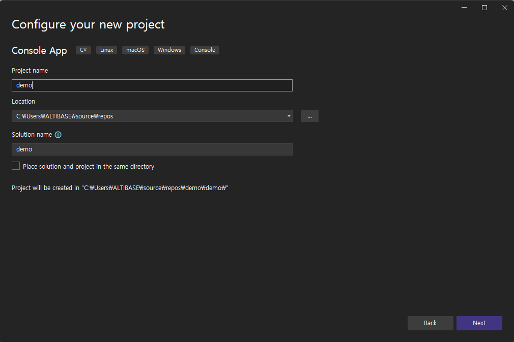
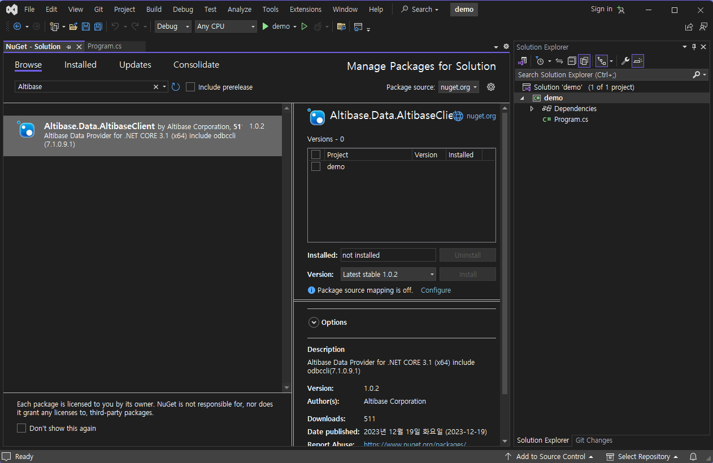

# 6.Altibase ADO.NET

## Altibase ADO.NET Overview

Altibase ADO.NET is a driver that enables access to the Altibase server from applications based on .NET core. With this driver, users can use Microsoft's ADO.NET API with Altibase. .NET Core developers can utilize ADO.NET to access data sources such as DBMS, execute commands, retrieve data, manipulate results, and reflect the results to the data sources again.


For more detailed information about Microsoft's ADO.NET, please refer to [.NET documentation](https://learn.microsoft.com/en-us/dotnet/).

### Requirements
- Altibase CLI Library
  
  Altibase ADO.NET connects to the Altibase server via the CLI library. The following CLI library is included in the Altibase ADO.NET NuGet package:
  
  - Linux x86-64  : libdotnet_sl.so
  - Windows x64 : dotnet_sl.dll
  
- Altibase 7.1.0.8.3 and above

- .NET Core 3.1

### Supported OS

Altibase ADO.NET supports operating systems that are supported by both Altibase 7.1 clients and .NET Core 3.1.

- [.NET Core 3.1 - Supported OS versions](https://github.com/dotnet/core/blob/main/release-notes/3.1/3.1-supported-os.md#net-core-31---supported-os-versions)
- [Altibase 7.1 Client Supported OS](https://github.com/ALTIBASE/Documents/blob/master/Technical%20Documents/kor/Supported%20Platforms.md#altibase-71-server--client)

If Altibase ADO.NET NuGet package does not include the CLI library for the desired OS, please contact [Altibase's Support Portal](http://support.altibase.com/en/).


##  Using the Altibase ADO.NET

This section describes how to Altibase ADO.NET for NET Core developers.

### Download Altibase ADO.NET

Users can download Altibase.Data.AltibaseClient.nupkg [here](https://www.nuget.org/packages/Altibase.Data.AltibaseClient).

### Compile .NET Core Application Program

There are two methods to compile the application program with Altibase ADO.NET.

>  **Compile using dotnet CLI**

1️⃣ Lists all configured NuGet sources using dotnet CLI.

~~~c
[user@ /] dotnet nuget list source
Registered Sources:
  1.  nuget.org [Enabled]
      https://api.nuget.org/v3/index.json
~~~

2️⃣ Configure Altibase ADO.NET NuGet package dependency on \<PackageReference> in the project file.

~~~c#
<Project Sdk="Microsoft.NET.Sdk" DefaultTargets="Build" xmlns="http://schemas.microsoft.com/developer/msbuild/2003">
  <PropertyGroup>
    <OutputType>exe</OutputType>
    <TargetFramework>netcoreapp3.1</TargetFramework>
  </PropertyGroup>
  <ItemGroup>
    /* Configure Altibase ADO.NET NuGet package dependency */
    <PackageReference Include="Altibase.Data.AltibaseClient" />
  </ItemGroup>
  <ItemGroup>
    <Compile Include="demo.cs" />
  </ItemGroup>
</Project>
~~~

3️⃣ Build the project.

~~~
[user@ /] dotnet build demo.csproj
~~~


>  **Compile with IDE**

This is how to register Altibase ADO.NET with IDE(Integrated Development Environment). The following example is using MS Visual Studio.

1️⃣ Create a new project.



2️⃣ Select the package source "nuget.org" on the "manage NuGet package for solution" window, search "Altibase.Data.AltibaseClient", and install it.




### Declare Using Altibase ADO.NET

To use Altibase ADO.NET classes in the .NET Core-based application, users need to declare as follows:

~~~c#
using Altibase.Data.AltibaseClient;
~~~


### Connection Setting

This section describes how to connect to the Altibase server from the .NET core application program.

#### Using the Connection URL

The connection string to access the Altibase server is as follows: 

~~~c#
Server=127.0.0.1;PORT=20300;User=sys;Password=manager;connection_properties=value;...
~~~

#### Setting Connection Properties

This section describes additional connection properties that can be used in the connection string besides the default connection properties mentioned above. The following items are included in the description of each property:

- Default Value : The value used by default, if no other value is specified
- Range : The value available for specification
- Mandatory : Whether or not the property must be specified
- Setting Range : The Setting Range is classified into System, Session, and N/A based on the scope of the property set after connecting to the Altibase server.
  - System : This property setting can affects other sessions.
  - Session : This property setting affects only the session itself.
  - N/A : This property setting only affects the process of connecting to the Altibase server.
- Description: The description of the property.

##### application name

- Default Value : .NET Altibase Data Provider
- Range : A random string
- Mandatory : No
- Setting Range : Session
- Description : This indicates the information of the application of the session. This value can be outputted CLIENT_APP_INFO column of V$SESSION.

##### connection life time

- Default Value : 0
- Range : [0 ~ 2<sup>31</sup>(2147483648)]
- Mandatory : No
- Setting Range : Session
- Description : This setting determines whether to remove the connection from the connection pool if it has not been used for the specified amount of time. The unit for this property is seconds (sec). 
  If the value of this property is set to 0, the connection will not be removed. If it is not 0, the connection will be removed from the connection pool if it remains unused for the specified value.

##### connection timeout

- Default Value : 15

- Range : [0 ~ 2<sup>31</sup>(2147483648)]

- Mandatory : No

- Setting Range : N/A

- Description : This sets the wait time for connecting to the Altibase server. The unit for this property is seconds (sec). A value of 0 means waiting indefinitely until the connection is established, while a non-zero value indicates that the connection attempt will fail if it is not established within the specified value.
  

##### data source

- Default Value : See description
- Range : A random string
- Mandatory : No
- Setting Range : N/A
- Description : This indicates the data source name. The used value will be changed by the following conditions:
  - If the value of the connection property `server` exists, this setting will be ignored.
  - If the value of the connection property `server` does not exist and the original ODBC data which has the same value as the `data source` exists, the DSN(data source name) of the original ODBC data will be used.
  - If both the value of the connection property `server` and the original ODBC data which has the same value as the `data source` do not exist, this will use the server's IP or hostname.

##### encoding

- Default Value : N/A
- Range :  [Supported Database Character Sets](https://github.com/ALTIBASE/Documents/blob/master/Manuals/Altibase_7.1/eng/Getting%20Started%20Guide.md#supported-database-character-sets)
- Mandatory : No
- Setting Range : Session
- Description : This configures the character sets of the client.

##### enlist 

- Default Value :  true
- Range : [true | false]
- Mandatory : No
- Setting Range : Session
- Description : This property configures implicit transaction handling. When set to true, transactions participate implicitly. When set to false, transactions participate explicitly.

##### max pool size

- Default Value : 100
- Range : [0 ~ 2<sup>31</sup>(2147483648)]
- Mandatory : No
- Setting Range : N/A
- Description : This property sets the maximum number of connections in the connection pool for a specific connection string.

##### min pool size 

- Default Value : 0
- Range : [0 ~ 2<sup>31</sup>(2147483648)]
- Mandatory : No
- Setting Range : N/A
- Description : This property sets the minimum number of connections in the connection pool for a specific connection string. When the connection pool is initially created, this setting determines the number of connections that are generated. 

##### nchar literal replace

- Default Value : false
- Range : [true | false]
- Mandatory : No
- Setting Range : Session
- Description : This setting determines whether constant strings with national character sets are used in queries. "true" indicates that constant strings with national character sets are used, while "false" indicates that they are not used.

##### password

- Default Value : N/A
- Range : Database user password
- Mandatory : Yes
- Setting Range : N/A
- Description : This property holds the password associated with the database user connecting to the Altibase server.

##### persist security info 

- Default Value :  false
- Range : [true | false]
- Mandatory : No
- Setting Range : N/A
- Description : This setting determines whether to include the password when retrieving strings from the connection information. "true" includes the password, while "false" does not.

##### pooling

- Default Value :  true
- Range : [true | false]
- Mandatory : No
- Setting Range : N/A
- Description : This setting determines whether to enable connection pooling or not. "true" uses the connection pooling, while "false" does not.

##### port 

- Default Value :  20300
- Range : [0~65535]
- Mandatory : No
- Setting Range : N/A
- Description : This property holds the service port number of the Altibase server.

##### prefer ipv6 

- Default Value :  false
- Range : [true | false]
- Mandatory : No
- Setting Range : N/A
- Description : When users enter the hostname into the connection property `server`, the hostname will be converted into IPv4 or IPv6 address following this value. If this value is set to "true", the hostname will be converted into IPv6 address. If this value is set to "false", the hostname will be converted into IPv4 address.

##### server

- Default Value :  localhost
- Range : A random string
- Mandatory : No
- Setting Range : N/A
- Description : This property holds the IP address or the hostname of the Altibase server.

##### transaction timeout

- Default Value : Setting value of the server
- Range :  [0 ~ 2<sup>31</sup>(2147483648)]
- Mandatory : No
- Setting Range : Session
- Description : This setting limits the execution time of transactions performing change operations (UPDATE, INSERT, DELETE). The unit is in seconds (sec). A value of 0 means there is no limit on the execution time of change transactions. If the execution time of a change transaction exceeds the configured value (which is not 0), the session connection is terminated, and the transaction is rolled back.

##### user id *or* uid

- Default Value :  N/A
- Range : A random string
- Mandatory : Yes
- Setting Range : N/A
- Description : This property holds the database user name who accesses the Altibase server.


### Connection Pooling

The process of an application connecting to a database server involves multiple steps and can take a considerable amount of time, potentially being repeated many times. To minimize the number of connections opened and closed, ADO.NET provides connection pooling.

Connection pooling maintains ownership of connections. When a connection request is received, the pool checks if an available connection exists and either assigns it or creates a new connection in the connection pool for allocation. When a connection is closed, it is returned to the connection pool rather than being immediately released.

#### Creating Connection Pools

When a connection is first opened, a connection pool is created based on a matching algorithm that matches the connection string to the existing connection pools. If the connection string does not exactly match an existing connection pool, a new connection pool is created. Differences in connection properties of the connection string, including case and whitespace, result in different pools being recognized. If the connection string does not set the `min pool size` property to a non-zero value, no automatic connection pools are created (the default is 0).

#### Connection Allocation and Addition

When a connection request is received, the pool checks the matching connection pool for an available connection. If no matching pool is found, a new one is created. Connections can be created up to the value set by the `max pool size` property. When the number of created connections exceeds the `max pool size`, this operation waits until a connection removed from the connection pool occurs due to exceeding the connection property `connection life time`.

Connections that encounter exceptions are automatically removed, and explicitly closing a connection does not remove connections but returns the connections to the connection pool.

#### Connection Removal

If connections are not explicitly closed or removed by the application, the connection pooler periodically inspects the pools and removes connections not used within the specified time set by the `connection life time` property, maintaining at least the minimum number of connections set by the `min pool size` property. Exception-handling connections are also removed.

#### Clearing Connection Pools

The AltibaseConnection class provides methods for clearing pools: ClearPool and ClearAllPools. ClearPool removes a specified connection pool, while ClearAllPools removes all connection pools.

#### Constraints

The number of created connections cannot exceed the Altibase server property [MAX_CLIENT](https://github.com/ALTIBASE/Documents/blob/master/Manuals/Altibase_7.1/eng/General%20Reference-1.Data%20Types%20%26%20Altibase%20Properties.md#max_client), so when configuring the `max pool size` and `min pool size` properties, MAX_CLIENT should be taken into account.


### Transaction Processing

In Altibase ADO.NET, a transaction is processed by using AltibaseTransaction object or CommittableTransaction object.

#### AltibaseTransaction Object

AltibaseTransaction gains the transaction object through AltibaseConnection.BeginTransaction() method as below.

This method can only be used for local transactions.

~~~c#
AltibaseConnection sConn = new AltibaseConnection(sConnStr); sConn.Open();

// Transaction starts
AltibaseTransaction sTrans = sConn.BeginTransaction();
AltibaseCommand sCmd = sConn.CreateCommand();

// Transaction processing ...

// TODO

// Transaction ends 
sTrans.Commit();
~~~

#### CommitableTransaction Object

The CommitableTransaction object can participate in transactions implicitly or explicitly. In Altibase ADO.NET, to participate implicitly in transactions, either do not set the `enlist` connection property in the connection string or set it to `enlist=true`. For explicit participation, set the `enlist` connection property to `enlist=false` in the connection string.

#### Distributed Transaction

Altibase ADO.NET allows explicit participation in distributed transactions through the AltibaseConnection.EnlistDistributedTransaction method. However, since distributed transactions are not supported in .NET Core 3.1, Altibase ADO.NET only supports local transactions.


### Array Binding

Altibase ADO.NET supports "Array Binding", which means that the parameter binding for data in array format is possible. This allows processing multiple rows with fewer network costs compared to regular binding, resulting in improved performance.

The steps of array binding are as follows:

1️⃣ Declare all the variables desired to bind as an array.

The size of the array must be greater than or equal to the value of the `ArrayBindCount` property of the AltibaseCommand class.

2️⃣ Bind the array variables to parameters. 

If the type of bound columns is CHAR, VARCHAR, or BLOB, the `ArrayBindSize` property of the AltibaseParameter class should be set to the size equal to the largest element in the array.

3️⃣ Set the ArrayBindCount value of the AltibaseCommand class.

Example) To input 100 elements at once, set `ArrayBindCount = 100;` 

4️⃣ Execute the query.

#### Cautions

When performing array binding, the following points should be noted:

- The valid range for ArrayBindCount is from 1 to 65535. It's not guaranteed that increasing the array size will always improve performance, so it's advisable to bind with an appropriate size.
- For CHAR, VARCHAR, and BLOB types, if the data size of a single element in the array exceeds ArrayBindSize, an error will occur.
- For NCHAR and NVARCHAR types, ArrayBindSize should be set in terms of the number of characters, not bytes.
- For BLOB types, use Object[] as the array type in the application, and each array element should be of type byte[].
  - Example 
    ~~~c#
    byte[] var1; 
    byte[] var2; 
    Object[] var = new Object[2] {var1, var2};
    ~~~
- For CLOB, BYTE, NIBBLE, BIT, VARBIT, and GEOMETRY types, array binding is not supported.

#### Constraints

Array binding supports only input parameters. Output or input/output parameters are not supported.


### Database Schema Information Search

GetSchema() method allows querying Altibase's meta tables in addition to common schemas such as MetadataCollections, DataSourceInformation, DataTypes, Restrictions, and ReservedWords.

| Schema              | Meta Table               | Description                                                  |
| :------------------ | :----------------------- | :----------------------------------------------------------- |
| Users               | SYS_USERS_               | This table contains information about users.                 |
| Tables              | SYS_TABLES_              | This table contains information about all kinds of tables.   |
| Views               | SYS_VIEWS_               | This table contains information about views.                 |
| Sequences           | V$SEQ                    | This performance view contains information about sequences.  |
| Synonyms            | SYS_SYNONYMS_            | This table contains information about synonyms.              |
| Indexes             | SYS_INDICES_             | This table contains information about indexes.               |
| Columns             | SYS_COLUMNS_             | This table contains information about columns.               |
| Constraints         | SYS_CONSTRAINTS_         | This table contains information about constraints.           |
| Procedures          | SYS_PROCEDURES_          | This table contains information about stored procedures and functions. |
| ProcedureParameters | SYS_PROC_PARAS_          | This table contains information about the parameters for stored procedures and functions. |
| IndexColumns        | SYS_INDEX_COLUMNS_       | This table contains information about index key columns.     |
| ConstraintColumns   | SYS_CONSTRAINT_ COLUMNS_ | This table contains information about columns having constraints. |
| Triggers            | SYS_TRIGGERS_            | This table contains information about triggers.              |

Please refer to the following manuals for more information about database schemas and related meta tables that Altibase supports.

- [Altibase 7.1 Administrator's Manual - 5.Objects and Privileges](https://github.com/ALTIBASE/Documents/blob/master/Manuals/Altibase_7.1/eng/Administrator's%20Manual.md#5-objects-and-privileges)
- [Altibase 7.1 GeneralReference-2.The Data Dictionary](https://github.com/ALTIBASE/Documents/blob/master/Manuals/Altibase_7.1/eng/General%20Reference-2.The%20Data%20Dictionary.md)


## Altibase ADO.NET API

This section describes the prominent classes implemented within Altibase ADO.NET's API, along with their constraints and unsupported APIs.

### Supported Interfaces

#### Establish Connection, Execute Query, and Retrieve Result

Altibase ADO.NET provides functionalities for establishing connections to Altibase servers, executing queries, and retrieving results. These functionalities are based on the following four classes. The sub-method functionalities of each class can be referred to in Microsoft's [.NET Core 3.1 API documentation](https://learn.microsoft.com/en-us/dotnet/api/?view=netcore-3.1).

| Class               | Description                                                  |
| :------------------ | :----------------------------------------------------------- |
| AltibaseConnection  | Establish connections to the Altibase server and start transactions. |
| AltibaseCommand     | Execute queries on the Altibase server and display the parameters. |
| AltibaseDataReader  | Retrieve and output the results of commands executed on the Altibase server. |
| AltibaseDataAdapter | Fill a DataSet with data and update the data stored in the database. |

#### Handling Exceptions and Executing Transactions

Altibase ADO.NET provides the following classes to handle exceptions, execute stored procedures, and process transactions, etc.

| Class               | Description                                                  |
| :------------------ | :----------------------------------------------------------- |
| AltibaseException   | Output the database errors or client errors from .NET Core.  |
| AltibaseParameter   | Define the input/output parameters of SQL commands or stored procedures. |
| AltibaseTransaction | Perform transaction-related commands in the database.        |

#### Basic Implementation

The following is a list of APIs that inherit the basic implementation from ADO.NET classes.

| ADO.NET API Class | Altibase ADO.NET Class | Category | Component                     |
| :---------------- | :--------------------- | -------- | ----------------------------- |
| DbProviderFactory | AltibaseFactory        | Method   | CreateCommandBuilder          |
|                   |                        | Method   | CreateConnectionStringBuilder |
| DbDataReader      | AltibaseDataReader     | Method   | GetProviderSpecificFieldType  |
|                   |                        | Method   | GetProviderSpecificValue      |
|                   |                        | Method   | GetProviderSpecificValues     |
|                   |                        | Property | VisibleFieldCount             |
| DbDataAdapter     | AltibaseDataAdapter    | Method   | GetBatchedRecordsAffected     |

#### Cautions for Supported Interfaces

- ColumnName is a case-sensitive attribute when it is used in DataReader, CommandBuilder, etc. 
  
  When creating a table, Altibase automatically converts column names that are not enclosed in double quotes("") to uppercase. If a column name was converted to uppercase during creation, users must use uppercase to obtain correct results.
  
- AltibaseDataReader.GetValue() method converts numeric data to the System.Decimal data type.

  As a result, if the data retrieved by GetValue() is of type NUMBER, NUMERIC, FLOAT, or DECIMAL and exceeds the range that can be represented by System.Decimal, data loss may occur.

- Altibase ADO.NET does not support the execution of multiple queries. To execute multiple queries at once, users should use stored procedures.

### Unsupported Interfaces

Below is a list of interfaces not supported by Altibase ADO.NET. Using unsupported interfaces will result in a NotImplementedException error.

| ADO.NET API Class | Altibase ADO.NET Class | Category | Component                                          |                    |
| --------------------- | :--------------------------- | :----- | :----------------------------------------------------------- | :----------------- |
| DbConnection          | AltibaseConnection           | Method | ChangeDatabase                                               |                    |
|                       |                              | Property | DataSource                                                   |                    |
|                       |                              | Property | ServerVersion                                                |                    |
| DbCommand             | AltibaseCommand              | Method | Cancel                                                       |                    |
|                       |                              | Property | CommandTimeout                                               |                    |
|                       |                              | Property | CommandType                                                  |                    |
| DbDataReader          | AltibaseDataReader           | Method | GetData                                                      |                    |
|                       |                              | Method | GetDbDataReader                                              |                    |
|  |                              | Property | Depth                                                        | Always it returns 0 |
|                       |                              | Property | HasRows                                                      |                    |
| DbDataAdapter         | AltibaseDataAdapter          | Method | AddToBatch(IDbCommand command)                               |                    |
|                       |                              | Method | CrearBatch                                                   |                    |
|                       |                              | Method | ExecuteBatch                                                 |                    |
|                       |                              | Method | GetBatchedParameter                                          |                    |
|                       |                              | Method | InitializeBatching                                           |                    |
|                       |                              | Method | TerminateBatching                                            |                    |
| DbDataSourceEnumerator                 |  | Class |  |             |
| DbProviderFactory     | AltibaseFactory              | Method | CreateDataSourceEnumerator |                    |
| DbParameter           | AltibaseParameter            | Method | ResetDbType                                                  |                    |
| DbParameterCollection | AltibaseParameterCollection  | Method | AddRange                                                     |                    |

## Altibase ADO.NET Data Types

The AltibaseDbType class is used to declare the data types of table columns or parameters.

Users can find the AltibaseDbType Class and Altibase server data types corresponding to the .NET Core data types from the table below:

| AltibaseDbType Class | Altibase Data Type | .NET Core   |
| :------------------- | :----------------- | :---------- |
| BigInt               | BIGINT             | Int64       |
| BitArray             | BIT                | BitArray[]  |
| Blob                 | BLOB               | Byte[]      |
| Binary               | BYTE               | Byte[]      |
| Char                 | CHAR               | String      |
| Clob                 | CLOB               | String      |
| DateTime             | DATE               | DateTime    |
| Decimal              | DECIMAL            | Decimal     |
| Double               | DOUBLE             | Double      |
| Float                | FLOAT              | Decimal     |
| Geometry             | GEOMETRY           | Byte[]      |
| Integer              | INT                | Int32       |
| NChar                | NCHAR              | String      |
| NibbleArray          | NIBBLE             | NibbleArray |
| Number               | NUMBER             | Decimal     |
| Numeric              | NUMERIC            | Decimal     |
| NVarChar             | NVARCHAR           | String      |
| Real                 | REAL               | Float       |
| SmallInt             | SMALLINT           | Int16       |
| VarBitArray          | VARBIT             | BitArray[]  |
| VarChar              | VARCHAR            | String      |

> [!TIP]
> To use constant strings containing national characters in queries, simply prefix the string with 'N'.

## Altibase ADO.NET Examples

### DDL and DML Statements

Access ALTIBASE HDB, create the *test_goods* table, insert data, and then perform SELECT using the AltiabseConnection class.

```c#
using Altibase.Data.AltibaseClient;

class ConnectionTest
{
 static void Main(string[] args)
 {
   string sConnectionString = "Server=127.0.0.1;PORT=20091;User=sys;Password=manager";
   AltibaseConnection conn = new AltibaseConnection(sConnectionString);
   try
   {
     conn.Open(); // This connects to the database
     AltibaseCommand command = new AltibaseCommand("drop table test_goods", conn);
     try
     {
       command.ExecuteNonQuery(); // This executes a query
     }
     catch (Exception ex) {}
	 
     command.CommandText =
           "create table test_goods (
            gno char(10),
            gname char(20),
            location char(9),
            stock integer,
            price numeric(10, 2))";
     command.ExecuteNonQuery(); // This executes a query
	 
     command.CommandText = "insert into test_goods values ('A111100001','IM-300','AC0001',1000,78000)";
     command.ExecuteNonQuery(); //This executes a query
	 
     command.CommandText = "insert into test_goods values ('A111100002','IM-310','DD0001',100,98000)";
     command.ExecuteNonQuery(); //This executes a query
	 
     command.CommandText = "insert into test_goods values ('B111100001','NT-H5000','AC0002',780,35800)";
     command.ExecuteNonQuery(); //This executes a query
	 
     command.CommandText = "select * from test_goods";
     AltibaseDataReader dr = command.ExecuteReader();
	 
     Console.WriteLine(" GNO GNAME LOCATION STOCK PRICE");
     Console.WriteLine("===================================================================================");
     while (dr.Read())
     {
       for (int i = 0; i < dr.FieldCount; i++)
       {
         Console.Write("\t{0}", dr[i]);
       }
       // This outputs the retrieved data
       Console.WriteLine();
     }
   }
   catch (Exception ex)
   {
   Console.WriteLine(ex.ToString());
   }
   conn.Close(); // This closes the connection to the database
 }
} 
```

Result:

```c#
GNO        GNAME    LOCATION STOCK PRICE
==================================================
A111100001 IM-300   AC0001   1000  78000
A111100002 IM-310   DD0001   100   98000
B111100001 NT-H5000 AC0002   780   35800
```

### Bulk Copy

Copy data from the *bulkcopy_source* table to the *bulkcopy_destination* table using AltibaseBulkCopy.

```c#
using System;
using System.Data;
using Altibase.Data.AltibaseClient;

class Program
{
 static void Main(string[] args)
 {
   if (args.Length != 2)
   {
     Console.WriteLine("\t[NOT PASSED]: Invalid argument");
     return;
   }
   string connectionString = GetConnectionString(args);
   using (AltibaseConnection sourceConnection = new AltibaseConnection(connectionString))
   {
     sourceConnection.Open();
     // Perform an initial count on the destination table.
     AltibaseCommand commandRowCount = new AltibaseCommand( "SELECT COUNT(*) FROM BULKCOPY_DESTINATION;",sourceConnection);
     long countStart = System.Convert.ToInt32(commandRowCount.ExecuteScalar());
     Console.WriteLine("Starting row count = {0}", countStart);
     // Get data from the source table as a AltibaseDataReader.
     AltibaseCommand commandSourceData = new AltibaseCommand("SELECT A1, A2, A3, A4 FROM BULKCOPY_SOURCE;",sourceConnection);
     AltibaseDataReader reader = commandSourceData.ExecuteReader();
     // Open the destination connection. In the real world you would
     // not use AltibaseBulkCopy to move data from one table to the other
     // in the same database. This is for demonstration purposes only.
     using (AltibaseConnection destinationConnection =  new AltibaseConnection(connectionString))
     {
       destinationConnection.Open();
       // Set up the bulk copy object.
       // Note that the column positions in the source
       // data reader match the column positions in
       // the destination table so there is no need to
       // map columns.
       using (AltibaseBulkCopy bulkCopy = new AltibaseBulkCopy(destinationConnection))
       {
         bulkCopy.DestinationTableName = "BULKCOPY_DESTINATION";
         try
         {
           // Write from the source to the destination.
           bulkCopy.WriteToServer(reader);
         }
         catch (Exception ex)
         {
           Console.WriteLine(ex.Message);
         }
         finally
         {
           // Close the AltibaseDataReader. The AltibaseBulkCopy
           // object is automatically closed at the end
           // of the using block.
           reader.Close();
         }
       }
       // Perform a final count on the destination
       // table to see how many rows were added.
       long countEnd = System.Convert.ToInt32(commandRowCount.ExecuteScalar());
       Console.WriteLine("Ending row count = {0}", countEnd);
       Console.WriteLine("{0} rows were added.", countEnd - countStart);
     }
   }
 }
 private static string GetConnectionString(string[] args)
 // To avoid storing the sourceConnection string in your code,
 // you can retrieve it from a configuration file.
 {
   return "Server=" + args[0] + ";" + "PORT=" + args[1] + ";" + "User=sys;Password=manager";
 }
}
```

### Connection Pooling

The example of using connection pooling in ADO.NET is as below.

```c#
static void Main(string[] sArgs)
{
 AltibaseConnection cn = new AltibaseConnection();
 AltibaseConnection cn2 = new AltibaseConnection();
 AltibaseCommand cmd = new AltibaseCommand();
 string cnStr = "Server=127.0.0.1;Port=20300;User=user;Password=pwd;Pooling=true;Min Pool Size=0;Max Pool Size=10";
 
 cn.ConnectionString = cnStr;
 cn.Open();
 
 Console.WriteLine("Successfully Connected.");
 
 cmd.Connection = cn;
 cmd.CommandText = "SELECT TO_CHAR(SYSDATE, 'YYYY-MM-DDHH:MI:SS') FROM DUAL";
 
 AltibaseDataReader dr = cmd.ExecuteReader();
 while (dr.Read())
 {
  Console.WriteLine(dr[0].ToString());
 }
 dr.Close();
 cn.Close();
 cn2.ConnectionString = cnStr;
 .NET Data Provider 55
 cn2.Open(); // Pooled Connection
 cn2.Close();
}
```

### Array Binding

~~~c#
using System;
using System.Data;
using Altibase.Data.AltibaseClient;

class ArrayBind
{
 static void Main()
 {
  AltibaseConnection con = new AltibaseConnection();
  con.ConnectionString = "DSN=127.0.0.1;UID=sys;PWD=manager;NLS_USE=KO16KSC5601";
  con.Open();
  Console.WriteLine("Connected successfully");
  // table: create table t1 (c1 int, c2 varchar(12));
  // 3 records
  const int arrayBindCount = 3;
  int[] c1 = new int[arrayBindCount] { 100, 200, 300};
  String[] c2 = new String[arrayBindCount] { "APPLE", "ORANGE", "GRAPE" };
  AltibaseCommand cmd = new AltibaseCommand();
  cmd.Connection = con;
  
  //=====================================================
  // bind parameters
  //=====================================================
   cmd.CommandText = "insert into t1 values (?, ?)";
   AltibaseParameter prm1 = new AltibaseParameter("c1", DbType.Int32);
   prm1.Direction = ParameterDirection.Input;
   prm1.Value = c1;
   AltibaseParameter prm2 = new AltibaseParameter("c2", DbType.AnsiString);
   prm2.Direction = ParameterDirection.Input;
   prm2.Value = c2;
   prm2.ArrayBindSize = 12; // max element size in bytes
   cmd.Parameters.Add(prm1);
   cmd.Parameters.Add(prm2);
 
  //=====================================================
  // execute INSERT
  //=====================================================
  cmd.ArrayBindCount = arrayBindCount;
  cmd.ExecuteNonQuery();
 
  //=====================================================
  // SELECT
  //=====================================================
  IDataReader sDataReader = null;
  cmd.Parameters.Clear();
  cmd.CommandText = "select * from t1";
  sDataReader = cmd.ExecuteReader();
  while (sDataReader.Read())
  {
   for (int i = 0; i < sDataReader.FieldCount; i++)
   {
   Console.Write("[" + sDataReader.GetValue(i) + "] ");
   }
   Console.WriteLine();
  }
  sDataReader.Close();
  con.Close();
  con.Dispose();
 }
}
~~~