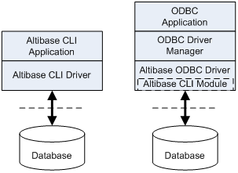
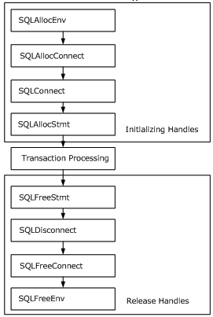
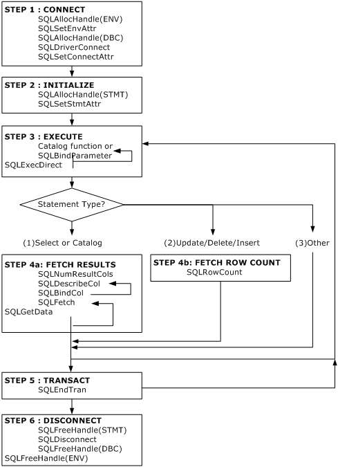
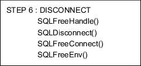

# 1. Altibase CLI Introduction

This chapter briefly introduces the background of Altibase CLI, how to use it, its programming steps, and more.

### Overview

X/Open CLI and ODBC are standard open application program interfaces to access the database, and are callable SQL programming interfaces. A callable programming SQL interface is an interface which accesses the database and executes a SQL statement by calling a CLI function.

#### X/Open CLI and ODBC

The standard callable SQL interface (called X/Open CLI or SAG CLI) was created by X/Open and SQL Access Group (SAG).

Microsoft’s ODBC for Windows was also built upon the X/Open CLI specification. 

#### What is Altibase CLI?

Altibase CLI is a callable SQL programming interface supported for Altibase. The Altibase CLI driver can be used singularly for the CLI application, or as the sub-library of the following libraries. 

-   libalticapi.a: Altibase C API library 
-   libapre.a: APRE C/C++ library 
-   libiloader.a: iLoader API library

The Altibase CLI driver is included in the Altibase server and client packages as a library, and is required to build or run the following applications. 

-   Altibase CLI applications 
-   Altibase C API applications 
-   APRE C/C++ applications 
-   XA applications 
-   iLoader API applications

#### Altibase ODBC Driver

For an ODBC application to access a database, a separate module or driver provided by the database to be accessed is required, apart from the ODBC software (e.g., ODBC Driver Manager). Altibase provides the ODBC driver for this purpose. For further information on the Altibase ODBC driver, please refer to the *Altibase ODBC User’s Manual.*

#### Differences Between CLI and ODBC

Altibase CLI conforms to X/Open CLI standards and ODBC specifications to maximum levels, and is very similar to an ODBC interface. However, since the Altibase CLI application does not run through the ODBC Driver Manager at runtime, Altibase CLI guarantees faster response time than an ODBC application.



[Figure 1-1] The CLI Driver and the ODBC Driver Accessing the Database

#### Before Reading This Manual

Altibase CLI conforms not only to X/Open CLI standards, but also to ODBC specifications. Also, since the Altibase CLI core module runs in the lower part of the Altibase ODBC Driver as shown in the figure above, most of the internal operations of the Altibase CLI driver and Altibase ODBC driver are similar. 

The contents of this manual mostly apply also to the ODBC driver, and terminologies related to both ODBC and Altibase CLI are used.

### Basic Usages

This section explores the prior knowledge necessary for writing applications using Altibase CLI. 

As shown in [Figure 1-1] below, Altibase CLI applications are typically composed of the following three steps:

-   Initialization of Handles 
-   Processing of Transactions 
-   Release of Handles

Operations other than the above, such as processing diagnostic messages, occur throughout the whole application. 



[Figure 1-2] Altibase CLI Application Steps

#### Initialization of Handles

This step allocates and initializes the environment and connection handles. Transition from one step to the next step is made by passing the appropriate handles to send information about the execution results of the previous step. Handle types provided by Altibase CLI are as follows:

##### Environment Handles

The environment handle references the overall environment of an application’s state. An environment handle must be allocated prior to allocating a connection handle, and multiple environment handles can be allocated in a single application. 

##### Connection Handles

The connection handle references information related to the connections managed by Altibase CLI. This information includes the general status, transaction status, and diagnostic information. An application allocates a connection handle for each connection to attempt connection to the Altibase server. 

##### Statement Handles

The statement handle references information of the SQL statements managed by Altibase CLI, and is associated with the connection handle. A statement handle is allocated to execute a statement. A maximum number of 1,024 statements can be allocated to a single connection. 

#### Processing of Transactions

Below figure shows the execution order of a function call.


[Figure 1-3] The Execution Order of a Function Call

#### Release of Handles

This step releases the allocated handles, recovers the allocated memory, and then terminates the application.

#### Processing Diagnostic Messages

A diagnosis is an operation which handles warnings or error states that are generated in an application.

##### Application Return Values

| Return Values         | Description                                                  |
| --------------------- | ------------------------------------------------------------ |
| SQL_SUCCESS           | The function completed successfully                          |
| SQL_SUCCESS_WITH_INFO | The function executed successfully with a warning and other information |
| SQL_NO_DATA           | The function executed successfully, but no related data is available. |
| SQL_ERROR             | The function failed                                          |
| SQL_INVALID_HANDLE    | The function failed due to an invalid input handle.          |

Diagnostic messages are generated for all, but SQL_SUCCESS, SQL_NO_DATA_FOUND, and SQL_INVALID_HANDLE. To check the diagnostic message, you can call SQLGetDiagRec() and SQLGetDiagField().

##### Diagnostic Messages

A diagnostic message is a five-byte alphanumeric string. The first two characters depict the class, and the last three characters depict the sub class. 

The diagnostic messages provided by Altibase CLI conform with X/Open SQL CAE specifications.

#### Restrictions

The Altibase client library does not handle signals.

Therefore, if the network is disconnected due to an external issue, a running application can be forcefully terminated by receiving the SIGPIPE signal. To prevent the application from forcefully terminating, the SIGPIPE signal must be handled within the user application. Since the application can hang if you call an Altibase client library function within a SIGPIPE signal handler function, caution is required when writing signal handler functions. Nevertheless, it is possible to call an Altibase client library function after signal handling is complete.

### Basic Programming Steps



#### Step 1: Connect to the Database

For any application, the first step is to connect to the database. The following functions are necessary for this step:


The first operation required to connect to the database, is to allocate an environment handle using SQLAllocHandle(). 

An application sets the environment attributes of the current environment by calling SQLSetEnvAttr(). 

Next, the application allocates a connection handle using SQLAllocHandle(), and calls SQLDriverConnect() to connect to the data source. 

After that, the application sets the connection attributes using SQLSetConnectAttr().

#### Step 2: Initialize the Application

The second step is to initialize the application as shown in the following figure. The exact operation is dependent on the application.


An application allocates a statement handle using SQLAllocStmt(), and most applications specify statement attributes (such as the cursor type) using SQLSetStmtAttr().

#### Step 3: Build and Execute a SQL Statement

The third step is to build and execute a SQL statement as shown below. This step can be processed in many different ways. An application creates or executes a SQL statement, based on the SQL statement input by the user.


When a SQL statement is created and the variables are bound, the statement is executed with SQLExecDirect. For statements that are executed multiple times, it is more efficient performance wise to prepare the statement with SQLPrepare() and repeatedly execute it with SQLExecute().

If a SQL statement includes parameter markers(‘?’), an application calls SQLBindParameter() and binds each argument to an application variable. SQLPrepare() must be executed before binding the arguments, SQLExecute() can be executed after they have been bound.

An application can delay the execution of a SQL statement and call a function that returns a result set which includes information from the system catalogs instead. 

The next step for the application to take depends on how the SQL statement is executed. 

| SQL Statement Types        | Aniticipated Actions                                         |
| -------------------------- | ------------------------------------------------------------ |
| SELECT or Catalog Funciton | Step 4a: Fetches the results.                                |
| UPDATE, DELETE, or INSERT  | Step 4b: Fetches the number of affected rows.                |
| Other SQL Statements       | Step 3: Builds and excutes a SQL statement. Or Step 5: Commits the transaction |

#### Step 4a: Fetch the Results

This step fetches the results as shown in the above figure.


If the statement executed in Step 3 is a SELECT statement or catalog function, an application calls SQLNumResultCols() to figure out the number of columns in the result set. This step is unnecessary if the application already knows the number of columns in the result set.

Next, the application fetches the name of each column in the result set, the data type, precision and etc. using SQLDescribeCol(). Likewise, this step is unnecessary if the application already knows this information. Afterwards, the application sends this information to SQLBindCol(), which binds application variables to columns in the result set.

Now the application calls SQLFetch() to fetch the first row of data and stores the data to the bound variable using SQLBindCol(). If there is long data in the row, data can be retrieved using SQLGetData(). To fetch additional data, the application continues to call SQLFetch() and when necessary, SQLGetData().

Once all of the data has been fetched in the above procedure, the application must close the open cursor using SQLCloseCursor(), before executing another statement using SQLPrepare() and SQLExecute(), to fetch data. 

The application returns to Step 3 to execute another statement in the same transaction, or goes to Step 5 to commit or roll back the transaction. 

#### Step 4b: Fetch the Row Count 


If the statement executed in Step 3 is either an UPDATE, INSERT, or DELETE statement, an application fetches the number of affected rows using SQLRowCount(). 

If multiple statements have been executed using array bind or etc., the rows that were affected by the execution of each statement can be fetched using the SQLMoreResults() and SQLRowCount() functions. 

The application returns to Step 3 to execute another statement in the same transaction, or goes to Step 5 to commit or roll back the transaction. 

#### Step 5: Commit/Rollback the Transaction


This step calls SQLEndTran() to commit or roll back the transaction. An application performs this step only when the transaction commit mode is set to non-auto-commit mode. If the transaction commit mode is auto-commit, the transaction automatically is commited when a statement is executed. 

To execute a statement in a new transaction, the application must return to Step 3; To disconnect from the database, the application goes to Step 6.

####  Step 6: Disconnect from the Altibase

The final step is to disconnect from the database, as shown in the following figure. First, the application calls SQLFreeHandle () to free the handle.



The final step is to disconnect from the database. First, an application calls SQLFreeHandle() and frees handles. 

Next, the application disconnects from the database using SQLDisconnect(), and frees the connection handle using SQLFreeConnect().

Lastly, the application frees the environment handle using SQLFreeEnv() and terminates the program.

### Building an Altibase CLI Application

This section describes how to build an Altibase CLI application.

#### Header File and Library

To write and build an application using Altibase CLI, the following header and library files in the include and lib subdirectories of the $ALTIBASE_HOME directory are required.

```
$ALTIBASE_HOME/include/sqlcli.h
$ALTIBASE_HOME/lib/libodbccli.a
```

#### Compiling

When compiling, use the following option in the compile command.

```
-I$ALTIBASE_HOME/include
```

When linking, use the following option in the link command.

```
-L$ALTIBASE_HOME/lib -lodbccli
```

