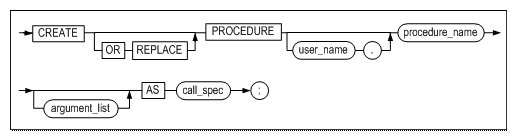
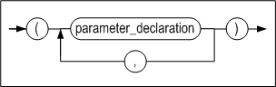

# 3. SQL Statements for External Procedures

This chapter describes SQL statements supported by Altibase for the use of external procedures

### CREATE LIBRARY statement

#### Syntax


#### Description

This creates a new external library object or changes the previously existing external library into a new external library.

##### library_name

This specifies the name of the library object.

##### file_name

This specifies the name of the dynamic library file. This file must be located at $ALTIBASE_HOME/lib. Even if the user-specified file does not exist in the given directory, however, a library object is created. Whether or not the dynamic library file exists is checked at the execution of an external procedure; if it does not exist, the given external procedure object status changes to ‘INVALID’.

#### Example
~~~~~~~~~~~~~~~~~~~~~~~~~~~~~~~~~~~~~~~~~~~~~~
CREATE OR REPLACE LIBRARY lib1 AS 'shlib.so';
~~~~~~~~~~~~~~~~~~~~~~~~~~~~~~~~~~~~~~~~~~~~~~


### ALTER LIBRARY statement

#### Syntax


#### Description

This compiles the library object.

Since only the C/C++ languages are supported for external procedures, the execution of this statement does not set off any operations on the server. This is a reserved statement for the support of other languages in the future.

#### Example
~~~~~~~~~~~~~~~~~~~~~~~~~~~~~~~~~~~~~~~~~~~~~~
ALTER LIBRARY lib1 COMPILE;
~~~~~~~~~~~~~~~~~~~~~~~~~~~~~~~~~~~~~~~~~~~~~~


### DROP LIBRARY statement

#### Syntax


#### Description

This drops the external library object in the database.

Even if an external procedure, which is included in the library object to be dropped, is being executed, the given library object is dropped. Only the library object is dropped from the database, however, and the related dynamic library file is left intact.

#### Example
~~~~~~~~~~~~~~~~~~~~~~~~~~~~~~~~~~~~~~~~~~~~~~
DROP LIBRARY lib1;
~~~~~~~~~~~~~~~~~~~~~~~~~~~~~~~~~~~~~~~~~~~~~~


### CREATE PROCEDURE statement

#### Syntax

**create_procedure ::=**



**argument_list ::=**


**argument_declaration ::=**


**call_spec ::=**


**parameter_list ::=**


**parameter_declaration::=**


#### Description

This creates a new external procedure, or changes a previously existing external procedure into a new external procedure.

##### procedure_name

This specifies the name of the external procedure object.

##### argument_list

The argument can be omitted; on specification, the name, data type and input/output of the argument must be defined. Valid input/output types must be one of the following; on omission, IN is the default value.

-   IN: The input argument which receives an input value when a procedure is called. 
-   OUT: The argument which returns the output value after executing the procedure. 
-   INOUT: The shared argument for input and output; it receives an input value when a procedure is called and returns an output value after a procedure is executed.

When the external procedure is being executed, the value is passed to the procedure with the IN argument, and the procedure returns the value to the called routine with the OUT argument.

##### call_spec

This specifies the names of user-defined functions, library objects and parameters. The order in which user-defined functions and library objects are specified is irrelevant, however, they must be specified only once.

##### fun_name

This specifies the name of the user-defined function corresponding to the external procedure.

##### lib_name

This specifies the name of the external library object which contains the user-defined function corresponding to the external procedure.

##### parameter_list

This clause is specified to assign the arguments of the external procedure object to the corresponding arguments of the user-defined function. In general, the argument names of argument_list should be taken as they are for the argument names of this clause. 

With the following properties, additional information for each parameter can be passed to user-defined functions. Property parameters that are specified with properties merely assist the actual parameter and are not related to the arguments of external procedure objects.

| Property Name | For IN, Data Type | INOUT/ OUT/ For RETURN, Data Type | Description                                                  |
| ------------- | ----------------- | --------------------------------- | ------------------------------------------------------------ |
| INDICATOR     | short             | short \*                          | Indicates whether or not the value of the given parameter is NULL. One of the following values can be taken. ALTIBASE_EXTPROC_IND_NULL ALTIBASE_EXTPROC_IND_NOTNULL |
| LENGTH        | long long         | long long \*                      | Indicates the length of the given parameter value in bytes. Note that for strings, the number of bytes, instead of the number of characters, is displayed. For data types other than strings, the size of the given data type is displayed. |
| MAXLEN        | \-                | long long                         | Indicates the buffer size of the given parameter. For IN mode parameters, this property parameter cannot be specified. |

In the following example, the PARAMETERS clause specifies the arguments and properties of the arguments that are passed to user-defined functions.
~~~~~~~~~~~~~~~~~~~~~~~~~~~~~~~~~~~~~~~~~~~~~~~~~~~~~~~~~~~~~~~~~~
CREATE OR REPLACE PROCEDURE proc1(

a1 IN CHAR(30),

a2 OUT CHAR(30) )

AS

LANGUAGE C

LIBRARY lib1

NAME "str_uppercase"

PARAMETERS( a1, a1 LENGTH, a2 );

/
~~~~~~~~~~~~~~~~~~~~~~~~~~~~~~~~~~~~~~~~~~~~~~~~~~~~~~~~~~~~~~~~~~
From the PARAMETERS clause of the above procedure, the str_uppercase function prototype can be surmised to be as below:

```
extern "C" void str_uppercase( char* str1, long long str1_len, char* str2 );
```

#### Example
~~~~~~~~~~~~~~~~~~~~~~~~~~~~~~~~~~~~~~~~~~~~~~~~~~~~~~~~~~~~~~~~~~
create or replace procedure proc1( a1 in char(30), a2 out char(30) )

as

language c

library lib1

name "str_uppercase"

parameters( a1, a1 LENGTH, a2 )

;

/
~~~~~~~~~~~~~~~~~~~~~~~~~~~~~~~~~~~~~~~~~~~~~~~~~~~~~~~~~~~~~~~~~~


### DROP PROCEDURE statement

#### Syntax


#### Description

This drops the external procedure object from the database. 

If the external procedure to be dropped is being executed, an error is raised, instead of performing deletion.

#### Example

~~~~~~~~~~~~~~~~~~~~~~~~~~~~~~~~~~~~~~~~~~~~~~~~~~~~~~~~~~~~~~~~~~
DROP PROCEDURE proc1;
~~~~~~~~~~~~~~~~~~~~~~~~~~~~~~~~~~~~~~~~~~~~~~~~~~~~~~~~~~~~~~~~~~


### CREATE FUNCTION

#### Syntax

**create_function ::=**


**argument_list ::=**


**argument_declaration ::=**


**call_spec ::=**


**parameter_list ::=**



**parameter_declaration::=**


#### Description

This creates a new external function or changes a previously existing external function into a new external function.

##### func_name

This specifies the name of the external function object.

##### argument_list

Please refer to the section of the CREATE PROCEDURE statement.

##### call_spec

This specifies the names of user-defined functions, library objects and parameters and return values. The order in which user-defined functions and library objects are specified is irrelevant, however, they must be specified only once.

##### fun_name

This specifies the name of the user-defined function corresponding to the given external procedure. 

##### lib_name

This specifies the name of the external library object which contains the user-defined function corresponding to the given external procedure.

##### parameter_list

Please refer to the section of the CREATE PROCEDURE statement.

##### RETURN

This keyword specifies that the given parameter is used to get the return value of the external function. After the RETURN clause, property parameters can be additionally specified, as with function parameters. For further information on property parameters, please refer to the description of the CREATE PROCEDURE statement.

Restriction:

-   The RETURN clause must be specified at last, after specifying all of the parameters for function arguments; otherwise, an error is raised.
  
-   Not specifying property parameters after the RETURN clause is equivalent to not specifying the RETURN clause at all. Thus, (a, b, RETURN) and (a, b) are the same.


### DROP FUNCTION

#### Syntax


#### Description

Drops the external function object from the database. 

If the external function to be dropped is being executed, an error is raised, instead of performing deletion. 

#### Example

~~~~~~~~~~~~~~~~~~~~~~~~~~~~~~~~~~~~~~~~~~~~~~~~~~~~~~~~~~~~~~~~~~
DROP FUNCTION func1;
~~~~~~~~~~~~~~~~~~~~~~~~~~~~~~~~~~~~~~~~~~~~~~~~~~~~~~~~~~~~~~~~~~


### EXECUTE

#### Syntax

**execute_procedure_statement::=**


**execute_function_statement::=**


**parameter_notation::=**


#### Description

This executes the external procedure or external function.

##### parameter_notation

The way to pass a value to a parameter is as follows:

-   Postional-based: This is a basic delivery method, based on the position of a defined parameter. The value is entered.
  
-   Name-based: Enter the name of the defined parameter and the value after the arrow (=\>). Values can be passed in any order.
  
-   Mixed: Position-based and name-basedcan be used together. However, the position-based delivery method must be entered first.

#### Example.

~~~~~~~~~~~~~~~~~~~~~~~~~~~~~~~~~~~~~~~~~~~~~~~~~~~~~~~~~~~~~~~~~~
var var1 char(30);

var var2 char(30);

exec :var1 := 'hello world';

exec proc1( var1, var2 );

print var2;
~~~~~~~~~~~~~~~~~~~~~~~~~~~~~~~~~~~~~~~~~~~~~~~~~~~~~~~~~~~~~~~~~~
