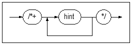
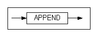
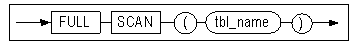
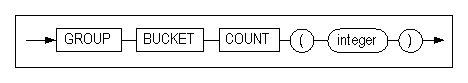
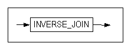
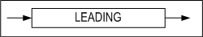
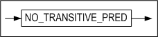
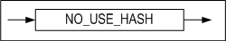
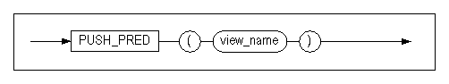
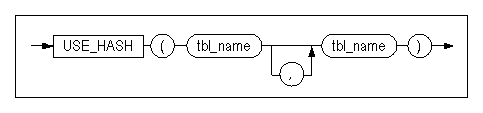

# 2. Altibase SQL Basics

This chapter describes the basics for using Altibase's SQL.

### Comments

In Altibase, the following two types of comment delimiters can be used in SQL statements:

- /\*         \*/  
  In the same way as using the same syntax as in C, the start of a comment is indicated with '/*' and the end with '\*/'. This kind of comment can occupy multiple lines. 
- \--  
  Use two hyphen '-' characters to indicate the start of a single-line comment.

###  Altibase Objects

Altibase provides the following data objects that are either schema objects or non-schema objects:

- ###### Schema Objects
  - Constraint
  - Index
  - Sequence
  - Synonym
  - Table
  - Stored procedure
  - View
  - Trigger
  - Database link

- ###### Non-Schema Objects
  - User
  - Replication
  - Tablespace
  - Directory

#### Rules for Object Names

##### Object Names

Database objects are named using identifiers that follow these rules:

- The maximum length of an identifier is 40 bytes. 

- Users can choose to enclose an identifier in double quotation marks (“) or not. If users create  40 SQL Reference an object and specify its name in double quotation marks, it must always be referenced that way. 

- A nonquoted identifier is not surrounded by delimiters and is case insensitive. Altibase internally changes names to upper-case letters. Quoted identifiers are case sensitive.

  ```
  employees, EMPLOYEES, “EMPLOYEES”
  ```

- Nonquoted identifiers can contain upper and lowercases letters of the alphabet, numeric character between 0 ~ 9, the underscore character ('_'), the dollar-sign character ("$") and the pound-sign character ('#'). An identifier must start with either a letter or the underscore character('\_'). Nonquoted identified cannot begin with 'V\$', 'X\$, or 'D\$'.
  
- Quoted identifiers can contain characters, punctuation marks and spaces, but not double quotation marks.
  
- Altibase reserved words cannot be used as object names (A list of reserved words in Altibase is provided below.).
  
- Objects should not share the same name within the same namespace.

  - The following schema objects share one namespace:  
    Tables, Views, Sequences, Synonyms, Stored procedures
  - The following schema objects have their own namespace:  
    Constraints, Indexes, Triggers, Database link objects
  - A table and view in the same schema cannot share the same name because tables and views share the same namespace. However, a table and index can share the same name in the same namespace because tables and indexes exist in different namespaces.  
  - The following non-schema objects also have their own namespace:  
    Users, Replication objects, Tablespaces, Directory objects.

For more detailed information about Altibase objects, please refer to the *Administrator's Manual*.

##### Passwords

Altibase uses password authentication. This means that the user has to enter a password when logging into the database.

The password the user uses to connect to Altibase also has similar constraints as the object name: characters for passwords are A\~Z, a\~z, 0~9, _, and $. In addition, Altibase's reserved words cannot be in passwords. The first character must be a letter or _. The maximum length of the password is 40 bytes.

Altibase automatically converts lowercase passwords to uppercase by default. However, you can create a case sensitive password by setting the value of CASE_SENSITIVE_PASSWORD to 1, and then enclosing the password in quotation marks, when creating a user with the CREATE USER statement. If you omit the quotation marks, the database will convert the string to uppercase, even if the value of CASE_SENSITIVE_PASSWORD is 1.

##### Reserved Words.

The following words are reserved words in Altibase, and cannot be used as database object names or passwords. The (O) indicates that the keyword cannot be used as a database object name but can be used as a column name. You should keep this in mind when creating database objects and writing SQL statements.

<table width="520">
<tbody>
<tr>
<td width="170">
<p>_PROWID</p>
</td>
<td width="189">
<p>FIFO(O)</p>
</td>
<td width="161">
<p>PRIMARY</p>
</td>
</tr>
<tr>
<td width="170">
<p>ACCESS(O)</p>
</td>
<td width="189">
<p>FIXED(O)</p>
</td>
<td width="161">
<p>PRIOR</p>
</td>
</tr>
<tr>
<td width="170">
<p>ADD</p>
</td>
<td width="189">
<p>FLASHBACK(O)</p>
</td>
<td width="161">
<p>PROCEDURE</p>
</td>
</tr>
<tr>
<td width="170">
<p>AFTER(O)</p>
</td>
<td width="189">
<p>FLUSH(O)</p>
</td>
<td width="161">
<p>PURGE</p>
</td>
</tr>
<tr>
<td width="170">
<p>AGER(O)</p>
</td>
<td width="189">
<p>FLUSHER(O)</p>
</td>
<td width="161">
<p>QUEUE</p>
</td>
</tr>
<tr>
<td width="170">
<p>ALL</p>
</td>
<td width="189">
<p>FOLLOWING(O)</p>
</td>
<td width="161">
<p>RAISE</p>
</td>
</tr>
<tr>
<td width="170">
<p>ALTER</p>
</td>
<td width="189">
<p>FOR</p>
</td>
<td width="161">
<p>READ</p>
</td>
</tr>
<tr>
<td width="170">
<p>AND</p>
</td>
<td width="189">
<p>FOREIGN</p>
</td>
<td width="161">
<p>REBUILD</p>
</td>
</tr>
<tr>
<td width="170">
<p>ANY</p>
</td>
<td width="189">
<p>FROM</p>
</td>
<td width="161">
<p>RECOVER</p>
</td>
</tr>
<tr>
<td width="170">
<p>APPLY</p>
</td>
<td width="189">
<p>FULL(O)</p>
</td>
<td width="161">
<p>REMOVE</p>
</td>
</tr>
<tr>
<td width="170">
<p>ARCHIVE(O)</p>
</td>
<td width="189">
<p>FUNCTION(O)</p>
</td>
<td width="161">
<p>RENAME</p>
</td>
</tr>
<tr>
<td width="170">
<p>ARCHIVELOG(O)</p>
</td>
<td width="189">
<p>GOTO(O)</p>
</td>
<td width="161">
<p>REPLACE</p>
</td>
</tr>
<tr>
<td width="170">
<p>AS</p>
</td>
<td width="189">
<p>GRANT</p>
</td>
<td width="161">
<p>RETURN</p>
</td>
</tr>
<tr>
<td width="170">
<p>ASC</p>
</td>
<td width="189">
<p>GROUP</p>
</td>
<td width="161">
<p>RETURNING</p>
</td>
</tr>
<tr>
<td width="170">
<p>AT(O)</p>
</td>
<td width="189">
<p>HAVING</p>
</td>
<td width="161">
<p>REVOKE</p>
</td>
</tr>
<tr>
<td width="170">
<p>AUDIT(O)</p>
</td>
<td width="189">
<p>IF(O)</p>
</td>
<td width="161">
<p>RIGHT</p>
</td>
</tr>
<tr>
<td width="170">
<p>AUTOEXTEND(O)</p>
</td>
<td width="189">
<p>IN</p>
</td>
<td width="161">
<p>ROLLBACK</p>
</td>
</tr>
<tr>
<td width="170">
<p>BACKUP(O)</p>
</td>
<td width="189">
<p>INDEX</p>
</td>
<td width="161">
<p>ROLLUP</p>
</td>
</tr>
<tr>
<td width="170">
<p>BEFORE(O)</p>
</td>
<td width="189">
<p>INITRANS(O)</p>
</td>
<td width="161">
<p>ROW</p>
</td>
</tr>
<tr>
<td width="170">
<p>BEGIN(O)</p>
</td>
<td width="189">
<p>INNER(O)</p>
</td>
<td width="161">
<p>ROWCOUNT</p>
</td>
</tr>
<tr>
<td width="170">
<p>BETWEEN</p>
</td>
<td width="189">
<p>INSERT</p>
</td>
<td width="161">
<p>ROWNUM</p>
</td>
</tr>
<tr>
<td width="170">
<p>BODY(O)</p>
</td>
<td width="189">
<p>INSTEAD</p>
</td>
<td width="161">
<p>ROWTYPE</p>
</td>
</tr>
<tr>
<td width="170">
<p>BULK</p>
</td>
<td width="189">
<p>INTERSECT</p>
</td>
<td width="161">
<p>SAVEPOINT</p>
</td>
</tr>
<tr>
<td width="170">
<p>BY</p>
</td>
<td width="189">
<p>INTO</p>
</td>
<td width="161">
<p>SEGMENT</p>
</td>
</tr>
<tr>
<td width="170">
<p>CASCADE(O)</p>
</td>
<td width="189">
<p>IS</p>
</td>
<td width="161">
<p>SELECT</p>
</td>
</tr>
<tr>
<td width="170">
<p>CASE</p>
</td>
<td width="189">
<p>ISOLATION(O)</p>
</td>
<td width="161">
<p>SEQUENCE</p>
</td>
</tr>
<tr>
<td width="170">
<p>CAST(O)</p>
</td>
<td width="189">
<p>JOIN(O)</p>
</td>
<td width="161">
<p>SESSION</p>
</td>
</tr>
<tr>
<td width="170">
<p>CHECKPOINT(O)</p>
</td>
<td width="189">
<p>KEY(O)</p>
</td>
<td width="161">
<p>SET</p>
</td>
</tr>
<tr>
<td width="170">
<p>CLOSE(O)</p>
</td>
<td width="189">
<p>LANGUAGE(O)</p>
</td>
<td width="161">
<p>SHARD</p>
</td>
</tr>
<tr>
<td width="170">
<p>COALESCE(O)</p>
</td>
<td width="189">
<p>LATERAL</p>
</td>
<td width="161">
<p>SOME</p>
</td>
</tr>
<tr>
<td width="170">
<p>COLUMN</p>
</td>
<td width="189">
<p>LEFT(O)</p>
</td>
<td width="161">
<p>SPLIT</p>
</td>
</tr>
<tr>
<td width="170">
<p>COMMENT(O)</p>
</td>
<td width="189">
<p>LESS(O)</p>
</td>
<td width="161">
<p>SQLCODE</p>
</td>
</tr>
<tr>
<td width="170">
<p>COMMIT(O)</p>
</td>
<td width="189">
<p>LEVEL</p>
</td>
<td width="161">
<p>SQLERRM</p>
</td>
</tr>
<tr>
<td width="170">
<p>COMPILE(O)</p>
</td>
<td width="189">
<p>LIBRARY(O)</p>
</td>
<td width="161">
<p>START</p>
</td>
</tr>
<tr>
<td width="170">
<p>COMPRESS</p>
</td>
<td width="189">
<p>LIFO(O)</p>
</td>
<td width="161">
<p>STEP</p>
</td>
</tr>
<tr>
<td width="170">
<p>COMPRESSED(O)</p>
</td>
<td width="189">
<p>LIKE</p>
</td>
<td width="161">
<p>STORAGE</p>
</td>
</tr>
<tr>
<td width="170">
<p>CONJOIN(O)</p>
</td>
<td width="189">
<p>LIMIT(O)</p>
</td>
<td width="161">
<p>STORE</p>
</td>
</tr>
<tr>
<td width="170">
<p>CONNECT</p>
</td>
<td width="189">
<p>LINK</p>
</td>
<td width="161">
<p>SYNONYM</p>
</td>
</tr>
<tr>
<td width="170">
<p>CONSTANT</p>
</td>
<td width="189">
<p>LINKER</p>
</td>
<td width="161">
<p>TABLE</p>
</td>
</tr>
<tr>
<td width="170">
<p>CONSTRAINTS(O)</p>
</td>
<td width="189">
<p>LOB</p>
</td>
<td width="161">
<p>THAN</p>
</td>
</tr>
<tr>
<td width="170">
<p>CONTINUE(O)</p>
</td>
<td width="189">
<p>LOCAL</p>
</td>
<td width="161">
<p>THEN</p>
</td>
</tr>
<tr>
<td width="170">
<p>CREATE</p>
</td>
<td width="189">
<p>LOCK</p>
</td>
<td width="161">
<p>TO</p>
</td>
</tr>
<tr>
<td width="170">
<p>CROSS</p>
</td>
<td width="189">
<p>LOGANCHOR</p>
</td>
<td width="161">
<p>TOP</p>
</td>
</tr>
<tr>
<td width="170">
<p>CUBE(O)</p>
</td>
<td width="189">
<p>LOGGING</p>
</td>
<td width="161">
<p>TRIGGER</p>
</td>
</tr>
<tr>
<td width="170">
<p>CURSOR(O)</p>
</td>
<td width="189">
<p>LOOP</p>
</td>
<td width="161">
<p>TRUE</p>
</td>
</tr>
<tr>
<td width="170">
<p>CYCLE(O)</p>
</td>
<td width="189">
<p>MAXROWS</p>
</td>
<td width="161">
<p>TRUNCATE</p>
</td>
</tr>
<tr>
<td width="170">
<p>DATABASE(O)</p>
</td>
<td width="189">
<p>MAXTRANS</p>
</td>
<td width="161">
<p>TYPE</p>
</td>
</tr>
<tr>
<td width="170">
<p>DECLARE(O)</p>
</td>
<td width="189">
<p>MERGE</p>
</td>
<td width="161">
<p>TYPESET</p>
</td>
</tr>
<tr>
<td width="170">
<p>DECRYPT(O)</p>
</td>
<td width="189">
<p>MINUS</p>
</td>
<td width="161">
<p>UNION</p>
</td>
</tr>
<tr>
<td width="170">
<p>DEFAULT</p>
</td>
<td width="189">
<p>MODE</p>
</td>
<td width="161">
<p>UNIQUE</p>
</td>
</tr>
<tr>
<td width="170">
<p>DELAUDIT(O)</p>
</td>
<td width="189">
<p>MODIFY</p>
</td>
<td width="161">
<p>UNLOCK</p>
</td>
</tr>
<tr>
<td width="170">
<p>DELETE</p>
</td>
<td width="189">
<p>MOVE</p>
</td>
<td width="161">
<p>UNPIVOT</p>
</td>
</tr>
<tr>
<td width="170">
<p>DEQUEUE(O)</p>
</td>
<td width="189">
<p>MOVEMENT</p>
</td>
<td width="161">
<p>UNTIL</p>
</td>
</tr>
<tr>
<td width="170">
<p>DESC</p>
</td>
<td width="189">
<p>NEW</p>
</td>
<td width="161">
<p>UPDATE</p>
</td>
</tr>
<tr>
<td width="170">
<p>DETERMINISTIC(O)</p>
</td>
<td width="189">
<p>NOAUDIT</p>
</td>
<td width="161">
<p>USING</p>
</td>
</tr>
<tr>
<td width="170">
<p>DIRECTORY(O)</p>
</td>
<td width="189">
<p>NOCOPY</p>
</td>
<td width="161">
<p>VALUES</p>
</td>
</tr>
<tr>
<td width="170">
<p>DISABLE(O)</p>
</td>
<td width="189">
<p>NOCYCLE</p>
</td>
<td width="161">
<p>VARIABLE</p>
</td>
</tr>
<tr>
<td width="170">
<p>DISASTER(O)</p>
</td>
<td width="189">
<p>NOLOGGING</p>
</td>
<td width="161">
<p>VC2COLL</p>
</td>
</tr>
<tr>
<td width="170">
<p>DISCONNECT(O)</p>
</td>
<td width="189">
<p>NOT</p>
</td>
<td width="161">
<p>VIEW</p>
</td>
</tr>
<tr>
<td width="170">
<p>DISJOIN(O)</p>
</td>
<td width="189">
<p>NULL</p>
</td>
<td width="161">
<p>VOLATILE</p>
</td>
</tr>
<tr>
<td width="170">
<p>DISTINCT</p>
</td>
<td width="189">
<p>NULLS</p>
</td>
<td width="161">
<p>WAIT</p>
</td>
</tr>
<tr>
<td width="170">
<p>DROP</p>
</td>
<td width="189">
<p>OF</p>
</td>
<td width="161">
<p>WHEN</p>
</td>
</tr>
<tr>
<td width="170">
<p>EACH(O)</p>
</td>
<td width="189">
<p>OFF</p>
</td>
<td width="161">
<p>WHENEVER</p>
</td>
</tr>
<tr>
<td width="170">
<p>ELSE</p>
</td>
<td width="189">
<p>OFFLINE</p>
</td>
<td width="161">
<p>WHERE</p>
</td>
</tr>
<tr>
<td width="170">
<p>ELSEIF(O)</p>
</td>
<td width="189">
<p>OLD</p>
</td>
<td width="161">
<p>WHILE</p>
</td>
</tr>
<tr>
<td width="170">
<p>ELSIF(O)</p>
</td>
<td width="189">
<p>ON</p>
</td>
<td width="161">
<p>WITH</p>
</td>
</tr>
<tr>
<td width="170">
<p>ENABLE(O)</p>
</td>
<td width="189">
<p>ONLINE</p>
</td>
<td width="161">
<p>WITHIN</p>
</td>
</tr>
<tr>
<td width="170">
<p>END(O)</p>
</td>
<td width="189">
<p>OPEN</p>
</td>
<td width="161">
<p>WORK</p>
</td>
</tr>
<tr>
<td width="170">
<p>ENQUEUE(O)</p>
</td>
<td width="189">
<p>OR</p>
</td>
<td width="161">
<p>WRAPPED</p>
</td>
</tr>
<tr>
<td width="170">
<p>ESCAPE(O)</p>
</td>
<td width="189">
<p>ORDER</p>
</td>
<td width="161">
<p>WRITE</p>
</td>
</tr>
<tr>
<td width="170">
<p>EXCEPTION</p>
</td>
<td width="189">
<p>OTHERS</p>
</td>
<td width="161">&nbsp;</td>
</tr>
<tr>
<td width="170">
<p>EXEC(O)</p>
</td>
<td width="189">
<p>OUT</p>
</td>
<td width="161">&nbsp;</td>
</tr>
<tr>
<td width="170">
<p>EXECUTE(O)</p>
</td>
<td width="189">
<p>OUTER</p>
</td>
<td width="161">&nbsp;</td>
</tr>
<tr>
<td width="170">
<p>EXISTS</p>
</td>
<td width="189">
<p>OVER</p>
</td>
<td width="161">&nbsp;</td>
</tr>
<tr>
<td width="170">
<p>EXIT(O)</p>
</td>
<td width="189">
<p>PACKAGE</p>
</td>
<td width="161">&nbsp;</td>
</tr>
<tr>
<td width="170">
<p>EXTENT(O)</p>
</td>
<td width="189">
<p>PARALLEL</p>
</td>
<td width="161">&nbsp;</td>
</tr>
<tr>
<td width="170">
<p>EXTENTSIZE(O)</p>
</td>
<td width="189">
<p>PARTITION</p>
</td>
<td width="161">&nbsp;</td>
</tr>
<tr>
<td width="170">
<p>FALSE</p>
</td>
<td width="189">
<p>PIVOT</p>
</td>
<td width="161">&nbsp;</td>
</tr>
<tr>
<td width="170">
<p>FETCH(O)</p>
</td>
<td width="189">
<p>PRECEDING</p>
</td>
<td width="161">&nbsp;</td>
</tr>
</tbody>
</table>
[[Table 2-1] List of Reserved Words]()

### HINT

#### Syntax

hints ::=



#### Prerequisites

The hint can be specified in the following:

- Simple SELECT, UPDATE, DELETE, and INSERT statements 
- The main query or subquery of a compound statement 
- The initial query of a compound statement (enclosed in a set operator)

#### Description

Users can specify the hint after the SELECT, UPDATE, DELETE, and INSERT keywords.

A plus sign (+) after a comment delimiter (/*) tells Altibase that the comment is a hint. The plus sign must follow immediately after the comment delimiter. 

Users can specify multiple hints in a single comment by separating them with blank spaces. If a hint has a syntax error, Altibase ignores the hint and executes the query. 

For more detailed information about each hint, please refer to the next section. 

For more detailed information about using hints for query tuning, please refer to the *Performance Tuning Guide*. 

#### Examples

##### Direct-Path INSERT Hint

 Insert all data from table T1 to table T2 as a direct-PATH INSERT operation. INSERT /*+ APPEND */ INTO T2 SELECT * FROM T1;

```
INSERT /*+ APPEND */ INTO T2 SELECT * FROM T1;
```


##### Table Access Method Hints (full scan, index scan, index ascending order scan, index descending order scan, no index scan)

The following query selects the employee numbers, names, and occupations of all the female employees.

```
SELECT eno, e_firstname, e_lastname, emp_job FROM employees WHERE sex = 'F';
```

For example, an index would be created on the Gender (SEX) column of the table EMPLOYEES witht he number of employees, and the value of this column would be either 'M' or 'F'.

If there are as many male employees as female employees, a full scan would be faster than an index scan. However, if there are many more male employees than female employees, an index scan would be faster than a full scan. If a column has only two different values, the query optimizer assumes that half of the rows contain each value and uses the cost-based approach to perform a full scan. 

Comparing the numbers of accesses in the queries below, the numbers of accesses are 20 and 4, respectively. 

<Query\> Select the employee numbers, names, and jobs of all female employees (use a full scan). 

```
iSQL> SELECT /*+ FULL SCAN(employees) */ eno, e_firstname, e_lastname, emp_job
 FROM employees 
 WHERE sex = 'F';
ENO E_FIRSTNAME E_LASTNAME EMP_JOB 
------------------------------------------------
.
.
.
------------------------------------------------
PROJECT ( COLUMN_COUNT: 4, TUPLE_SIZE: 65, COST: 0.18 )
 SCAN ( TABLE: EMPLOYEES, FULL SCAN, ACCESS: 20, COST: 0.14 )
------------------------------------------------
```

<Query\> Select the employee numbers, names, and jobs of all female employees (use an index scan). 

```
iSQL> CREATE INDEX gender_index ON employees(sex);
Create success.
iSQL> SELECT /*+ INDEX(employees, gender_INDEX) use gender_index because there are few female employees */ eno, e_firstname, e_lastname, emp_job
 FROM employees
 WHERE sex = 'F';
ENO E_FIRSTNAME E_LASTNAME EMP_JOB 
------------------------------------------------
.
.
.
------------------------------------------------
PROJECT ( COLUMN_COUNT: 4, TUPLE_SIZE: 65 )
 SCAN ( TABLE: EMPLOYEES, INDEX: GENDER_INDEX, ACCESS: 4, SELF_ID: 2 )
------------------------------------------------
```

<Query\> Select the order numbers, good numbers, and order quantities for all orders between January and March (use an index scan). The order table for each month is called ORDERS_##.

```
create view orders as
select ono, order_date, eno, cno, gno, qty from orders_01
union all
select ono, order_date, eno, cno, gno, qty from orders_02
union all
select ono, order_date, eno, cno, gno, qty from orders_03;
create index order1_gno on orders_01(gno);
create index order2_gno on orders_02(gno);
create index order3_gno on orders_03(gno);

iSQL> select /*+ index( orders, 
           orders1_gno, orders2_gno,orders3_gno ) */
           ONO, GNO, QTY
      from orders;
ONO                  GNO         QTY         
-------------------------------------------------
.
.
.
------------------------------------------------
PROJECT ( COLUMN_COUNT: 3, TUPLE_SIZE: 24 )
 VIEW ( ORDERS, ACCESS: 14, SELF_ID: 6 )
  PROJECT ( COLUMN_COUNT: 6, TUPLE_SIZE: 48 )
   VIEW ( ACCESS: 14, SELF_ID: 5 )
    BAG-UNION
     PROJECT ( COLUMN_COUNT: 6, TUPLE_SIZE: 48 )
      SCAN ( TABLE: ORDERS_01, INDEX: ORDERS1_GNO, ACCESS: , SELF_ID: 0 )
     PROJECT ( COLUMN_COUNT: 6, TUPLE_SIZE: 48 )
      SCAN ( TABLE: ORDERS_02, INDEX: ORDERS2_GNO, ACCESS: 4, SELF_ID: 1 )
     PROJECT ( COLUMN_COUNT: 6, TUPLE_SIZE: 48 )
      SCAN ( TABLE: ORDERS_03, INDEX: ORDERS3_GNO, ACCESS: 7, SELF_ID: 4 )
------------------------------------------------
```


##### Join Order Hints (ordered, optimized)

\<Query\> Select the employee number, name, and customer name of the employee who is in charge of the order (join the tables EMPLOYEES and CUSTOMERS, and then use the ORDERED hint to join that with the table ORDERS).

```
iSQL> SELECT /*+ ORDERED */ DISTINCT o.eno, e.e_lastname, c.c_lastname
FROM employees e, customers c, orders o
WHERE e.eno = o.eno AND o.cno = c.cno;
ENO E_LASTNAME C_LASTNAME 
------------------------------------------------
.
.
.
------------------------------------------------
PROJECT ( COLUMN_COUNT: 3, TUPLE_SIZE: 48 )
 DISTINCT ( ITEM_SIZE: 40, ITEM_COUNT: 21, BUCKET_COUNT: 1024, ACCESS: 21, SELF_ID: 4, REF_ID: 3 )
 JOIN
 JOIN
 SCAN ( TABLE: EMPLOYEES E, FULL SCAN, ACCESS: 20, SELF_ID: 1 )
 SCAN ( TABLE: CUSTOMERS C, FULL SCAN, ACCESS: 400, SELF_ID: 2 )
 SCAN ( TABLE: ORDERS O, FULL SCAN, ACCESS: 12000, SELF_ID: 3 )
------------------------------------------------
```

<Query\> Select the employee number, name, and customer name of the employee who is in charge of the order (let the optimizer determine the table join order, regardless of the table join order in the FORM clause).

```
iSQL> SELECT DISTINCT o.eno, e.e_lastname, c.c_lastname
FROM employees e, customers c, orders o 
WHERE e.eno = o.eno AND o.cno = c.cno;
ENO E_LASTNAME C_LASTNAME 
------------------------------------------------
.
.
.
------------------------------------------------
PROJECT ( COLUMN_COUNT: 3, TUPLE_SIZE: 48 )
 DISTINCT ( ITEM_SIZE: 40, ITEM_COUNT: 21, BUCKET_COUNT: 1024, ACCESS: 21, SELF_ID: 4, REF_ID: 1 )
 JOIN
 JOIN
 SCAN ( TABLE: CUSTOMERS C, FULL SCAN, ACCESS: 20, SELF_ID: 2 )
 SCAN ( TABLE: ORDERS O, INDEX: ODR_IDX2, ACCESS: 30, SELF_ID: 3 )
 SCAN ( TABLE: EMPLOYEES E, INDEX: __SYS_IDX_ID_366, ACCESS: 30, SELF_ID: 1 )
------------------------------------------------
```


##### Optimizer Mode Hints (rule, cost)

```
iSQL> SELECT /*+ RULE */ * FROM t1, t2 WHERE t1.i1 = t2.i1;
iSQL> SELECT /*+ COST */ * FROM t1, t2 WHERE t1.i1 = t2.i1;
```


##### Normal Form Hints (cnf, dnf)

```
iSQL> SELECT /*+ CNF */ * FROM t1 WHERE i1 = 1 OR i1 = 2;
iSQL> SELECT /*+ DNF */ * FROM t1 WHERE i1 = 1 OR i1 = 2;
```


##### Join Method Hints (nested loop, hash, sort, sort merge)

```
iSQL> SELECT /*+ USE_NL (t1,t2) */ * FROM t1, t2 WHERE t1.i1 = t2.i1;
iSQL> SELECT /*+ USE_HASH (t1,t2) */ * FROM t1, t2 WHERE t1.i1 = t2.i1;
iSQL> SELECT /*+ USE_SORT (t1,t2) */ * FROM t1, t2 WHERE t1.i1 = t2.i1;
iSQL> SELECT /*+ USE_MERGE (t1,t2) */ * FROM t1, t2 WHERE t1.i1 = t2.i1;
```


##### Hash Bucket Size Hints (hash bucket count, group bucket count, set bucket count)

```
iSQL> SELECT /*+ HASH BUCKET COUNT (20) */ DISTINCT * FROM t1;
iSQL> SELECT * FROM t1 GROUP BY i1, i2;
iSQL> SELECT /*+ GROUP BUCKET COUNT (20) */ * FROM t1 GROUP BY i1, i2;
iSQL> SELECT * FROM t1 INTERSECT SELECT * FROM t2;
iSQL> SELECT /*+ SET BUCKET COUNT (20) */  * FROM t1 INTERSECT SELECT * FROM t2;
```


##### Push Predicate Hints

<Query\> Select the customer list and good numbers for orders of more than 10,000 goods between January and March (use the PUSH PREDICATE hint to join the tables CUSTOMERS and ORDERS). 

```
iSQL> create view orders_t as
    2 select ono, order_date, eno, cno, gno, qty from orders orders_01
    3 union all
    4 select ono, order_date, eno, cno, gno, qty from orders orders_02
    5 union all
    6 select ono, order_date, eno, cno, gno, qty from orders orders_03;
Create success.
iSQL> alter session set explain plan = only;
Alter success.
iSQL> alter session set trclog_detail_predicate =1;
Alter success.
iSQL> select /*+ PUSH_PRED(orders_t) */ c_lastname, gno
    2 from customers, orders_t
    3 where customers.cno = orders_t.cno
    4 and orders_t.qty >= 10000;
C_LASTNAME            GNO
-------------------------------------
.
.
.
-----------------------------------------------------------
PROJECT ( COLUMN_COUNT: 2, TUPLE_SIZE: 34, COST: 1.68 )
 JOIN ( METHOD: NL, COST: 1.67 )
  SCAN ( TABLE: SYS.CUSTOMERS, FULL SCAN, ACCESS: ??, COST: 0.23 )
  VIEW ( SYS.ORDERS_T, ACCESS: ??, COST: 0.07 )
   PROJECT ( COLUMN_COUNT: 6, TUPLE_SIZE: 48, COST: 0.04 )
    VIEW ( ACCESS: ??, COST: 0.04 )
     BAG-UNION
      PROJECT ( COLUMN_COUNT: 6, TUPLE_SIZE: 48, COST: 0.01 )
       SCAN ( TABLE: SYS.ORDERS ORDERS_01, INDEX: SYS.ODR_IDX2, RANGE SCAN, ACCESS: ??, COST: 0.01 )
        [ VARIABLE KEY ]
        OR
         AND
          CUSTOMERS.CNO = ORDERS_01.CNO
        [ FILTER ]
        ORDERS_01.QTY >= 10000
      PROJECT ( COLUMN_COUNT: 6, TUPLE_SIZE: 48, COST: 0.01 )
       SCAN ( TABLE: SYS.ORDERS ORDERS_02, INDEX: SYS.ODR_IDX2, RANGE SCAN, ACCESS: ??, COST: 0.01 )
        [ VARIABLE KEY ]
        OR
         AND
          CUSTOMERS.CNO = ORDERS_02.CNO
        [ FILTER ]
        ORDERS_02.QTY >= 10000
      PROJECT ( COLUMN_COUNT: 6, TUPLE_SIZE: 48, COST: 0.01 )
       SCAN ( TABLE: SYS.ORDERS ORDERS_03, INDEX: SYS.ODR_IDX2, RANGE SCAN, ACCESS: ??, COST: 0.01 )
        [ VARIABLE KEY ]
        OR
         AND
          CUSTOMERS.CNO = ORDERS_03.CNO
        [ FILTER ]
        ORDERS_03.QTY >= 10000
-----------------------------------------------------------
```


### Hint List

This section briefly discusses how to use hints and their meanings. For more detailed information about how each hint is processed by the query optimizer, please refer to Chapter 3. Query Optimizer in the *Performance Tuning Guide.* 

| Category                     | Hint                                                         |
| ---------------------------- | ------------------------------------------------------------ |
| Optimizer Approach and Goal  | [COST](#cost) [RULE](#rule) [FIRST_ROWS](#first_rows)        |
| Normalization Form           | [CNF](#cnf) [DNF](#dnf) NO_EXPAND USE_CONCAT                 |
| Access Method                | [FULL SCAN](#full-scan) [INDEX](#index) [INDEX ASC](#index-asc) INDEX_ASC [INDEX DESC](#index-desc) <br />INDEX_DESC [NO INDEX](#no-index) NO_INDEX |
| Parallel Processing          | [PARALLEL](#parallel) NO_PARALLEL                            |
| Join Order                   | LEADING [ORDERED](#ORDERED)                                  |
| Join Method                  | [USE_NL](#use_nl) [USE_FULL_NL](#use_full_nl) [USE_FULL_STORE_NL](#use_full_store_nl) [USE_INDEX_NL](#use_index_nl) <br />[USE_ANTI](#use_anti) [USE_HASH](#use_hash) [USE_ONE_PASS_HASH](#use_one_pass_hash) [USE_TWO_PASS_HASH](#use_two_pass_hash) <br />[USE_INVERSE_HASH](#use_inverse_hash) [USE_SORT](#use_sort) [USE_ONE_PASS_SORT](#use_one_pass_sort) <br />[USE_TWO_PASS_SORT](#use_two_pass_sort) [USE_MERGE](#use_inverse_hash) |
| Join Method                  | [NL_SJ](#nl_sj) [HASH_SJ](#hash_sj) [SORT_SJ](#sort_sj) [MERGE_SJ](#merge_sj) [NL_AJ](#nl_aj) [HASH_AJ](#hash_aj) [SORT_AJ](#sort_aj) [MERGE_AJ](#merge_aj) [INVERSE_JOIN](#inverse_join) [NO_INVERSE_JOIN](#no_inverse_join) NO_USE_HASH NO_USE_MERGE <br />NO_USE_NL NO_USE_SORT |
| Query Conversion             | [NO_MERGE](#no_merge) [NO_TRANSITIVE_PRED](#no_transitive_pred) [NO_UNNEST](#no_unnest) [UNNEST](#unnest) |
| Intermediate Result Table    | [TEMP_TBS_DISK](#temp_tbs_disk) [TEMP_TBS_MEMORY](#temp_tbs_memory) |
| Hash Bucket Size             | [GROUP BUCKET COUNT](#group-bucket-count) [HASH BUCKET COUNT](#hash-bucket-count) [SET BUCKET COUNT](#set-bucket-count) |
| Group Process Method         | [GROUP_HASH](#group_hash) [GROUP_SORT](#group_sort)          |
| Duplicate Elimination Method | [DISTINCT_HASH](#distinct_hash) [DISTINCT_SORT](#datafile_spec) |
| View Optimization Method     | [NO_PUSH_SELECT_VIEW](#no_push_select_view) [PUSH_SELECT_VIEW](#push_select_view) [PUSH_PRED](#push_pred) |
| Simple Query                 | [EXEC_FAST](#exec_fast) [NO_EXEC_FAST](#no_exec_fast)        |
| Simple Filter                | [SERIAL_FILTER](#serial_filter) [NO_SERIAL_FILTER](#no_serial_filter) |
| Others                       | [APPEND](#append) [DELAY](#delay) HIGH_PRECISION [KEEP_PLAN](#keep_plan) [NO DELAY](#no-delay) <br />[NO_PLAN_CACHE](#no_plan_cache) RESULT_CACHE TOP_RESULT_CACHE<br />[PLAN_CACHE_KEEP](#PLAN_CACHE_KEEP) |

#### APPEND

This hint specifies a direct-path INSERT operation and can only be used in INSERT statements. Direct-path INSERT creates a new page and inserts data, instead of searching for free space in pages. The V$DIRECT_PATH_INSERT performance view displays statistics for direct-Path INSERT operations. 



#### CNF

This hint specifies that predicates in the WHERE clause are to be normalized in the conjunctive normal form. 


#### COST

If this hint is specified, the optimizer creates an execution plan with the lowest cost.


#### DELAY 

These hints activate a function which delays execution of hierarchy, sorting, windowing, grouping, set, and distinction based upon execution plan graphs regardless of properties in queries so that the execution can be carried out in fetch.


#### DISTINCT_HASH

This hint speicifies HASH for DISTINT.


#### DISTINCT_SORT

This hint specifies SORT for DISTINCT.


#### DNF

This hint specifies that predicates in the WHERE clause are to be normalized in the disjunctive normal form. 


#### EXEC_FAST 

If this hint is specified when EXECUTOR_FAST_SIMPLE_QUERY property is deactivated, simple statements, such as SELECT, INSERT, UPDATE, or DELETE statement are executed with SIMPLE
QUERY. If SIMPLE QUERY is applied, it will be output on the execution plan.


#### FIRST_ROWS

If this hint is specified, the optimizer creates an execution plan that most efficiently returns the first n rows of a table. 


#### FULL SCAN

This hint specifies that the full table scan will be performed for the specified table.



#### GROUP BUCKET COUNT

This hint specifies the number of hash buckets for the GROUP-AGGREGATION and AGGREGATION execution nodes. 



#### GROUP_HASH

This hint specifies HASH for GROUP BY.


#### GROUP_SORT

This hint specifies SORT for GROUP BY.


#### HASH_AJ

If this hint is specified, a nested subquery uses a hash join to perform an anti-join. You need to specify this hint within the subquery. If the subquery cannot be unnested with an anti-join, this hint becomes invalid. 


#### HASH BUCKET COUNT

This hint specifies the number of hash buckets for the HASH and DISTINCT execution nodes. 


#### HASH_SJ

If this hint is specified, a nested subquery uses a hash join to perform a semi-join. You need to specify this hint within the subquery. If the subquery cannot be unnested with a semi-join, this hint becomes invalid.


#### HIGH_PRECISION

This is a hint used for preventing errors in the four fundamental arithmetic operations and mod operation. 

When this hint is used, the float type is used as the data type. When operating with a float type, computational performance may be lower than that of a real or double data type. But, the precision of up to 38 digits and mod operation is guaranteed. 


#### INDEX

This hint specifies an index scan. 


#### INDEX ASC

This hint specifies an index scan in ascending order.


#### INDEX_ASC

This hint performs the same action equivalent to the INDEX ASC hint.


#### INDEX DESC

This hint specifies an index scan in descending order. 


#### INDEX_DESC

This hint performs the same action equivalent to the INDEX DESC hint.


#### INVERSE_JOIN

If this hint is specified, a nested subquery uses an inverse join[^1] to perform either an anti-join or a semi-join. You need to specify this hint within the subquery. 

[^1]: An inverse join can be either an inverse index nested loop join, an inverse hash join, or an inverse sort join. For more detailed information about inverse joins, please refer to the *Performance Tuning Guide*.

This hint can be used with other hints that force semi-joins or anti-joins. For example, this hint forces an inverse hash join if it is used with the HASH_SJ hint.



#### KEEP_PLAN

If this hint is specified, the optimizer uses an exisiting execution plan (instead of recreating it) whenever the statistics for a table that is referenced by the plan changes. This hint can be used to prepare/execute and direct/execute a query. 


#### LEADING

This hint firstly joins the tables that are used in a hint. If more than one LEADING hint is used, only the first LEADING hint is effective. When used with the ORDERED hint, the ORDERED hint is ignored. If the Lateral View is specified in the table used for hint, it has no effect.



#### MERGE_AJ

If this hint is specified, a nested subquery uses a merge join to perform an anti-join. You need to specify this hint within the subquery. If the subquery cannot be unnested with an anti-join, this hint becomes invalid.


#### MERGE_SJ

If this hint is specified, a nested subquery uses a merge join to perform a semi-join. Users need to specify this hint within the subquery. If the subquery cannot be unnested with a semi-join, this hint becomes invalid. 


#### NL_AJ

If this hint is specified, a nested subquery uses a nested loop join to perform an anti-join. Users need to specify this hint within the subquery. If the subquery cannot be unnested with an anti-join, this hint becomes invalid. 


#### NL_SJ

If this hint is specified, a nested subquery uses a nested loop join to perform a semi-join. Users need to specify this hint within the subquery. If the subquery cannot be unnested with a semi-join, this hint becomes invalid. 


#### NO DELAY 

This hint deactivates aforementioned delaying function . Delaying execution of hierarchy, sorting, windowing, grouping, set, and distinction based upon execution plan graphs is not activated


#### NO_EXEC_FAST 

Even though SELECT, INSERT, UPDATE, DELETE statements are simple statements, they are not executed with SIMPLE QUERY if this hint is specified when EXECUTOR_FAST_SIMPLE_QUERY property is deactivated.


#### NO_EXPAND

This hint performs the same action equivalent to the CNF hint.


#### NO INDEX

This hint specifies not to perform an index scan. 


#### NO_INDEX

This hint performs the same action equivalent to the NO INDEX hint.


#### NO_INVERSE_JOIN

If this hint is specified, a nested subquery uses a one-pass hash join or a two-pass hash join to perform either an anti-join or a semi-join. Users need to specify this hint within the subquery. 

This hint can be used with other hints that force semi-joins or anti-joins. For example, this hint forces a one-pass hash join or a two-pass hash join if it is used with the HASH_SJ hint.


#### NO_MERGE

This hint instructs not to merge the main query and inline view query into one query.


#### NO_PARALLEL

This hint performs the same action equivalent to the NOPARALLEL hint.


#### NO_PLAN_CACHE

This hint specifies that the plan cache is not to store plans. 


#### NO_PUSH_SELECT_VIEW

This hint specifies that a WHERE predicate outside a view is not to be pushed inside the view.


#### NO_SERIAL_FILTER

If a hint is specified while the SERIAL_EXECUTE_MODE property is enabled, it will not operate in Serial Execute Mode.


#### NO_TRANSITIVE_PRED

This hint specifies that predicate transitivity is not to be allowed. For more detailed information about predicate transitivity, please refer to the *Performance Tuning Guide* in Chapter 3: Query Optimizer.



#### NO_UNNEST

This hint specifies not to unnest a subquery. 


#### NO_USE_HASH

This hint selects a join method from among the hints excluding the HASH hint. 



#### NO_USE_MERGE

This hint selects a join method from among the hints excluding the MERGE hint.


#### NO_USE_NL

This hint selects a join method from among the hints excluding the NL hint.


#### NO_USE_SORT

This hint selects a join method from among the hints excluding the SORT hint.


#### PARALLEL

This hint specifies to execute queries in parallel when scanning partitioned tables. 

- NOPARALLEL: Does not execute in parallel
- PARALLEL integer: Executes as many threads in parallel as specified for integer


#### PLAN_CACHE_KEEP

This is used to instruct the plan to exclude it from the victim selection process and keep it in the plan cache. This hint is applied during the hardprepare process. So when users switch the plan to unkeep, the soft prepare will not go back tothe keep state.


#### ORDERED

This hint specifies to follow the join order in the FROM clause. 


#### PUSH_PRED

This hint specifies that a WHERE predicate outside a view is to be pushed inside the view.



#### PUSH_SELECT_VIEW

This hint specifies that a WHERE predicate outside a view is to be pushed inside the view.


#### RESULT_CACHE

If this hint is specified, the intermediate results of the firstly query can be stored so that the results can be re-usable when the same query is executed. 


#### RULE

If this hint is specified, the optimizer creates a rule-based execution plan.


#### SET BUCKET COUNT

It is a hint to specify the number of hash buckets for SET-INTERSECT and SET-DIFFERENCE execution nodes.


#### SERIAL_FILTER

If the hint is specified while the SERIAL_EXCUTE_MODE property is disabled, it operates in Serial Excute mode.


#### SORT_AJ

If this hint is specified, a nested subquery uses a sort join to perform an anti-join. You need to specify this hint within the subquery. If the subquery cannot be unnested with an anti-join, this hint becomes invalid. 


#### SORT_SJ

If this hint is specified, a nested subquery uses a sort join to perform a semi-join. You need to specify this hint within the subquery. If the subquery cannot be unnested with a semi-join, this hint becomes invalid. 


#### TEMP_TBS_DISK

This hint specifies that all intermediate query results are to be stored on disk temporary space.


#### TEMP_TBS_MEMORY

This hint specifies that all intermediate query results are to be stored in memory temporary space.


#### TOP_RESULT_CACHE

This hints specifies the top result cache that the final results is cached. 


#### UNNEST

This hint specifies that a subquery is to be unnested.


#### USE_ANTI

This hint specifies that a left outer join and an anti outer join are to be performed on the table in the FULL OUTER JOIN query and to concatenate the results. This hint is only available if both of the joined columns have indexes. For more detailed information, please refer to the ANTI-OUTER-JOIN node. 


#### USE_CONCAT

This hint performs the same action equivalent to the DNF hint.


#### USE_FULL_NL

This hint specifies that a full nested loop join is to be used. 


#### USE_FULL_STORE_NL

This hint specifies that a full store nested loop join is to be used. 


#### USE_HASH

This hint specifies that a hash join is to be used. If there is no join predicate, a nested loop join is used. 



#### USE_INDEX_NL

This hint specifies that an index nested loop join is to be used. 


#### USE_INVERSE_HASH

This hint specifies that an inverse hash join is to be used. 


#### USE_MERGE

This hint specifies that a sort merge join is to be used. If there is no sort predicate, a nested loop join is used. 


#### USE_NL

This hint specifies that a nested loop join is to be used. 


#### USE_ONE_PASS_HASH

This hint specifies that a one-pass hash join is to be used. 


#### USE_ONE_PASS_SORT

This hint specifies that a one-pass sort join is to be used. 


#### USE_SORT

This hint specifies that a sort join is to be used. If there is no sort predicate, a nested loop join is used. 


#### USE_TWO_PASS_HASH

This hint specifies that a two-pass hash join is to be used. 


#### USE_TWO_PASS_SORT

This hint specifies that a two-pass sort join is to be used. 


