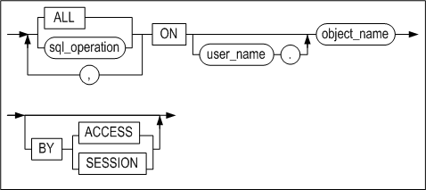

# 5. Data Control Language

This chapter explains each of the Data Control Language (DCL) statements that are available in Altibase.

### ALTER REPLICATION 

#### Syntax

**alter_replication_dcl ::=**


#### Description

ALTER REPLICATION controls the operation of a replication object that has been created with the CREATE REPLICATION statement. For more information about replication, please refer to the *Replication Manual.* 

*STOP*

This stops the replication.

*FLUSH*

This is used to instruct the current session to wait, for the number of seconds specified in wait_time, for the replication Sender thread to send information about changed data, up to the current log (the log at the time the FLUSH statement is executed), to the other server. 

If this is used together with the ALL option, the current session is instructed to wait until the information about changed data in the most recent log, rather than the current log, has been transferred to the other server.

#### Example

- Stop the replication object rep1. 

  \<Query\> Stop the replication.

  ```
  iSQL> ALTER REPLICATION rep1 STOP;
  Alter success.
  ```


### ALTER SESSION 

#### Syntax

**alter_session::=**


[set_transaction_clause::=](#set_transaction)

**alter_session_set_clause::=**


**replication_mode_set_clause::=**


**dblink_session_close_clause::=**


#### Description

This statement is used to change the attributes of the current session.

*alter_session_set_clause*

For more information on property_name and property_value in alter_session_set_clause, please refer to Chapter 2 of the *General Reference*, which explains all Altibase properties.

*replication_mode_set_clause*

This clause is used to set the replication mode for transactions that are executed in the current session. 

If DEFAULT is specified, replication will be performed in the mode that was selected as the default mode when the replication object was created. However, if NONE is specified, none of the DDL, DML, or DCL statements executed in the session will be replicated. 

For more detailed information on the replication mode, please refer to the *Replication Manual.*

*dblink_session \_close_clause*

When a user connects to a server, a session is created in the server. If Database Link is used in that session, a Database Link session, for use in performing Database Link-related tasks, is created in association with the session allocated to the user. When the user's session is subsequently terminated, the Database Link session is also terminated. However, if the user's session is not terminated after the Database Link operations have been performed, the Database Link session will also needlessly remain open.

In such cases, dblink_session_close_clause can be used to explicitly end the Database Link session.

*set_transaction_clause*

The SET TRANSACTION statement is used to set the current transaction as read-only or read/write, or to set its isolation level. For more information on the SET TRANSACTION statement, refer to the description section of the SET TRANSACTION statement.

#### Example

\<Query\> Close the database link session only, keeping the current session alive.

```
iSQL> ALTER SESSION CLOSE DATABASE LINK ALL;
```


### ALTER SYSTEM 

#### Syntax

**alter_system ::=**


**alter_system_set_clause ::=**


#### Description

The ALTER SYSTEM statement is used to change Altibase system properties. Only the SYS user or a user to whom the ALTER SYSTEM privilege has been granted can access the complete functionality of the ALTER SYSTEM statement.

*CHECKPOINT*

This is used to execute checkpointing.

*MEMORY COMPACT*

This is used to perform memory compaction. It is only useful on the IBM AIX platform.

*START/STOP FLUSHER integer*

This is used to start up or shut down the flusher. The flusher identifier of the integer can be viewed by querying the V$FLUSHER performance view.

*ARCHIVE LOG START/STOP*

Executing ALTER SYSTEM ARCHIVE LOG START starts the Archivelog thread, whereas ALTER SYSTEM ARCHIVE LOG STOP stops the thread. This statement can be executed only when the system is running in Archivelog mode. To determine whether the system is running in Archivelog mode, query the V\$LOG or V$ARCHIVE performance view. 

For more detailed information about Archivelog mode, please refer to Chapter 10: Backup and Recovery in the *Administrator's Manual.*

*SWITCH LOGFILE*

This statement forcibly archives log files. Even if the current log file is not full, this command instructs the database to close it and resume logging in the next log file. 

Only the sysdba can execute this statement.

*SET alter_system_set_clause*

This statement is used to change the values of database properties. For more information about these properties, please refer to the *General Reference.*

*FLUSH BUFFER_POOL*

This statement flushes all pages that are in the buffer to disk, thereby emptying the buffer.

Only the sysdba can execute this statement. It should only be executed after careful consideration. Because execution of this statement deletes all of the pages in the buffer, “buffer miss”, that is, failure to find records that are being sought in the buffer, can occur upon subsequent query execution. 

*COMPACT SQL_PLAN_CACHE*

This removes the execution plan which is not being used in the SQL plan cache.

*RESET SQL_PLAN_CACHE*

This removes the execution plan which is not being used in the SQL plan cache and initializes statistical information related to the plan cache.

*START \| STOP \| RELOAD AUDIT*

This statement starts/stops auditing or reapplies auditing conditions.

*RELOAD ACCESS LIST*

The RELOAD ACCESS LIST statement is used to update a list which permits or blocks the access of IP packet. This statement can be executed only in the administrator mode. The access list is comprised with the configured files in the ACCESS_LIST_FILE property. Refer to the ACCESS_LIST property for in-depth information.

#### Examples

\<Query\> Stop flusher 1.

```
iSQL> ALTER SYSTEM STOP FLUSHER 1;
```

\<Query\> Start the Archivelog thread in archive mode.

```
iSQL> ALTER SYSTEM ARCHIVE LOG START;
```


### AUDIT

#### Syntax

**audit ::=**


**audit_operation_clause ::=**


**by_clause ::=**


**audit_object_clause ::=**



**ddl_clause ::=**


#### Prerequisites

Only the SYS user can configure auditing conditions with this statement.

#### Description

Auditing tracks specific statements or all statements being executed on the Altibase server in real time and records their information. Auditing conditions can be configured with this statement.

*audit_operation_clause*

This specifies that auditing is to be performed on the execution of certain SQL statements on the Altibase server. 

The auditing target operation is specified in sql_statement_type of this clause. Using the comma(,), multiple operations can be specified together. The following operations can be specified for auditing:

- SELECT
- INSERT
- UPDATE
- DELETE
- MOVE
- MERGE
- ENQUEUE
- DEQUEUE
- LOCK
- EXEC or EXECUTE
- COMMIT
- ROLLBACK
- SAVEPOINT
- CONNECT
- DISCONNECT
- ALTER SESSION
- ALTER SYSTEM

ALL specifies auditing on all of the statements listed above.

*by_clause*

This specifies that auditing is to be performed on the statements that are executed by a certain user. 

*audit_object_clause*

This specifies that auditing is to be performed on certain operations being executed on certain objects on the Altibase server. 

Using the comma(,), multiple operations can be specified together. The following table shows the types of objects specifiable for auditing target operations and their auditing descriptions.

| Operation    | Object Type | Auditing Description                                         |
| ------------ | ----------- | ------------------------------------------------------------ |
| SELECT       | TABLE       | The SELECT statement being operated on the target table object. |
| INSERT       | TABLE       | The INSERT statement being operated on the target table object. |
| UPDATE       | TABLE       | The UPDATE statement being operated on the target table object. |
| DELETE       | TABLE       | The DELETE statement being operated on the target table object. |
| MOVE         | TABLE       | The MOVE statement being operated on the target table object. |
| MERGE        | TABLE       | The MERGE statement being operated on the target table object. |
| ENQUEUE      | QUEUE       | The ENQUEUE statement being operated on the target queue object. |
| DEQUEUE      | QUEUE       | The DEQUEUE statement being operated on the target queue object. |
| LOCK         | TABLE       | The LOCK statement being operated on the target table object. |
| EXEC/EXECUTE | PROCEDURE   | The statement which is executing the target procedure object. |

ALL specifies auditing of all SQL statements executable on object types; however, only the above statements are valid.

*object_name*

This specifies the name of the object which is to be an auditing target. Object types available for specification are tables, views, queues, sequences, stored procedures and stored functions. 

*ddl_clause*

This specifies auditing the execution of DDL statements on the Altibase server.

*BY ACCESS \| SESSION*

If BY ACCESS is specified, an audit log is written for every statement or operation that meets the condition. For example, if auditing is performed with BY ACCESS specified and the same SQL statement is executed ten times in the same session, then ten audit logs are written. 

If BY SESSION is specified, only one audit log is recorded in 1 prepare - n execute structure to prevent leaving duplicated logs. Also the statistics log of the most recently executed statement will be recorded at the time the statement ends.

When neither is specified, BY SESSION is the default value. 

BY ACCESS|SESSION is not supported if the audit target is CONNECT, DISCONNECT, or DDL.

*WHENEVER [NOT] SUCCESSFUL*

If WHENEVER SUCCESSFUL is specified, only successful SQL statements and operations are audited. 

If WHENEVER NOT SUCCESSFUL is specified, only unsuccessful SQL statements and operations are audited. 

On omission of this clause, Altibase performs auditing, regardless of success or failure. 

If 'BY SESSION WHENEVER SUCCESSFUL' is specified, the same SQL statements executed in a session must all succeed for an audit log of that statement to be written.

If 'BY SESSION WHENEVER NOT SUCCESSFUL' is specified, the same SQL statements executed in a session must fail, at least once, for an audit log of that statement to be written.

#### Precautions

Even if auditing conditions are configured with the AUDIT statement, new conditions are not immediately applied to database auditing. For new auditing conditions to be applied to the running server, auditing must be restarted or RELOAD must be performed for the auditing conditions with the following statements.

```
ALTER SYSTEM STOP AUDIT;
ALTER SYSTEM START AUDIT;
ALTER SYSTEM RELOAD AUDIT;
```

#### Examples

\<Query 1\>  Write logs of all occasions where the execution of INSERT, UPDATE and DELETE statements fail for the table friends of user user1.

```
iSQL> AUDIT insert, update, delete ON user1.friends BY ACCESS WHENEVER NOT
SUCCESSFUL;
```

\<Query 2\> Write audit logs, in the unit of sessions, of all occasions where the execution of DDL statements succeed for the table friends of user user1.

```
iSQL> AUDIT all ON user1.friends BY SESSION WHENEVER SUCCESSFUL;
```

\<Query 3\> Write logs, in the unit of accesses, of all unsuccessful execution of CONNECT, DISCONNECT statements on the Altibase server.

```
iSQL> AUDIT connect, disconnect WHENEVER NOT SUCCESSFUL;
Audit success.
```

\<Query 4\>  Write logs, in the unit of sessions, of all executions of INSERT statements on the Altibase server.

```
iSQL> AUDIT insert;
Audit success.
```

\<Query 5\> Write logs of all executions of DDL statements by user user1.

```
iSQL> AUDIT DDL BY user1;
Audit success.
```


### COMMIT 

#### Syntax

**commit::=**


#### Description

The COMMIT statement explicitly commits the current transaction to the database. This statement is useful when AUTOCOMMIT mode has been set to FALSE.

*WORK*

The WORK keyword ensures compliance with standard SQL.

*FORCE global_tx_id*

In an XA environment, a transaction can be forcefully committed even when it is in an “in-doubt“ state. 

global_tx_id is a character string that consists of the format identifier, the global transaction ID, and the branch qualifier of the global transaction.

#### Restriction

This statement cannot be executed in AUTOCOMMIT mode. 

#### Example

The following statement applies the result of all of the transaction's previously executed commands to the database.

```
iSQL> COMMIT;
Commit success.
```


### DELAUDIT

#### Syntax

**delaudit ::=**


**delaudit_user_clause ::=**


**delaudit_object_clause ::=**


#### Prerequisites

Only the SYS user can delete auditing conditions with this statement.

#### Description

This statement deletes auditing conditions that have been enabled to perform auditing within the Altibase server.

*delaudit_user_clause*

This deletes auditing conditions that have the specified user name among statement auditing and DDL statement auditing conditions that have been enabled with the AUDIT … BY user_name statement.

ALL

This deletes all statement auditing and DDL statement auditing conditions that have been enabled without the BY user_name clause. Object auditing conditions are not deleted.

*delaudit_object_clause*

This deletes auditing conditions that have been enabled for a particular object.

#### Precautions

When the DELAUDIT statement is executed, auditing conditions are deleted from SYS_AUDIT_OPTS_. 

If auditing has already started, this statement cannot be executed. An error occurs if the user attempts to delete auditing conditions while auditing is being performed. You should first terminate auditing with the ALTER SYSTEM STOP AUDIT statement and then delete auditing conditions.

#### Example

\<Query 1\> Delete auditing conditions for the user user1. After deletion, you can see that the auditing conditions have been deleted from SYS_AUDIT_OPTS_.

```
iSQL> DELAUDIT by user1;
Audit success.
iSQL> SELECT * from SYSTEM_.SYS_AUDIT_OPTS_;
No rows selected.
```

\<Query 2\> If auditing has already started and DELAUDIT is executed, an error occurs. After terminating auditing, you can delete auditing conditions.

```
iSQL> alter system start audit;
Alter success.
iSQL> delaudit by user1;
[ERR-313B2 : Audit has already started.]
iSQL> alter system stop audit;
Alter success.
iSQL> delaudit by user1;
Audit success.
```


### NOAUDIT

#### Syntax

**noaudit ::=**


**audit_operation_clause ::=**


**by_clause ::=**


**audit_object_clause ::=**


**ddl_clause ::=**


#### Prerequisites

Only the SYS user can disable auditing conditions with this statement. 

#### Description

The NOAUDIT statement is used to disable auditing conditions that were previously enabled with the AUDIT statement.

*audit_operation_clause*

This clause is used to stop the auditing of certain SQL statements. 

sql_statement_type specifies auditing of the specified operation to be stopped. For further information on auditing operations available for specification, please refer to the description section of the AUDIT statement. 

ALL is used to stop auditing of all statements previously specified with the AUDIT ALL statement.

*audit_object_clause*

This clause is used to disable the auditing condition of a certain object. 

For sql_operation, specify the type of operation for which auditing is to be stopped on the object specified in the ON clause. For further information on SQL operations available for specification, please refer to the Description section of the AUDIT statement. 

ALL is equivalent to specifying all SQL statements executable of an object type.

ddl_clause

This clause specifies auditing of DDL statements to stop.

*WHENEVER [NOT] SUCCESSFUL*

WHENEVER SUCCESSFUL specifies auditing of successful SQL statements and object operations to stop. 

WHENEVER NOT SUCCESSFUL specifies auditing of unsuccessful SQL statements and object operations to stop. 

On omission, auditing of specified statements and object operations are stopped, regardless of its success or failure.

#### Precautions

Even if an auditing condition is disabled with the NOAUDIT statement, this is not immediately applied to database auditing. For the disablement of an auditing condition to be applied to the running server, auditing must be restarted or RELOAD must be performed for the auditing conditions with the following statements.

```
ALTER SYSTEM STOP AUDIT;
ALTER SYSTEM START AUDIT;
ALTER SYSTEM RELOAD AUDIT;
```


#### Examples

\<Query 1\>  Disable auditing of successful SELECT statements on the table friends.

```
iSQL> NOAUDIT select ON friends WHENEVER SUCCESSFUL;
Audit success.
```

\<Query 2\>  Disable auditing of SELECT statements.

```
iSQL> NOAUDIT select;
Audit success.
```

\<Query 3\> Disable auditing of DDL statements.

```
iSQL> NOAUDIT DDL;
Audit success.
```


### SAVEPOINT

#### Syntax

**savepoint::=**


#### Description

This statement is used to create a savepoint, which means to temporarily save the result of transaction processing up to the current point in time. In other words, SAVEPOINT is used to explicitly define a point within a transaction to which the transaction can be rolled back. This statement is useful in non-autocommit mode, that is, when AUTOCOMMIT mode has been set to FALSE.

#### Limitation

Not available in AUTOCOMMIT mode.

#### Examples

```
iSQL> AUTOCOMMIT OFF;
Set autocommit off success.
iSQL> CREATE TABLE savept(num INTEGER);
Create success.
iSQL> INSERT INTO savept VALUES(1);
1 row inserted.
iSQL> SAVEPOINT sp1;
Savepoint success.
iSQL> INSERT INTO savept VALUES(2);
1 row inserted.
iSQL> SELECT * FROM savept;
SAVEPT.NUM 
--------------
1 
2 
2 rows selected.
```

The transaction is rolled back to the time point at which the savepoint sp1 was defined.

```
iSQL> ROLLBACK TO SAVEPOINT sp1;
Rollback success.
iSQL> SELECT * FROM savept;
SAVEPT.NUM 
--------------
1 
1 row selected.
iSQL> COMMIT;
Commit success.
```


### ROLLBACK 

#### Syntax

**rollback ::=**


#### Description

*ROLLBACK (TO SAVEPOINT)*

This statement is used to roll back the current transaction, either partially (to a previously defined savepoint) or completely.

*FORCE global_tx_id*

In an XA environment, this option is used to forcefully roll back a transaction that is in an “in-doubt“ state. 

global_tx_id is a character string that consists of the format identifier, the global transaction ID, and the branch qualifier of the global transaction.

#### Precaution

This statement cannot be used in AUTOCOMMIT mode.

#### Example

```
iSQL> AUTOCOMMIT OFF;
Set autocommit off success.
iSQL> UPDATE employees SET salary = 2300 WHERE eno = 3;
1 row updated.
iSQL> SAVEPOINT emp3_sal;
Savepoint success.
iSQL> DELETE FROM employees WHERE eno = 19;
1 row deleted.
iSQL> SAVEPOINT emp19_ret;
Savepoint success.
iSQL> INSERT INTO employees(eno, e_lastname, e_firstname, salary, sex) VALUES(21, 'Templeton', 'Kimmie', 3000, 'F');
1 row inserted.
iSQL> SAVEPOINT emp21_join;
Savepoint success.
iSQL> UPDATE employees SET salary = 2200 WHERE eno=18;
1 row updated.
iSQL> SELECT eno, e_lastname, e_firstname, salary FROM employees WHERE eno in (3, 18, 19, 21);
ENO         E_LASTNAME            E_FIRSTNAME           SALARY
-------------------------------------------------------------------------
3           Kobain                Ken                   2300
18          Huxley                John                  2200
21          Templeton             Kimmie                3000
3 rows selected.
```

The transaction is rolled back to the time point at which the savepoint emp21_join was defined.

```
iSQL> ROLLBACK TO SAVEPOINT emp21_join;
Rollback success.
iSQL> SELECT eno, e_lastname, e_firstname, salary FROM employees WHERE eno in (3, 18, 19, 21);
ENO         E_LASTNAME            E_FIRSTNAME           SALARY
-------------------------------------------------------------------------
3           Kobain                Ken                   2300
18          Huxley                John                  1900
21          Templeton             Kimmie                3000
3 rows selected.
```

The transaction is rolled back to the time point at which the savepoint emp19_ret was defined.

```
iSQL> ROLLBACK TO SAVEPOINT emp19_ret;
Rollback success.
iSQL> SELECT eno, e_lastname, e_firstname, salary FROM employees WHERE eno in (3, 18, 19, 21);
ENO         E_LASTNAME            E_FIRSTNAME           SALARY
-------------------------------------------------------------------------
3           Kobain                Ken                   2300
18          Huxley                John                  1900
2 rows selected.
```

All of the changes made by the first UPDATE statement, the first DELETE statement and the last DML statement (the second INSERT statement) are committed. All of the other SQL DML statements were rolled back before the COMMIT statement was executed, and are thus lost. Additionally, the emp21_join savepoint is no longer available.

```
iSQL> ROLLBACK TO SAVEPOINT emp21_join;
[ERR-11016 : Savepoint not found]
iSQL> INSERT INTO employees(eno, e_lastname, e_firstname, sex, join_date) VALUES(22, 'Chow', 'May', 'F', TO_DATE('2011-11-19 00:00:00', 'YYYY-MM-DD HH:MI:SS'));
1 row inserted.
iSQL> COMMIT;
Commit success.
iSQL> SELECT eno, e_lastname, e_firstname, salary FROM employees;
ENO         E_LASTNAME            E_FIRSTNAME           SALARY
-------------------------------------------------------------------------
1           Moon                  Chan-seung
2           Davenport             Susan                 1500
4           Foster                Aaron                 1800
5           Ghorbani              Farhad                2500
6           Momoi                 Ryu                   1700
7           Fleischer             Gottlieb              500
8           Wang                  Xiong
9           Diaz                  Curtis                1200
10          Bae                   Elizabeth             4000
11          Liu                   Zhen                  2750
12          Hammond               Sandra                1890
13          Jones                 Mitch                 980
14          Miura                 Yuu                   2003
15          Davenport             Jason                 1000
16          Chen                  Wei-Wei               2300
17          Fubuki                Takahiro              1400
18          Huxley                John                  1900
20          Blake                 William
3           Kobain                Ken                   2300
22          Chow                  May                   0
20 rows selected.
iSQL> COMMIT;
Commit success.
```


### SET TRANSACTION 

#### Syntax

<a name="set_transaction"><a/>

**set_transaction ::=**


#### Description

The SET TRANSACTION statement is used to set the current transaction as read-only or read/write, or to set its isolation level. 

Setting the isolation level to READ COMMITTED or SERIALIZABLE combines a row-level access method with a method of maintaining multiple versions of records, thereby realizing excellent data consistency, concurrency, and performance. 

The changes made using the SET TRANSACTION statement affect only the current transaction, not other users or other transactions. 

The isolation level can be set to any of the three levels described below.

*READ COMMITTED*

This isolation level allows data within a table that has been changed by a committed transaction to be read, while also allowing other transactions to read the previous version of data that will be changed by a transaction that has not been committed. READ COMMITTED is the default Altibase transaction isolation level.

*REPEATABLE READ*

Because a read transaction maintains a shared lock on the data it retrieves until the transaction is complete, other transactions are prevented from changing these data. Locking records in this way guarantees that when a value is repeatedly retrieved, it will always be the same as the first time it was read. However, it is possible that other transactions will generate new records that satisfy the search conditions while such a lock is held. These records will be found on subsequent searches by the read transaction holding the lock, even though they were not found on the original search. This phenomenon is known as “Phantom Reads“.

*SERIALIZABLE*

This is the highest isolation level. This isolation level avoids locking all data when some records are retrieved using a SELECT statement with a ranged WHERE clause, but rather locks all data having key values that fall within the range of the data being read. This has the effect of preventing the “phantom reads” phenomenon and guaranteeing transaction isolation.

#### Considerations

This statement cannot be used when the current mode is AUTOCOMMIT mode. 

This statement cannot be used if there are any active transactions.

#### Examples

```
iSQL> AUTOCOMMIT OFF;
Set autocommit off success.

iSQL> SET TRANSACTION ISOLATION LEVEL READ COMMITTED;
Command execute success.

iSQL> SET TRANSACTION ISOLATION LEVEL REPEATABLE READ;
Command execute success.

```


| Transaction A                                                | Time Point | Transaction B                                                |
| ------------------------------------------------------------ | ---------- | ------------------------------------------------------------ |
| iSQL\> AUTOCOMMIT OFF; Set autocommit off success.           |            | iSQL\> AUTOCOMMIT OFF; Set autocommit off success.           |
| iSQL\> SET TRANSACTION READ ONLY; Command execute success.   | 1          |                                                              |
| iSQL\> SELECT e_last name FROM employees WHERE eno = 20; E_LASTNAME ------------------------ Blake 1 row selected. | 2          |                                                              |
|                                                              | 3          | iSQL\> UPDATE employees SET e_lastname = 'Jung' WHERE eno = 20; 1 row updated. |
| iSQL\> SELECT e_lastname FROM employees WHERE eno = 20; E_LASTNAME ------------------------ Blake 1 row selected. | 4          |                                                              |
|                                                              | 5          | iSQL\> commit; Commit success.                               |
| iSQL\> SELECT e_lastname FROM employees WHERE eno = 20; E_LASTNAME ------------------------ Jung 1 row selected. | 6          |                                                              |


