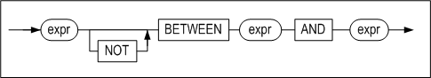
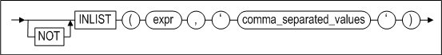
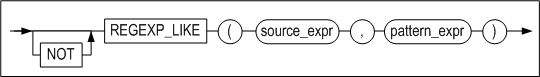

# 9. SQL Conditions

This chapter describes the conditional operators that can be used in conditional clauses in SQL statements in Altibase.

### SQL Conditions Overview

A SQL condition consists of one or several logical operators and expressions. The return value of a condition is one of the three possible logical outcomes: TRUE, FALSE, or UNKNOWN.

Conditions can be used in any of these clauses of a SELECT statement:

-   WHERE

-   START WITH

-   CONNECT BY

-   HAVING

Additionally, conditions can be used in the WHERE clause of DELETE and UPDATE statements. 

The sections that follow describe the various kinds of conditions in detail.

#### Logical Conditions

The following logical conditions are supported for use with Altibase. Each of them is described briefly below.

| Logical operators | Description                                                  |
| ----------------- | ------------------------------------------------------------ |
| AND               | Returns TRUE if both of the constituent conditions are TRUE. Returns FALSE if either or both of the constituent conditions are FALSE. |
| NOT               | Returns the opposite of the condition to which it applies. That is, it returns TRUE if the condition is FALSE, and returns FALSE if the condition is TRUE. |
| OR                | Returns TRUE if either or both of the constituent conditions are TRUE. Returns FALSE if both of the constituent conditions are FALSE. |

#### Comparison Conditions

Comparison conditions can be categorized as either simple comparisons or group comparisons. 

Simple comparison conditions are those in which one expression is compared with one expression.

Group comparison conditions are those in which one expression is compared with many expressions, or with multiple rows returned by a subquery.

#### Other Conditions

The other conditions that are supported for use with Altibase are listed and described briefly below.

| Condition Type        | Description                                                  |
| --------------------- | ------------------------------------------------------------ |
| BETWEEN condition     | This is a kind of comparison condition that is used to determine whether a value is within a given range. |
| EXISTS condition      | The EXISTS condition is used to check whether a subquery returns at least one row. |
| IN condition          | The IN condition is used to determine whether a value is the same as one or more in a list of values or results returned by a subquery. A NOT IN condition is used to determine whether a value is unlike all members in a list of values or results returned by a subquery. |
| INLIST condition      | The INLIST condition is used to determine whether a value is in a given list. |
| IS NULL condition     | The IS NULL condition is used to determine whether a value is a NULL value. |
| LIKE condition        | LIKE is a pattern-matching condition that is used to determine whether a string contains a given sequence of characters ("patters"). |
| REGEXP_LIKE condition | REGEXP_LIKE is a regular expression matching condition that is used to determine whether a string contains a given regular expression. |
| UNIQUE condition      | A UNIQUE condition is used to check whether a subquery returns exactly one row. |

### Logical Condition	

#### AND

##### Syntax

```
condition1 AND condition2
```


##### Description 

AND performs a logical AND evaluation on condition1 and condition2 and returns TRUE if both conditions are TRUE. It returns FALSE if either of them is FALSE. AND cannot return TRUE if either condition is UNKNOWN.

This is the AND Truth Table: 

| *Condition1 (Right)<br />\ <br />Condition2(Bottom)* | TRUE    | FALSE | UNKNOWN |
| ---------------------------------------------------- | ------- | ----- | ------- |
| TRUE                                                 | TRUE    | FALSE | UNKNOWN |
| FALSE                                                | FALSE   | FALSE | FALSE   |
| UNKNOWN                                              | UNKNOWN | FALSE | UNKNOWN |

##### Example

\<Query\> Display the names, wages, and hiring dates of all employees who are engineers and earn 2,000 dollars or more.

```
iSQL> SELECT e_firstname, e_lastname, salary, join_date 
 FROM employees 
 WHERE emp_job = 'engineer' 
 AND salary >= 2000;
E_FIRSTNAME           E_LASTNAME            SALARY      JOIN_DATE
--------------------------------------------------------------------------
Ken                   Kobain                2000        11-JAN-2010
1 row selected.
```


#### NOT

##### Syntax

```
NOT condition
```


##### Description

NOT returns the opposite of the input *condition*.

| *Condition* | TRUE  | FALSE | UNKNOWN |
| ----------- | ----- | ----- | ------- |
| NOT Result  | FALSE | TRUE  | UNKNOWN |

##### Example

\<Query\>  Display the names, departments, and birthdays of all employees except those born before 1980.

```
iSQL> SELECT e_lastname, e_firstname, dno, birth 
 FROM employees 
 WHERE NOT birth < BYTE'800101';
E_LASTNAME            E_FIRSTNAME           DNO         BIRTH
---------------------------------------------------------------------
Foster                Aaron                 3001        820730
Fleischer             Gottlieb              4002        840417
Wang                  Xiong                 4001        810726
Hammond               Sandra                4002        810211
Jones                 Mitch                 1002        801102
Davenport             Jason                 1003        901212
6 rows selected.
```


#### OR

##### Syntax

```
condition1 OR condition2
```


##### Description

OR performs a logical OR evaluation on condition1 and condition2 and returns TRUE if either or both conditions are TRUE.

This is the OR Truth Table:

| *Condition1 (Right)<br />\ <br />Condition2(Bottom)* | TRUE | FALSE   | UNKNOWN |
| ---------------------------------------------------- | ---- | ------- | ------- |
| TRUE                                                 | TRUE | TRUE    | TRUE    |
| FALSE                                                | TRUE | FALSE   | UNKNOWN |
| UNKNOWN                                              | TRUE | UNKNOWN | UNKNOWN |

##### Example

\<Query\>  Display the data for all inventory items numbering more than 20000 in stock or having a unit price of 100000 KRW or higher.

```
iSQL\> SELECT \*

FROM goods

WHERE stock \> 20000 OR price \>= 100000;

GOODS.GNO GOODS.GNAME GOODS.GOODS_LOCATION GOODS.STOCK

\------------------------------------------------

GOODS.PRICE

\--------------

C111100001 IT-U950 FA0001 35000

7820.55

D111100008 TM-U200 AC0006 61000

10000

E111100004 M-190G CE0001 88000

5638.76

E111100012 M-U420 CE0003 43200

3566.78

F111100001 AU-100 AC0010 10000

100000

5 rows selected.
```


### Comparison Conditions	

Comparison conditions can be broadly classified into simple comparison conditions and group comparison conditions on the basis of whether a single expression is compared with one expression or with many expressions.

#### Simple Comparison Condition

##### Syntax

**simple_comparison_condition ::=**


##### Description

Simple comparison conditions compare the expressions on the left and right on the basis of the specified operator and return TRUE, FALSE or UNKNOWN. 

Simple comparison conditions can be classified into those that compare the size of the two expressions and those that simply determine whether the two expressions are equivalent. 

When there are two or more expressions on each side of the operator (the lower path in the above diagram), only equality comparisons can be conducted. That is, size comparisons are not possible. 

Additionally, the number of expressions on the left must be the same as the number of expressions on the right. This rule also applies when the expressions take the form of a subquery SELECT list. 

Furthermore, when a subquery is used in a simple comparison, it must return only a single record.

##### Example

\<Query\> Display the name, quantity, unit price, and value of inventory for all products for which the value of inventory is more than 100 million KRW. (The value of inventory is the quantity multiplied by the unit price.)

```
iSQL> SELECT gname, stock, price, stock*price value_of_inv
FROM goods
WHERE stock*price > 100000000;
GNAME      STOCK    PRICE      VALUE_OF_INV 
------------------------------------------------
IT-U950    35000    7820.55    273719250 
TM-T88     10000    72000      720000000 
TM-U950    8000     96200      769600000
.
.
.
11 rows selected.
```


#### Group Comparison Conditions

##### Syntax

**group_comparison_condition ::=**


##### Description

In a group comparison condition, the expression on the left is compared with each of the expressions or subquery results on the right. It is acceptable, and typical, for the subquery to return multiple rows. 

When there are two or more expressions on the left side of the operator, only equality comparisons can be conducted, but size comparisons cannot. Additionally, the expressions on the right must be nested using parentheses to form groups. The number of elements in each group, or alternatively the number of columns returned by a subquery, must be the same as the number of expressions on the left.

-   ANY / SOME  
    The ANY and SOME keywords have the same meaning. Group comparison conditions containing either keyword return TRUE if the comparison of the expression on the left with at least one of the expressions or subquery results on the right returns TRUE.
    
-   ALL  
    Group comparison conditions containing the ALL keyword return TRUE only when the expression on the left is compared with all of the expressions or subquery results on the right and TRUE is returned in every case.

##### Example

\<Query\>  Display information about all orders taken by any employee whose last name starts with “B”.

```
iSQL> SELECT ono, order_date, processing 
 FROM orders 
 WHERE eno = ANY 
(SELECT eno FROM employees WHERE e_lastname LIKE 'B%');
ONO                  ORDER_DATE   PROCESSING
--------------------------------------------------
12300003             29-DEC-2011  P
12300004             30-DEC-2011  P
12300006             30-DEC-2011  P
12300008             30-DEC-2011  P
12300009             30-DEC-2011  P
12300011             30-DEC-2011  P
12300013             30-DEC-2011  P
12310001             31-DEC-2011  O
12310003             31-DEC-2011  O
12310005             31-DEC-2011  O
12310006             31-DEC-2011  O
12310010             31-DEC-2011  O
12 rows selected.
```


### Other Conditions

#### BETWEEN

##### Syntax 

**between_condition ::=**



##### Description

BETWEEN comparisons are used to check whether a value falls within a given range.

*column1* between x1 and x2’ is logically the same as *column1* >= x1 and *column1* <= x2’

##### Example

\<Query\> Display the name, quantity, unit price, and value of inventory for all products for which the value of inventory is between 1 million KRW and 10 million KRW. (The value of inventory is the quantity multiplied by the unit price.)

```
iSQL> SELECT gname, stock, price, stock*price value_of_inv
FROM goods
WHERE stock*price BETWEEN 1000000 AND 10000000;
GNAME      STOCK      PRICE     VALUE_OF_INV 
------------------------------------------------
IM-310     100        98000     9800000 
.
.
.
M-T500     5000       1000.54   5002700 
7 rows selected.
```


#### EXISTS

##### Syntax

**exists_condition ::=**


##### Description

An EXISTS condition is used to check whether a subquery returns any rows. If at least one row is returned, the EXISTS condition returns TRUE.

##### Example

\<Query\>  Output the customer numbers of customers who ordered at least two kinds of products. (The orders table is first queried to find pairs of rows having the same customer number but different product numbers, which indicate customers who ordered more than one kind of product. If such a pair of rows exists, the EXISTS condition returns TRUE, so the customer number is output).

```
iSQL> SELECT DISTINCT cno
FROM orders a
WHERE EXISTS
 (SELECT *
 FROM orders b
 WHERE a.cno = b.cno
 AND NOT(a.gno = b.gno));
CNO 
------------------
19
15
14
11
6
5
3
2
1
9 rows selected.
```

\<Query\> Retrieve the names of any customers who have ordered all available products. The innermost subquery, which is located at the end of the query string, finds the products ordered by each customer in the *orders* table. The next subquery, located in the middle of the query string, searches for products that have not been ordered by that customer. If there are no products that have not been ordered by that customer, the customer's name will be displayed.

```
iSQL> SELECT customers.c_lastname
FROM customers
WHERE NOT EXISTS
 (SELECT *
 FROM goods
 WHERE NOT EXISTS
 (SELECT *
 FROM orders
 WHERE orders.cno = customers.cno
 AND orders.gno = goods.gno));
CNAME 
------------------------
No rows selected.
```


#### IN

##### Syntax

**in_condition ::=**


##### Description

The IN condition is the same as a group comparison using the '=ANY' condition. This kind of condition returns TRUE if the expression on the left matches any of the expressions on the right. 

The NOT IN condition is the same as a group comparison using the '!=ALL' condition. This kind of condition returns TRUE if none of the expressions on the right match the expression on the left.

##### Example

\<Query\> Display the name, position, and telephone number of every employee who is on either the application development team or the marketing team.

```
iSQL> SELECT e_firstname, e_lastname, emp_job, emp_tel 
 FROM employees 
 WHERE dno IN (1003, 4001);
E_FIRSTNAME           E_LASTNAME            EMP_JOB          EMP_TEL
---------------------------------------------------------------------------
Elizabeth             Bae                   programmer       0167452000
.
.
.
7 rows selected.
```

The WHERE clause in the above SQL statement has the same meaning as:

```
WHERE DNO = 1003 or DNO = 4001
```

\<Query\> Retrieve the names of customers who ordered product number C111100001.

```
iSQL> SELECT DISTINCT customers.c_lastname, customers.c_firstname 
 FROM customers 
 WHERE customers.cno 
 IN (SELECT orders.cno FROM orders WHERE orders.gno = 'C111100001');
C_LASTNAME            C_FIRSTNAME
-----------------------------------------------
Martin                Pierre
Fedorov               Fyodor
Dureault              Phil
Sanchez               Estevan
4 rows selected.
```


#### INLIST

##### Syntax

**inlist_condition ::=**



##### Description

The INLIST condition returns TRUE if any of the individual values in *comma_separated_values* match expr.

The NOT INLIST condition returns TRUE if none of the individual values in comma_separated_values match expr. Each value in *comma_separated_values* must be a string containing only ASCII characters. 

The values in *comma_separated_values* are automatically converted to the type of expr in order to perform the comparison.


##### Example

```
iSQL> SELECT dno, e_firstname, e_lastname 
 FROM employees 
 WHERE INLIST (dno, '1003,4001' );
DNO         E_FIRSTNAME           E_LASTNAME
------------------------------------------------------------
1003        Elizabeth             Bae
1003        Zhen                  Liu
1003        Yuu                   Miura
1003        Jason                 Davenport
4001        Xiong                 Wang
4001        Curtis                Diaz
4001        John                  Huxley
7 rows selected.
```


#### IS NULL

##### Syntax

**isnull_condition ::=**


##### Description

The IS NULL condition is used to check whether or not the expression is NULL.

##### Example

\<Query\>  Display the employee number, name, and position of every employee whose birthday has not been input.

```
iSQL> SELECT eno, e_firstname, e_lastname, emp_job 
 FROM employees 
 WHERE salary IS NULL;
ENO         E_FIRSTNAME           E_LASTNAME            EMP_JOB
---------------------------------------------------------------------------
1           Chan-seung            Moon                  CEO
8           Xiong                 Wang                  manager
20          William               Blake                 sales rep
3 rows selected.
```


#### LIKE

##### Syntax

**like_condition ::=**


##### Description

LIKE is a pattern-matching condition that is used to determine whether a string contains a given sequence of characters (“pattern”). The percent ("%") and underscore ("\_") characters are wildcard characters in LIKE conditions. "%" is used to represent a string, while "\_" is used to represent a single character. 

When it is desired to search for the actual characters "%" or "\_", rather than using them as wildcards, use the ESCAPE keyword at the end of the LIKE condition to define an escape character, and then use the escape character in front of "%" or "\_" to indicate that it is not to be handled as a wildcard character

The maximum length for a pattern string is 4000 bytes.

##### Examples

\<Query\> Display the employee number, name, department number, and telephone number of every employee whose last name starts with “D”.

```
iSQL> SELECT eno, e_lastname, e_firstname, dno, emp_tel FROM employees WHERE e_lastname LIKE 'D%';
ENO         E_LASTNAME            E_FIRSTNAME           DNO         EMP_TEL
----------------------------------------------------------------------------
2           Davenport             Susan                             0113654540
9           Diaz                  Curtis                4001        0165293668
15          Davenport             Jason                 1003        0119556884
3 rows selected.
```

\<Query\> Display information for all departments that containt an underscore ("\_") in the department name.

```
iSQL> INSERT INTO departments VALUES(5002, 'USA_HQ', 'Palo Alto', 100);
1 row inserted.
iSQL> SELECT * FROM departments
WHERE dname LIKE '%\_%' ESCAPE '\';
DNO         DNAME                           DEP_LOCATION  MGR_NO
---------------------------------------------------------------------------
5002        USA_HQ                          Palo Alto     100
1 row selected.

```

In the above example, the backslash ("\\") is defined as an escape character using the ESCAPE option. Using this escape character before the underscore character indicates that the underscore character is not to be handled as a wildcard.

\<Query\> Display the first names of all employees who have the letter “h” in their first names.

```
iSQL> SELECT e_firstname 
 FROM employees 
 WHERE e_firstname LIKE '%h%';
E_FIRSTNAME
------------------------
Chan-seung
Farhad
Elizabeth
Zhen
Mitch
Takahiro
John
7 rows selected.
```


#### REGEXP_LIKE

##### Syntax

**regexp_like_condition ::=**



##### Description

REGEXP_LIKE is similar to the LIKE condition. While LIKE performs simple pattern matching, REGEXP_LIKE performs regular expression matching. Altibase supports POSIX Basic Regular Expression (BRE). For more detailed information on regular expressions, please refer to Appendix A. Regular Expressions.

*source_expr* can be a column or character expression that is a search target. *source_expr* generally takes the form of a CHARACTER type column, such as CHAR and VARCHAR CHAR columns. 

*pattern_expr* can be a value which expresses a search pattern as a regular expression. *pattern_expr* generally takes the form of a string, and can contain up to 1024 bytes.

##### Example

\<Query\>  Output the employee number, name, department number and telephone number of employees whose last name starts with “D”.

```
iSQL> SELECT eno, e_lastname, e_firstname, dno, emp_tel FROM employees WHERE REGEXP_LIKE(e_lastname, '^D');
ENO         E_LASTNAME            E_FIRSTNAME           DNO         EMP_TEL
----------------------------------------------------------------------------
2           Davenport             Susan                             0113654540
9           Diaz                  Curtis                4001        0165293668
15          Davenport             Jason                 1003        0119556884
3 rows selected.
```

\<Query\> Output employees whose last name consists of 5 characters.

```
iSQL> SELECT eno, e_lastname, emp_job 
        FROM employees
        WHERE REGEXP_LIKE (trim(e_lastname), '^.{5}$');
ENO         E_LASTNAME            EMP_JOB
-------------------------------------------------------
6           Momoi                 programmer
13          Jones                 PM
14          Miura                 PM
20          Blake                 sales rep
4 rows selected.
```


#### UNIQUE

##### Syntax

**unique_condition ::=**


##### Description

UNIQUE is used to determine whether a subquery returns only a single row.

##### Example

\<Query\> If there is only one CEO, output the following message: “There is only one CEO”.

```
iSQL> SELECT 'There is only one CEO.' message 
 FROM dual 
 WHERE UNIQUE 
  (SELECT * 
  FROM employees 
  WHERE emp_job = 'CEO');
MESSAGE
--------------------------
There is only one CEO.
1 row selected.
```

\<Query\> If there is only one female customer in the customers table, output the following message: 'There is only one female customer.'

```
iSQL> SELECT 'There is only one female customer.' message
FROM dual
WHERE UNIQUE
 (SELECT *
 FROM customers
 WHERE SEX = 'F');
ENAME 
------------------------
No rows selected.
```


