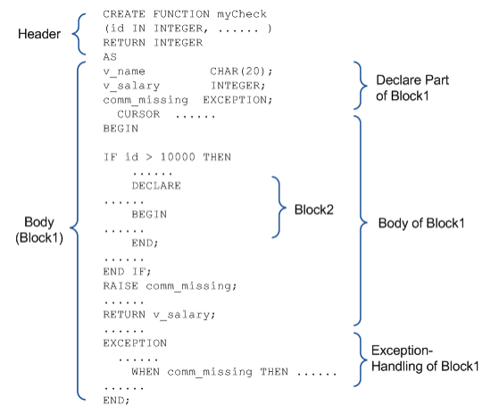

# 1. Introduction to Stored Procedures

### Overview

A stored procedure is a kind of database object that consists of SQL statements, control statements, assignment statements, exception handlers, etc. Stored procedures are created in advance, compiled, and stored in a database, ready for execution. In that state, stored procedures can be simultaneously accessed by multiple SQL statements.

The term “stored procedure” is sometimes used to refer to stored procedures and stored functions collectively. Stored procedures and stored functions differ only in that stored functions return a value to the calling application, whereas stored procedures do not.

Stored procedures and stored functions can be created using the CREATE PROCEDURE and CREATE FUNCTION statements, respectively. For more information about these statements, please refer to the explanations of the CREATE PROCEDURE and CREATE FUNCTION statements in Chapter2: SQL Statements for Managing Stored Procedures of this manual.

#### Types of Stored Objects

##### Stored Procedures

Stored procedures are called, either by SQL statements or by other stored procedures, using IN parameters, OUT parameters, or IN/-OUT parameters. When a stored procedure is called, procedural statements defined in the body of the procedure are executed. A stored procedure has no return value, but can still pass values to the client or calling routine via OUT or IN/OUT parameters. However, because a stored procedure has no return value, it cannot be used as an operand in an expression in a SQL statement.

##### Stored Functions

A stored function is the same as a stored procedure with the exception that it has a return value, and thus can be used as an operand in an expression in a SQL statement.

##### Typesets

A typeset is a set of user-defined types that can be used in stored procedures. They are chiefly used for passing user-defined types between procedures in the form of parameters and return values.

For more information about typesets, please refer to Chapter 7: Typesets.

#### Features

##### Procedural Programming using SQL

The Altibase PSM (Persistent Stored Module) provides control flow statements and exception handlers so that procedural programming can be conducted using SQL statements.

##### Performance

When a client sequentially executes multiple SQL statements, it must send each SQL statement individually and wait for the result before sending the next statement. This increases the amount of time and expense that is required for communication between the server and client. In contrast, a program that is authored such that it uses stored procedures needs to communicate with the server only one time in order to execute multiple SQL statements, because the client only needs to call one stored procedure comprising several SQL statements.

Therefore, using stored procedures reduces communication expenses, and additionally reduces the burden associated with type conversion when different data types are used on the server and client applications.

##### Modularity

All of the SQL operations required to conduct one business action can be gathered together and modularized in the form of a single stored procedure.

##### Easily Maintained Source Code

Because stored procedures reside in the database server, when business logic changes, only the stored procedures need to be changed; there is no need to update client programs distributed among multiple machines.

##### Sharing and Productivity

Stored procedures are stored in the database, which means that one user can execute another user's stored procedures, as long as s/he has been granted suitable access privileges. Moreover, because stored procedures can be called from within other stored procedures, when the need arises for a new business process that is based on an existing business process, the stored procedure for the new business process has only to call the stored procedure for the existing business process, thereby eliminating redundancy and increasing productivity.

##### Integration with SQL

The conditions that are used in the WHERE clause of a SELECT statement can be used as conditions in control flow statements in stored procedures without change. This means that SQL-style functions that are not originally supported for use as conditions in control flow statements in host languages such as C/C++ can now be used. Furthermore, built-in functions that are supported in SQL statements can be used without change in stored procedures.

##### Error Handling in SQL

Because exception handlers are provided for use with stored procedures, appropriate action can be immediately taken on the server in response to errors that occur during the execution of SQL statements

##### Persistent Storage

Stored procedures are database objects, and thus are permanently stored in the database until explicitly dropped by a user. This means that business logic that supports business practices is also permanently preserved in the database

##### Enhanced Security

The altiwrap utility encrypts PSM code programs such as stored procedures and stored functions to prevent them from being exposed. For more detailed information about this utility, please refer to the *Utilities Manual*. Altibase can encrypt the following statements.

-   CREATE [OR REPLACE] PROCEDURE

-   CREATE [OR REPLACE] FUNCTION

-   CREATE [OR REPLACE] TYPESET

-   CREATE [OR REPLACE] PACKAGE

-   CREATE [OR REPLACE] PACKAGE BODY


### Structure of Stored Procedures

Stored procedures are a kind of block-structured language. The body of one stored procedure typically consists of several logical blocks.

A stored procedure consists of a header and a body. The body of a stored procedure is one large block that consists of a declare section, the actual body of the procedure, and an exception-handling section. The main block can have multiple sub-blocks.

The following is an example illustrating the structure of a stored procedure:



Block2 is a sub-block of Block1 and can have a structure just like that of Block1, including a DECLARE section, body and an exception-handling section.

A control flow statement is also a block, in that it has an explicit beginning and ending.


### Considerations when using Stored Procedures

#### Transaction Management

The transaction control commands that can be used in stored procedures are COMMIT and ROLLBACK statements. The use of these commands within a stored procedure can affect tasks that are being conducted outside of the stored procedure.

For example, assume that the following commands are executed in NON-AUTOCOMMIT mode:

```
iSQL> INSERT INTO t1 values (1);
iSQL> INSERT INTO t1 values (2);
iSQL> EXECUTE proc1;
```

Suppose that proc1 contains the commands “Insert Into t1 values (3)” and “ROLLBACK”. When it is executed, the statement within the procedure that inserted the value of 3 is not the only statement that will be rolled back. Additionally, the INSERT statements that were executed directly from iSQL and inserted the values of 1 and 2 will also be rolled back. That is, the two INSERT statements are handled as part of the same transaction as the statements within the stored procedure.

####  Limitations

COMMIT and ROLLBACK commands can be executed while the cursor is OPEN. However, the user should note that if ROLLBACK is executed while the cursor is OPEN and not yet COMMITTED, the cursor will close.

Stored functions that are called from within SELECT statements cannot contain INSERT, UPDATE, or DELETE statements.

In addition, they cannot contain transaction control statements. Stored functions that are called from within INSERT, UPDATE or DELETE statements cannot contain transaction control statements.

#### Related Meta Tables

For information about the meta tables related to stored procedures, please refer to the Data Dictionary in the *General Reference.*


