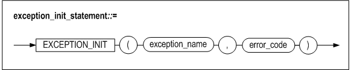

# 10. Pragma

### Overview

Compile operation can be varied depending on the types of pragma in case of using pragma. The pragma can be used within stored procedures, stored functions, and stored packages.

#### Types of Pragma

The following pragmas can be used in Altibase. Thorough information on each pragma will be delineated in the next section.

-   Autonomous Transaction Pragma(Autonomous_Transaction Pragma)

-   Exception(Exception_Init Pragma)

#### Syntax


### Autonomous Transaction Pragma

#### Syntax


#### Function

Autonomous transaction pragma is used to modify PSM object operation carried out within a transaction. The autonomous transaction pragma is configured when compiling PSM object creation.

The PSM object specified with the autonomous transaction pragma independently operates, and it does not share transaction sources with the main transaction. In particular, the autonomous transaction pragma is highly efficient for writing a program which is module-centric or contains high reusability.


The location in which the autonomous transaction pragma should be defined is as follows:

-   The top stored procedures
-   The top stored functions
-   The top stored package subprograms
-   psm_body of triggers

The differences between Autonomous and nested transactions is as follows:

|                                                   | Autonomous Transaction                                       | Nested Transaction                                           |
| ------------------------------------------------- | ------------------------------------------------------------ | ------------------------------------------------------------ |
| Exception Handling                                | Transaction unit exception handling- (transaction-level recovery when an error occurs in an autonomous transaction) | Exception handling per statement                             |
| Transaction Dependecy                             | Independent transacaction                                    | Relevant transaction and dependency                          |
| sVisibility                                       | Checking the session status from another session when terminating an autonomous transaction. | Unable to check the session status if commit execution was performed after terminating a nested transaction. |
| Availability whether the source is shared or not. | Source is not shared with other transactions. (lock, savepoint , rollback , commit independently operates) | Source is shared with relevant transactions (lock, savepoint , rollback , commit dependently operates) |

#### Note

Since autonomous transactions do not share lock, source use, commit dependency with the main transaction, even if the main transaction is rolled back, the contents of the autonomous transaction are not rolled back.

A deadlock might be encountered when accessing an object referenced in the main transaction since the autonomous transaction separately operates from the main transaction.

#### Example

##### Declaring pragma autonomous_transaction in Stored Procedures

```
iSQL> create table t1(c1 integer);
Create success.
iSQL> create or replace procedure proc1 as
pragma autonomous_transaction;
begin
insert into t1 values ( 1 );
commit;
end;
/
Create success.
```


##### Declaring pragma autonomous_transaction in Stored Functions

```
iSQL> create table t1(c1 integer);
Create success.
iSQL> create or replace function sub2 return integer as
pragma autonomous_transaction;
begin
insert into t1 values ( 100 );
commit;
return 100;
end;
/
Create success
```


##### Declaring pragma autonomous_transaction in Package Subprograms

```
iSQL> create table t1(c1 integer);
Create success.
iSQL> create or replace package pkg1 as
procedure sub1;
function sub2 return integer;
end;
/
Create success.
iSQL> create or replace package body pkg1 as
procedure sub1 as
pragma autonomous_transaction;
begin
insert into t1 values ( 1 );
commit;
end;
function sub2 return integer as
pragma autonomous_transaction;
begin
insert into t1 values ( 100 );
commit;
return 100;
end;
end;
/
Create success.
```


##### Declaring pragma autonomous_transaction in Triggers.

```
iSQL>create table t1( c1 integer );
Create success.
iSQL>create table t2( c1 integer );
Create success.
iSQL>insert into t1 values(1);
1 row inserted.
iSQL>create or replace trigger tri1
after insert on t1
for each row
pragma autonomous_transaction;
var1 integer;
var2 integer;
begin
var1 := 1;
select c1 into var2 from t1 where c1 = var1;
insert into t2 values( var2 + var1 );
commit;
end;
/
Create success.
iSQL>insert into t1 values ( 2 );
1 row inserted.
iSQL> select * from t1;
C1
--------------
1
2
2 rows selected.
iSQL> select * from t2;
C1
--------------
2
1 row selected.
```


### Exception Initialization Pragma

#### Syntax



#### Function

Excepton initialization pragma enables the user to initialize exception variables with Altibase error codes.

The user can use the excepton variables initialized by Altibase error codes in place of other handler in the exception handling.

The location in which exception initialzation pragram can be defined is as follows:

-   The declarative part of stored procedures
-   The declarative part of stored functions
-   The declarative part of stored package
-   The declarative part of stored package subprograms

##### exception_name

excepton_name is used to specify the exception variable to initialize. The exception variable should be declared within the identitcal block as pragma.

##### error_code

error_code is used to specify Altibae error code when an error occurrs which was not set in exception_name. Refer to the *Error Message Reference* for in-depth infomration on Altibae error code.

#### Example

##### Specific Error Occurrence

Initialize stored procedure error messages occurring with the error number 201070 as "Too many rows".

```
iSQL> create table t1(c1 integer);
Create success.
iSQL> insert into t1 values ( 1 );
1 row inserted.
iSQL> insert into t1 values ( 2 );
1 row inserted.
iSQL> select * from t1;
C1
--------------
1
2
2 rows selected.
iSQL> create or replace procedure proc1 as
v1 integer;
e1 exception;
pragma exception_init(e1, 201070 );
begin
select c1 into v1 from t1;
exception
when e1 then
println(SQLERRM);
println('catch exception');
end;
/
Create success.
iSQL> exec proc1;
Too many rows
at "SYS.PROC1", line 6
catch exception
Execute success.
```


##### The stored procedure modified exception handlers to others in above example.

```
iSQL> create table t1(c1 integer);
Create success.
iSQL> insert into t1 values ( 1 );
1 row inserted.
iSQL> insert into t1 values ( 2 );
1 row inserted.
iSQL> select * from t1;
C1
--------------
1
2
2 rows selected.
iSQL> create or replace procedure proc1 as
    v1 integer;
    e1 exception;
    begin
    select c1 into v1 from t1;
    exception
    when others then
    println(SQLERRM);
    println('catch exception');
    end;
    /
Create success.
iSQL> exec proc1;
Too many rows
at "SYS.PROC1", line 5
catch exception
Execute success.
```


##### In case of occuring a different error other than initialized exception in the exception variable e1:

The initialized exception is "Too many rows", and the error actually occurred was "No data found".

```
iSQL> create or replace procedure proc2 as
v1 integer;
e1 exception;
pragma exception_init(e1, 201070 );
begin
select c1 into v1 from t1 where c1 = 3;
end;
/
Create success.
iSQL> exec proc2;
[ERR-3116A : No data found.
at "SYS.PROC2", line 6]
```


