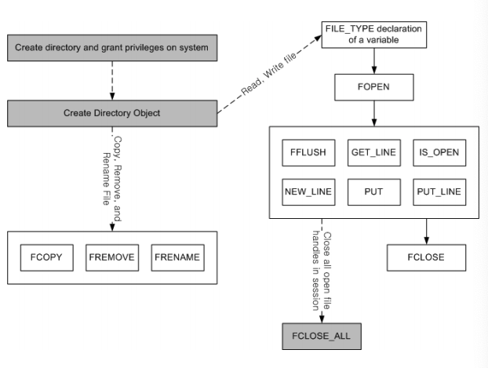

# 12. Altibase Stored Procedures and Built-in Functions

Altibase provides a variety of built-in stored procedures and functions, including file control functions. This chapter introduces these stored procedures and functions and describes how to use them.

This chapter contains the following topics:

-   File Control

-   TCP Connection Control

-   DBMS Stats

### File Control

The file control functionality of stored procedures enables users to read from and write to text files in the file system. This functionality allows users to perform a wide variety of tasks, including maintaining their own logs, recording the results of tasks, and inserting data read from text files into database tables.

This functionality is described in detail in this section.

#### Managing Directories

In order for stored procedures to be able to create and manage text files, it is first necessary to use DML to create a directory object that corresponds to the actual directory in which the files are to be saved.

##### Creating a Directory Object

The CREATE DIRECTORY statement is used to create a database object corresponding to each directory in which it is desired to store and maintain files.

When the CREATE DIRECTORY statement is executed, information about the directory is recorded in the SYS_DIRECTORIES_ meta table. However, this statement does not actually create the physical directory in the file system. Therefore, the user must first manually perform the additional tasks of creating the physical directory and granting suitable permissions for the directory.

In the CREATE DIRECTORY statement, the user must specify the name and the absolute path of the directory to be accessed by the database.

Consider the following example. First, a physical directory named alti_dir1 is created in the /home/altibase/altibase_home/psm_msg directory.

```
$ mkdir /home/altibase/altibase_home/psm_msg/alti_dir1
```

Then, a corresponding directory object is created within the database to make it possible to manipulate the files in the alti_dir1 directory.

```
iSQL> create directory alti_dir1 as '/home/altibase/altibase_home/psm_msg';
Create success.
```

##### Changing a Directory Object

It is possible to use the CREATE OR REPLACE DIRECTORY statement to change the absolute path to which an existing directory object refers:

```
iSQL> create or replace directory alti_dir1 as '/home/altibase/altibase_home/psm_result';
Create success.
```

The effect of the above statement will vary depending on whether the alti_dir1 directory object already exists in the database. If a directory object having that name already exists, the path to which it refers will be changed to the one specified. If the alti_dir1 directory object does not exist in the database, it will be created.

##### Dropping a Directory Object

Directory objects can be removed from the database using the DROP DIRECTORY statement.

Note that the DROP DIRECTORY statement merely removes the directory object from the database. It does not actually delete the physical directory from the file system.

Therefore, the user must manually delete unnecessary directories and files from the file system using operating system commands.

The following example shows the use of the DROP DIRECTORY statement to remove a directory object from the database.

```
iSQL> DROP DIRECTORY alti_dir1;
Drop success.
```


#### File Control

##### FILE_TYPE

To enable stored procedures to control files, Altibase support a data type called “FILE_TYPE”.

FILE_TYPE contains file identifiers and other information; however, this information is not directly accessible by users.

Local variables having the FILE_TYPE data type can be used within stored procedures as parameters for file control-related system stored procedures and stored functions.

The following is an example of the declaration of a FILE_TYPE variable:

```
CREATE OR REPLACE PROCEDURE WRITE_T1
AS
	V1	FILE_TYPE;
	ID 	INTEGER;
	NAME 	VARCHAR(40);
BEGIN
……
END;
/
```


##### System-Provided Stored Procedures and Stored Functions for Handling Files

Altibase provides the following 12 system stored procedures and stored functions for managing files:

| Name       | Description                                                  |
| ---------- | ------------------------------------------------------------ |
| FCLOSE     | Closes an open file                                          |
| FCLOSE_ALL | Closes all files that were opened in the current session     |
| FCOPY      | Copies a file                                                |
| FFLUSH     | Physically writes data to a file                             |
| FOPEN      | Opens a file for reading or writing                          |
| FREMOVE    | Removes a file                                               |
| FRENAME    | Renames a file                                               |
| GET_LINE   | Reads one line from a file                                   |
| IS_OPEN    | Checks whether a file is open                                |
| NEW_LINE   | Outputs an OS-specific carriage return character or sequence |
| PUT        | Writes a string of text to a file                            |
| PUT_LINE   | Writes a line of text, followed by a carriage return character or sequence, to a file (=PUT+NEW_LINE) |

The system stored procedures and functions listed above are automatically created in the system when the CREATE DATABASE statement is executed. Additionally, PUBLIC synonyms are defined for these procedures and functions so that any user can use them to handle files within stored procedures.

The process of managing files using system procedures and functions is illustrated in the following figure:



##### Limitations

The following may cause errors during the execution of file control-related system stored procedures and stored functions:

###### Directory Name

When using a file control function, the directory parameter must be specified in upper-case letters, and must be the name of a directory object that was created using the CREATE DIRECTORY statement.

For example,

```
CREATE DIRECTORY alti_dir AS ‘…’;
```

After creating a directory object as shown above, use a statement like the following in the stored procedure:

```
file = FOPEN( ‘ALTI_DIR’, ‘a.txt’, ‘r’ );
```

Even if the name of the directory object was specified in lower-case letters, the names of all objects are stored in upper-case letters in the database. Therefore when specifying the name of a directory object as a parameter for a system procedure or function, it is necessary to use upper-case letters.

###### **The length of one line of text**

The maximum length of one line of text within a file cannot exceed 32767 bytes. An error will occur if this maximum length is exceeded.

###### File data types

Users cannot read or arbitrarily change the value of a FILE_TYPE variable. FILE_TYPE variables can be used only as parameters for system stored procedures and stored functions.

###### **File Control-Related System Stored Procedures and Stored Functions**

The system stored procedures and stored functions provided to manage files may generate exceptions other than system exceptions.

For example, when there is not enough disk space, or when there are not enough file handles, system stored procedures and functions will raise unforeseeable errors such as INVALID_OPERATION.

If an invalid parameter is passed to a file control-related system stored procedure or stored function, a VALUE_ERROR exception will occur.

#### FCLOSE

This stored procedure closes and reinitializes a file handle

##### Syntax

```
FCLOSE ( file IN OUT FILE_TYPE );
```


##### Parameters

| Name | Input/Output | Data Type | Description |
| ---- | ------------ | --------- | ----------- |
| file | IN OUT       | FILE_TYPE | File handle |

##### Return Value

Because it is a stored procedure, there is no return value.

##### Exception

This stored procedure never raises an error, even when it is executed on a file handle that is already closed.

##### Example

After executing FOPEN and performing actions on files, FCLOSE is called to close the file handle, as shown below:

```
CREATE OR REPLACE PROCEDURE PROC1
AS
    V1 FILE_TYPE;
    V2 VARCHAR(1024);
BEGIN
    V1 := FOPEN( 'ALTI_DIR', 'schema.sql', 'r' );
    GET_LINE( V1, V2, 100 );
    PRINTLN(V2);
    FCLOSE(V1);
END;
/
```


#### FCLOSE_ALL

This stored procedure closes all of the file handles that were opened in the current session. It is commonly used within exception handlers to ensure that files are closed properly even when exceptions are raised within stored procedures.

##### Syntax

```
FCLOSE_ALL;
```


##### Parameter

This is stored procedure have no parameter.

##### Return Value

Because it is a stored procedure, there is no return value.

##### Exception

There is no exception.

##### Example

The following example shows the use of FCLOSE_ALL to close all opened file handles when handling an exception.

```
CREATE OR REPLACE PROCEDURE PROC1
AS
    V1 FILE_TYPE;
    V2 VARCHAR(1024);
BEGIN
    V1 := FOPEN( 'ALTI_DIR', 'schema.sql', 'r' );
    GET_LINE( V1, V2, 100 );
    PRINTLN(V2);
FCLOSE(V1);
EXCEPTION
    WHEN READ_ERROR THEN
         PRINTLN('READ ERROR!!!');
         FCLOSE_ALL;
END;
/
```


#### FCOPY

This stored procedure is used to copy individual lines of text from one file to another. If the destination file does not exist in the specified destination directory, it is created, and the specified contents are copied from the source file to the new file. If the destination file already exists, the contents of the existing file are replaced with the specified contents from the source file.

##### Syntax

```
FCOPY (
location IN VARCHAR(40),
filename IN VARCHAR(256),
dest_dir IN VARCHAR(40),
dest_file IN VARCHAR(256),
start_line IN INTEGER DEFAULT 1,
end_line IN INTEGER DEFAULT NULL);
```


##### Parameters

| Name       | Input/Output | Data Type    | Description                                                  |
| ---------- | ------------ | ------------ | ------------------------------------------------------------ |
| location   | IN           | VARCHAR(40)  | The directory object corresponding to the path in which the source file is located |
| filename   | IN           | VARCHAR(256) | The name of the source file                                  |
| dest_dir   | IN           | VARCHAR(40)  | The directory object corresponding to the path in which the destination file is located |
| dest_file  | IN           | VARCHAR(256) | The name of the destination file                             |
| start_line | IN           | INTEGER      | The first line to copy <br />Default: 1                      |
| end_line   | IN           | INTEGER      | The last line to copy. Copies to the end of the file if set to NULL or not specified. <br />Default: NULL |

##### Return Values

Because it is a stored procedure, there is no return value.

##### Example

FCOPY can raise the following system-defined exceptions.

-   INVALID_PATH

-   ACCESS_DENIED

-   INVALID_OPERATION

-   READ_ERROR

-   WRITE_ERROR

For a detailed explanation of how to handle exceptions, please refer to "Handling File Control-Related Exceptions" in this chapter.

##### Example

In the following example, the entire contents of a.txt are copied to b.txt.

```
iSQL> EXEC FCOPY( 'ALTI_DIR', 'a.txt', 'ALTI_DIR', 'b.txt' );
Execute success.

$ cat a.txt
1-ABCDEFG
2-ABCDEFG
3-ABCDEFG
4-ABCDEFG
5-ABCDEFG
6-ABCDEFG
7-ABCDEFG
8-ABCDEFG
9-ABCDEFG
10-ABCDEFG

$ cat b.txt
1-ABCDEFG
2-ABCDEFG
3-ABCDEFG
4-ABCDEFG
5-ABCDEFG
6-ABCDEFG
7-ABCDEFG
8-ABCDEFG
9-ABCDEFG
10-ABCDEFG
```

In the following example, only the specified lines are copied from a.txt to b.txt.

```
iSQL> EXEC FCOPY( 'ALTI_DIR', 'a.txt', 'ALTI_DIR2', 'b.txt', 4, 9 );
Execute success.

$ cat a.txt
1-ABCDEFG
2-ABCDEFG
3-ABCDEFG
4-ABCDEFG
5-ABCDEFG
6-ABCDEFG
7-ABCDEFG
8-ABCDEFG
9-ABCDEFG
10-ABCDEFG

$ cat b.txt
4-ABCDEFG
5-ABCDEFG
6-ABCDEFG
7-ABCDEFG
8-ABCDEFG
9-ABCDEFG
```


#### FFLUSH

A stored procedure that physically writes data on the file.

##### Syntax

```
FFLUSH ( file IN FILE_TYPE );
```


##### Parameter

| Name | Input/Output | Data Type | Description   |
| ---- | ------------ | --------- | ------------- |
| file | IN           | FILE_TYPE | A file handle |

##### Return Value

Because it is a stored procedure, there is no return value.

##### Exceptions

FFLUSH can raise the following system-defined exceptions:

-   INVALID_FILEHANDLE

-   WRITE_ERROR

For a detailed explanation of how to handle exceptions, please refer to "Handling File Control-Related Exceptions" in this chapter.

##### Example

In the following example, all of the data in column I1 of table T1 are written to a file at one time. The last PUT_LINE parameter, *autoflush*, is set to FALSE. This prevents the data from being flushed to the file every time PUT_LINE is called. Instead, the data is flushed at the end using FFLUSH.

```
CREATE OR REPLACE PROCEDURE PROC1
AS
   V1 FILE_TYPE;
   R2 T1%ROWTYPE;
   CURSOR C1 IS SELECT I1 FROM T1;
BEGIN
   V1 := FOPEN( 'ALTI_DIR', 'a.txt', 'w' );
   FOR R2 IN C1 LOOP
       PUT_LINE( V1, R2.I1, FALSE );
   END LOOP;
   FFLUSH(V1);
   FCLOSE(V1);
EXCEPTION
   WHEN INVALID_PATH THEN
       PRINTLN('CANNOT OPEN FILE.');
   WHEN NO_DATA_FOUND THEN
       PRINTLN('NO DATA FOUND.');
       FCLOSE( V1 );
END;
/
```


#### FOPEN

This stored function opens a file and returns a file handle.

##### Syntax

```
FILE_TYPE variable :=
FOPEN (
         location IN VARCHAR(40),
         filename IN VARCHAR(256),
         open_mode IN VARCHAR(4) );
```


##### Parameters

| Name      | Input/Output | Data Type    | Description                                                  |
| --------- | ------------ | ------------ | ------------------------------------------------------------ |
| location  | IN           | VARCHAR(40)  | The directory object corresponding to the path in which the file is located |
| filename  | IN           | VARCHAR(256) | The name of the file to open                                 |
| open_mode | IN           | VARCHAR(4)   | Can be set to one of the following three options:<br /> r: Read w: Write a: Append <br />* Note: Only one option can be specified for open_mode. That is, combinations of two (or more) options, such as “rw” and “wa”, cannot be used. |

##### Return Value

When this function is executed successfully, it returns a file handler of which the data type is FILE_TYPE (an opened file handle).

##### Exception

FOPEN can raise the following system-defined exceptions.

-   INVALID_PATH

-   ACCESS_DENIED

-   INVALID_OPERATION

-   INVALID_MODE

For a detailed explanation of how to handle exceptions, please refer to "Handling File Control-Related Exceptions" in this chapter.

##### Example

The following example shows that before a file can be read from or written to, it is first necessary to open the file in the appropriate mode using FOPEN:

```
CREATE OR REPLACE PROCEDURE PROC1
AS
    V1 FILE_TYPE;
    V2 VARCHAR(1024);
BEGIN
    V1 := FOPEN( 'ALTI_DIR', 'schema.sql', 'r' );
    GET_LINE( V1, V2, 100 );
    PRINTLN(V2);
    FCLOSE(V1);
END;
/
```


#### FREMOVE

This stored procedure deletes the specified file.

##### Syntax

```
FREMOVE (
  location IN VARCHAR(40),
  filename IN VARCHAR(256));
```


##### Parameters

| Name     | Input/Output | Data Type    | Description                                                  |
| -------- | ------------ | ------------ | ------------------------------------------------------------ |
| location | IN           | VARCHAR(40)  | The directory object corresponding to the path in which the file is located. |
| filename | IN           | VARCHAR(256) | The file name                                                |

##### Return Value

As it is a stored procedure, no result value is returned.

##### Exceptions

FREMOVE can raise the following system-defined exceptions.

-   INVALID_PATH

-   ACCESS_DENIED

-   DELETE_FAILED

For a detailed explanation of how to handle exceptions, please refer to "Handling File Control-Related Exceptions" in this chapter.

##### Example

The following example shows how to use FREMOVE to delete files:

```
--## Current directory information
$ ls
a.sql       a.txt       b.txt       schema.sql

--##  FREMOVE Execution
iSQL> EXEC FREMOVE('ALTI_DIR','b.txt');
Execute success.

--# Directory information after the stored procedure is executed
$ ls
a.sql       a.txt       schema.sql
```


#### FRENAME

This stored procedure is used to change the name of a file or move the file to a different location. Its functionality is similar to that of the Unix mv command.

##### Syntax

```
FRENAME (
location IN VARCHAR(40),
filename IN VARCHAR(256),
dest_dir IN VARCHAR(40),
dest_file IN VARCHAR(256),
overwrite IN BOOLEAN DEFAULT FALSE );
```


##### Parameters		

| Name      | Input/Output | Date Type    | Description                                                  |
| --------- | ------------ | ------------ | ------------------------------------------------------------ |
| location  | IN           | VARCHAR(40)  | The directory object corresponding to the original location of the file |
| filename  | IN           | VARCHAR(256) | The original name of the file                                |
| dest_dir  | IN           | VARCHAR(40)  | The directory object corresponding to the direcotry to which the file is to be moved. |
| dest_file | IN           | VARCHAR(256) | The new name for the file                                    |
| overwrite | IN           | BOOLEAN      | If a file having the new name or location already exists, indicates whether to overwrite the existing file. <br />TRUE: overwrite the file <br />FALSE: do not overwrite the file. <br />Default: FALSE |

##### Return Value

Because it is a stored procedure, there is no return value.

##### Exceptions

FRENAME can raise the following system-defined exceptions.

-   INVALID_PATH

-   ACCESS_DENIED

-   RENAME_FAILED

For a detailed explanation of how to handle exceptions, please refer to "Handling File Control-Related Exceptions" in this chapter.

##### Example

The following example shows how to change the name of a file from “a.txt” to “result.txt”.

```
--## Current directory information
$ ls
a.sql       a.txt       schema.sql

--## FRENAME execution
iSQL> EXEC FRENAME('ALTI_DIR','a.txt','ALTI_DIR','result.txt',TRUE);
Execute success.

--# Direcotry information after the stored procedure is executed
$ ls
a.sql       result.txt  schema.sql
```


#### GET_LINE

This stored procedure reads one line from the specified file.

##### Syntax

```
GET_LINE (
   file IN FILE_TYPE,
   buffer OUT VARCHAR(32768),
   len IN INTEGER DEFAULT NULL);
```


##### Parameters

| Name   | Input/Output | Data Type      | Description                                                  |
| ------ | ------------ | -------------- | ------------------------------------------------------------ |
| file   | IN           | FILE_TYPE      | The file handle                                              |
| buffer | OUT          | VARCHAR(32768) | The buffer to store one line read from the file              |
| len    | IN           | INTEGER        | The maximum number of bytes to read from one line of the file. If this value is not specified, a maximum of 1024 bytes will be read from each line. <br />Default: NULL |

##### Return Value

Because it is a stored procedure, there is no return value.

##### Exceptions

GET_LINE can raise the following system-defined exceptions.

-   NO_DATA_FOUND

-   READ_ERROR

-   INVALID_FILEHANDLE

For a detailed explanation of how to handle exceptions, please refer to "Handling File Control-Related Exceptions" in this chapter.

##### Example

In the following example, 100 bytes are read from one line of the file.

```
iSQL> CREATE OR REPLACE PROCEDURE PROC1
    2 AS
    3     V1 FILE_TYPE;
    4     V2 VARCHAR(1024);
    5 BEGIN
    6     V1 := FOPEN( 'ALTI_DIR', 'schema.sql', 'r' );
    7     GET_LINE( V1, V2, 100 );
    8     PRINTLN(V2);
    9     FCLOSE(V1);
    10 END;
    11 /
Create success.
iSQL> EXEC PROC1;
create table t1 (i1 integer, i2 integer, i3 integer);
Execute success.
```


#### IS_OPEN

This stored function checks whether or not the specified file is open.

##### Syntax

```
BOOLEAN variable :=
IS_OPEN ( file IN FILE_TYPE );
```


##### Parameter

| Name | Input/Output | Data Type | Description     |
| ---- | ------------ | --------- | --------------- |
| file | IN           | FILE_TYPE | The file handle |

##### Return Value

The return type is BOOLEAN. This stored function returns TRUE if the specified file is open and FALSE if the file is not open.

##### Exceptions

If the specified file handle is open, TRUE is returned. In all other circumstances, FALSE is returned. Therefore, this function never returns an error.

##### Example

The following example shows how to check whether a file handle is open.

```
CREATE OR REPLACE PROCEDURE PROC1
AS
    V1 FILE_TYPE;
BEGIN
    IF IS_OPEN(V1) = FALSE THEN
        PRINTLN('V1 IS NOT OPENED.');
    ELSE
        PRINTLN('V1 IS OPENED.');
    END IF;
    V1 := FOPEN( 'ALTI_DIR', 'a.txt', 'w' );
    PRINTLN('FOPEN FUNCTION CALLED.');
    IF IS_OPEN(V1) = FALSE THEN
        PRINTLN('V1 IS NOT OPENED.');
    ELSE
        PRINTLN('V1 IS OPENED.');
    END IF;
    FCLOSE( V1 );
    PRINTLN('FCLOSE FUNCTION CALLED.');
    IF IS_OPEN(V1) = FALSE THEN
        PRINTLN('V1 IS NOT OPENED.');
    ELSE
        PRINTLN('V1 IS OPENED.');
    END IF;
END;
/
```


#### NEW_LINE

This store procedure writes an OS-specific carriage return character or sequence the specified number of times in the file.

##### Syntax

```
NEW_LINE  (
file IN FILE_TYPE,
lines IN INTEGER DEFAULT 1 );
```


##### Parameters

| Name  | Input/Output | Data Type | Description                                          |
| ----- | ------------ | --------- | ---------------------------------------------------- |
| file  | IN           | FILE_TYPE | The file handle                                      |
| lines | IN           | INTEGER   | The number of lines to write in the file. Default: 1 |

##### Return Value

Because it is a stored procedure, there is no return value.

##### Exceptions

NEW_LINE can raise the following system-defined exceptions.

-   INVALID_FILEHANDLE

-   WRITE_ERROR

For a detailed explanation of how to handle exceptions, please refer to "Handling File Control-Related Exceptions" in this chapter.

##### Example

The following example shows the use of NEW_LINE to insert blank lines in a file:

```
CREATE OR REPLACE PROCEDURE PROC1
AS
    V1 FILE_TYPE;
BEGIN
    V1 := FOPEN( 'ALTI_DIR', 'a.txt', 'w' );
    PUT_LINE( V1, 'REPORT', TRUE );
    NEW_LINE( V1, 3 );
    PUT_LINE( V1, '------', TRUE );
    FCLOSE( V1 );
END;
/

--##  a.txt file after the above-described stored procedure is executed
$ cat a.txt
REPORT


------
$
```


#### PUT

This stored procedure is used to write a character string to a file.

##### Syntax

```
PUT (
  file IN FILE_TYPE,
  buffer IN VARCHAR(32768));
```


##### Parameters

| Name   | Input/Output | Data Type      | Description                                                  |
| ------ | ------------ | -------------- | ------------------------------------------------------------ |
| file   | IN           | FILE_TYPE      | The file handler                                             |
| buffer | IN           | VARCHAR(32768) | The buffer in which to store the character string to be written to the file |

##### Return Value

Because it is a stored procedure, there is no return value.

##### Exceptions

PUT can raise the following system-defined exceptions:

-   INVALID_FILEHANDLE

-   WRITE_ERROR

For a detailed explanation of how to handle exceptions, please refer to "Handling File Control-Related Exceptions" in this chapter.

##### Example

The following example shows how to write text to a file:

```
CREATE OR REPLACE PROCEDURE PROC1
AS
    V1 FILE_TYPE;
BEGIN
    V1 := FOPEN( 'ALTI_DIR', 'a.txt', 'w' );
    PUT( V1, 'REPORT');
    PUT( V1, '-->');
    PUT_LINE( V1, 'SUCCESS', TRUE );
    FCLOSE( V1 );
END;
/
--## a.txt file result after the above-described stored procedure is executed
$ cat a.txt
REPORT-->SUCCESS
$
```


#### PUT_LINE

This stored procedure writes one line of text, including a carriage return character or sequence, to a file.

##### Syntax

```
PUT_LINE (
file IN FILE_TYPE,
buffer IN VARCHAR(32767),
autoflush IN BOOLEAN DEFAULT FALSE);
```


##### Parameters

| Ma,e      | Input/Out | Data Type      | Description                                                  |
| --------- | --------- | -------------- | ------------------------------------------------------------ |
| file      | IN        | FILE_TYPE      | The file handle                                              |
| Buffer    | IN        | VARCHAR(32767) | The buffer containing the line of text to be written to the file |
| autoflush | IN        | BOOLEAN        | Whether to flush to the file automatically <br />Default: FALSE |

##### Return Value

Because it is a stored procedure, there is no return value.

##### Exceptions

PUT_LINE can raise the following system-defined exceptions.

-   INVALID_FILEHANDLE

-   WRITE_ERROR

For a detailed explanation of how to handle exceptions, please refer to "Handling File Control-Related Exceptions" in this chapter.

##### Example

The following example shows how to write a line of text to a file:

```
CREATE OR REPLACE PROCEDURE PROC1
AS
    V1 FILE_TYPE;
BEGIN
    V1 := FOPEN('ALTI_DIR', 'a.txt', 'w');
    PUT_LINE(V1, '1-ABCDEFG');
    PUT_LINE(V1, '2-ABCDEFG');
    PUT_LINE(V1, '3-ABCDEFG');
    PUT_LINE(V1, '4-ABCDEFG');
    PUT_LINE(V1, '5-ABCDEFG');
    PUT_LINE(V1, '6-ABCDEFG');
    PUT_LINE(V1, '7-ABCDEFG');
    PUT_LINE(V1, '8-ABCDEFG');
    PUT_LINE(V1, '9-ABCDEFG');
    PUT_LINE(V1, '10-ABCDEFG');
    FCLOSE(V1);
END;
/
```

After the above stored procedure is performed, the contents of the file will be as follows:

```
$ cat a.txt
1-ABCDEFG
2-ABCDEFG
3-ABCDEFG
4-ABCDEFG
5-ABCDEFG
6-ABCDEFG
7-ABCDEFG
8-ABCDEFG
9-ABCDEFG
10-ABCDEFG
```


#### Handling File Control-Related Exceptions

The following is an explanation of some considerations to keep in mind when handling file control-related exceptions that may occur during the execution of a stored procedure or function.

The exceptions that may occur during the execution of file control-related stored procedures and functions are set forth in the following table. These exceptions can be handled using user-defined exception handlers, just like other system-defined exceptions.

| Exception Name     | Description                                                  |
| ------------------ | ------------------------------------------------------------ |
| INVALID_PATH       | The specified directory object does not exist (i.e. the specified object is not a directory object created using the CREATE DIRECTORY statement). |
| INVALID_MODE       | The file open mode is not valid. (A value other than “r”, “w”, or “a” was specified for the file open mode.) |
| INVALID_FILEHANDLE | The file handle is invalid. (The specified file could not be opened.) |
| INVALID_OPERATION  | The actual directory or file does not exist in the file system, or else access to the file system was denied. |
| READ_ERROR         | There is no opened file to read from, access to the file has been denied. |
| WRITE_ERROR        | There is no opened file to write to, write access to the file has been denied, or the file was not opened in write mode. |
| ACCESS_DENIED      | The user was denied access to the directory object. Sufficient privileges must be granted to the user using the GRANT statement. |
| DELETE_FAILED      | The file to be deleted does not exist, or access to the file has been denied. |
| RENAME_FAILED      | A file having the specified name already exists and the overwrite option was not specified, or another file system error has occurred. |

#### Examples

##### Example 1

The following procedure takes the directory and file names as input parameters, opens the corresponding file, and reads and echoes the contents of the file. The directory or file name may not be properly specified, or the file might be empty. Therefore, this stored procedure includes respective exception handlers for the INVALID_PATH and NO_DATE_FOUND system-defined exceptions.

```
--# CREATE VERIFY PROCEDURE
CREATE OR REPLACE PROCEDURE PROC2( PATH VARCHAR(40), FILE VARCHAR(40) )
AS
   V1 FILE_TYPE;
   V2 VARCHAR(100);
BEGIN
   V1 := FOPEN( PATH, FILE, 'r' );
   LOOP
       GET_LINE( V1, V2, 100 );
       PRINT( V2 );
   END LOOP;
EXCEPTION
   WHEN INVALID_PATH THEN
       PRINTLN('CANNOT OPEN FILE.');
   WHEN NO_DATA_FOUND THEN
       PRINTLN('NO DATA FOUND.');
       FCLOSE( V1 );
END;
/
```


##### Example 2

The following example shows how to write the contents of the table to a file or read from a file.

Create a user and assign suitable privileges to the user.

```
CONNECT SYS/MANAGER;
CREATE USER MHJEONG IDENTIFIED BY MHJEONG;
GRANT CREATE ANY DIRECTORY TO MHJEONG;
GRANT DROP ANY DIRECTORY TO MHJEONG;
```

Create and populate a table and create a directory object.

```
CONNECT MHJEONG/MHJEONG;
CREATE TABLE T1( ID INTEGER, NAME VARCHAR(40) );
INSERT INTO T1 VALUES( 1, ‘JAKIM’ );
INSERT INTO T1 VALUES( 2, ‘PEH’ );
INSERT INTO T1 VALUES( 3, ‘KUMDORY’ );
INSERT INTO T1 VALUES( 4, ‘KHSHIM’ );
INSERT INTO T1 VALUES( 5, ‘LEEKMO’ );
INSERT INTO T1 VALUES( 6, ‘MHJEONG’ );
CREATE DIRECTORY MYDIR AS ‘/home1/mhjeong’;
```

Create a procedure that reads all of the records in table T1 and writes the data to t1.txt

```
CREATE OR REPLACE PROCEDURE WRITE_T1
AS
  V1 FILE_TYPE;
  ID INTEGER;
  NAME VARCHAR(40);
BEGIN
  DECLARE
    CURSOR T1_CUR IS
    SELECT * FROM T1;
  BEGIN
    OPEN T1_CUR;
    V1 := FOPEN( ‘MYDIR’, ‘t1.txt’, ‘w’ );
    LOOP
      FETCH T1_CUR INTO ID, NAME;
      EXIT WHEN T1_CUR%NOTFOUND;
      PUT_LINE( V1, ‘ID : ‘||ID||’ NAME : ‘||NAME);
    END LOOP;
    CLOSE T1_CUR;
    FCLOSE(V1);
  END;
END;
/
```

Create a procedure that reads the contents of t1.txt and displays the contents on the screen.

```
CREATE OR REPLACE PROCEDURE READ_T1
AS
  BUFFER VARCHAR(200);
  V1 FILE_TYPE;
BEGIN
  V1 := FOPEN( ‘MYDIR’, ‘t1.txt’, ‘r’ );
  LOOP
    GET_LINE( V1, BUFFER, 200 );
    PRINT( BUFFER );
  END LOOP;
  FCLOSE( V1 );
EXCEPTION
  WHEN NO_DATA_FOUND THEN
    FCLOSE( V1 );
END;
/
```


##### Result

When the stored procedures created above are executed, the following result will be displayed:

```
iSQL> exec write_t1;
EXECUTE success.
iSQL> exec read_t1;
ID : 1 NAME : JAKIM
ID : 2 NAME : PEH
ID : 3 NAME : KUMDORY
ID : 4 NAME : KHSHIM
ID : 5 NAME : LEEKMO
ID : 6 NAME : MHJEONG
EXECUTE success.
```

The following file will be visible in the corresponding directory in the file system.

```
$ cd /home1/mhjeong
$ cat t1.txt
ID : 1 NAME : JAKIM
ID : 2 NAME : PEH
ID : 3 NAME : KUMDORY
ID : 4 NAME : KHSHIM
ID : 5 NAME : LEEKMO
ID : 6 NAME : MHJEONG
```


### TCP Access Control

##### Data Type

The CONNECT_TYPE is a data type which is supported in a stored procedure in order to control TCP access.

The CONNECT_TYPE internally contains stored TCP socket information, however, users cannot access to the internal data

##### Functions of CONNECT_TYPE

The local variables of CONNECT_TYPE in the stored procedures can be used as parameters or return values of the following functions.

| Function Name       | Description                                                  |
| ------------------- | ------------------------------------------------------------ |
| CLOSEALL_CONNECT    | Closes all the connection handles connected to the session   |
| CLOSE_CONNECT       | Closes a connection handle connected to a session            |
| IS_CONNECTED        | Confirms the connection status of a CONNECT_TYPE connection handle |
| OPEN_CONNECT        | Opens a file for reading or writing                          |
| WRITE_RAW           | Transmits RAW(VARBYTE) type data to a network through a connected connection handle |
| CHECK_CONNECT_STATE | Compares the current connection state and wanted state to see if state mutation is possible |
| CHECK_CONNECT_REPLY | Checks if the response message is suitable to the connection handle protocol |
| SEND_TEXT           | Sends the VARCHAR type data to the remote server             |
| RECV_TEXT           | Receives the VARCHAR type data from the remote server        |
| WRITE_RAW_VALUE     | Sends the RAW type VALUE data to remote server               |

##### TCP Access Control Connection State

| Connection State | Value |
| ---------------- | ----- |
| NO CONNECT       | 0     |
| CONNECTED        | 1     |
| SMTP HELO        | 2     |
| SMTP MAIL        | 3     |
| SMTP RCPT        | 4     |
| SMTP OPEN        | 5     |
| SMTP DATA        | 6     |
| SMTP CRLF        | 7     |

##### TCP Access Control Protocol Type

| Protocol Type | Value |
| ------------- | ----- |
| SMTP          | 1     |

#### CLOSEALL_CONNECT

CLOSEALL_CONNECT closes all the connection handle connected to the current session.

##### Syntax

```
CONNECT_TYPE variable :=
CLOSEALL_CONNECT();
```

##### Return Value

Returns 0 when succeeded.

##### Exception

Exception is not occurred.

##### Example

```
CREATE OR REPLACE PROCEDURE PROC1
AS
    V1 INTEGER;
BEGIN
    V1 := CLOSEALL_CONNECT();
END;
/
```

#### CLOSE_CONNECT

CLOSE_CONNECT closes a connection handle connected to the current session.

##### Syntax

```
CONNECT_TYPE variable :=
CLOSE_CONNECT(
         coon IN CONNECT_TYPE);
```

##### Parameter

| Name | In/Output | Data Type    | Description       |
| ---- | --------- | ------------ | ----------------- |
| coon | IN        | CONNECT_TYPE | Connection handle |

##### Return Value

Returns 0 when succeeded.

##### Exception

Exception is not occurred.

##### Example

```
CREATE OR REPLACE PROCEDURE PROC1
AS
    V1 CONNECT_TYPE;
    V2 INTEGER;
BEGIN
    V1 := OPEN_CONNECT('127.0.0.1', 22007, 1000, 3000);
    V2 := WRITE_RAW(V1, TO_RAW('MESSAGE'), RAW_SIZEOF('MESSAGE'));
    V2 := CLOSE_CONNECT(V1);
END;
/
```

#### IS_CONNECTED

IS_CONNECTED checks the connection state of the CONNECT_TYPE connection handle.

##### Syntax

```
CONNECT_TYPE variable :=
IS_CONNECTED(
         coon IN CONNECT_TYPE);
```

##### Parameter

| Name | In/Output | Data Type    | Description       |
| ---- | --------- | ------------ | ----------------- |
| coon | IN        | CONNECT_TYPE | Connection handle |

##### Return Value

Returns 0 if the connection handle is connected. If it is not connected, it returns -1.

##### Example

```
CREATE OR REPLACE PROCEDURE PROC1
    AS
    V1 CONNECT_TYPE;
    V2 INTEGER;
BEGIN
    V1 := OPEN_CONNECT('127.0.0.1', 22007, 1000, 3000);
    V2 := IS_CONNECTED(V1);
    IF V2 = 0 THEN
        PRINTLN('CONNECTD');
        V2 := WRITE_RAW(V1, TO_RAW('MESSAGE'), RAW_SIZEOF('MESSAGE'));
        V2 := CLOSE_CONNECT(V1);
    ELSE
        PRINTLN('NOT CONNECTD');
    END IF;
END;
/
```

#### OPEN_CONNECT

OPEN_CONNECT is a stored function which creates TCP sockets and accesses to the remote server with inserted IP and PORT.

##### Syntax

```
CONNECT_TYPE variable :=
OPEN_CONNECT(
         ip IN VARCHAR(64),
         port IN INTEGER,
         connect_timeout IN INTEGER,
         tx_buffersize IN INTEGER);
```

##### Parameters

| Name            | In/Output | Data Type   | Description                                                  |
| --------------- | --------- | ----------- | ------------------------------------------------------------ |
| ip              | IN        | VARCHAR(64) | IP address of remote server                                  |
| port            | IN        | INTEGER     | Port number of remote server                                 |
| connect_timeout | IN        | INTEGER     | The time allowing access(microseconds).<br />Waits until accessed if 0 or Null is input. |
| tx_buffersize   | IN        | INTEGER     | Specifies the size of transmission buffer. 2048~32767 bytes can be specified and Null or any value less than 2048 is specified as 2048 bytes. |

##### Return Value

Returns CONNECT_TYPE connection handle when succeeded.

##### Exception

CONNECT_TYPE returns Null Value if the connection handle is not connected to the network properly. Value of CONNECT_TYPE which is return value of IS_CONNECTED() function can be used to check whether it is connected.

##### Example

```
CREATE OR REPLACE PROCEDURE PROC1
AS
    V1 CONNECT_TYPE;
    V2 INTEGER;
BEGIN
    V1 := OPEN_CONNECT('127.0.0.1', 22007, 1000, 3000);
    V2 := WRITE_RAW(V1, TO_RAW('MESSAGE'), RAW_SIZEOF('MESSAGE'));
    V2 := CLOSE_CONNECT(V1);
END;
/
```

#### WRITE_RAW

WRITE_RAW sends RAW(VARBYTE) type data to network via connected handle.

##### Syntax

```
CONNECT_TYPE variable :=
WRITE_RAW (
         coon IN CONNECT_TYPE,
         data IN VARBYTE,
         length IN INTEGER );
```

##### Parameters

| Name   | In/Output | Data Type    | Description               |
| ------ | --------- | ------------ | ------------------------- |
| coon   | IN        | CONNECT_TYPE | Connection handle         |
| data   | IN        | VARBYTE      | Data to be sent           |
| length | IN        | INTEGER      | Length of data to be sent |

##### Return Value

Returns the length of the data sent to network when succeeded.

##### Exception

Returns -1 if an error occurred.

If the return value of IS_CONNECTED() function is -1, it indicates the connection handle is lost.

##### Example

```
CREATE OR REPLACE PROCEDURE PROC1
AS
    V1 CONNECT_TYPE;
    V2 INTEGER;
BEGIN
    V1 := OPEN_CONNECT('127.0.0.1', 22007, 1000, 3000);
    V2 := WRITE_RAW(V1, TO_RAW('MESSAGE'), RAW_SIZEOF('MESSAGE'));
    V2 := CLOSE_CONNECT(V1);
END;
```

#### CHECK_CONNECT_STATE

CHECK_CONNECT_STATE compares current connection state with the connection state wanted and checks if state mutation is available.

##### Syntax

```
INTEGER variable :=
CHECK_CONNECT_STATE(
  c IN CONNECT_TYPE,
  next_state IN INTEGER );
```

##### Parameters

| Name       | In/Output | Data Type    | Description                        |
| ---------- | --------- | ------------ | ---------------------------------- |
| c          | IN        | CONNECT_TYPE | Connection handle of remote server |
| next_state | IN        | INTEGER      | Value of the state wanted          |

##### Return Value

Returns 0 when succeeded.

##### Exception

UNSUPPORTED_STATE error occurs when changing the current connection state to the connection sate wanted is unsuppoerted.

##### Exception

```
CREATE OR REPLACE PROCEDURE PROC1
AS
    V1 CONNECT_TYPE;
    V2 INTEGER;
BEGIN
    V1 := OPEN_CONNECT( '127.0.0.1', 25, null, null );
    V2 := CHECK_CONNECT_STATE( V1, 1 ); --# 1 indicates connected state
    V2 := CLOSE_CONNECT( V1 );
END;
/
```

#### CHECK_CONNECT_REPLY

Checks if the reply fits the protocol of current connection.

##### Syntax

```
INTEGER variable :=
CHECK_CONNECT_REPLY(
  protocol_type IN INTEGER,
  reply IN VARCHAR(65534) );
```

##### Parameters

| Name          | In/Output | Data Type      | Description      |
| ------------- | --------- | -------------- | ---------------- |
| protocol_type | IN        | INTEGER        | Protocol type    |
| reply         | IN        | VARCHAR(65534) | Received message |

##### Return Value

Returns 0 when succeeded.

##### Exception

SMTP_REPLY_ERROR occurs when unsupported protocol is used or the reply contains error.

##### Example

```
CREATE OR REPLACE PROCEDURE PROC1
AS
    V1 CONNECT_TYPE;
    V2 INTEGER;
    V3 VARCHAR(65534);
BEGIN
    V1 := OPEN_CONNECT( '127.0.0.1', 25, null, null );
    V2 := CHECK_CONNECT_STATE( V1, 1 ); --# 1 indicates connected state
    IF ( V2 > 0 ) THEN
        V3 := RECV_TEXT( V1, 100 );
        V2 := CHECK_CONNECT_REPLY( 1, V3 ); --# 1 indicates SMTP
    END IF;
END;
/
```

#### SEND_TEXT

SEND_TXT sends VARCHAR type data to the connected handle via network.

##### Syntax

```
INTEGER variable :=
SEND_TEXT(
  c IN CONNECT_TYPE,
  data IN VARCHAR(65534),
  length IN INTEGER );
```

##### Parameters

| Name   | In/Output | Data Type      | Description                            |
| ------ | --------- | -------------- | -------------------------------------- |
| c      | IN        | CONNECT_TYPE   | Connection handle of the remote server |
| data   | IN        | VARCHAR(65534) | Data to be sent                        |
| length | IN        | INTEGER        | The length of the data to be sent      |

##### Return Value

Returns the length of the data sent to the nextwork when succeeded.

##### Exception

Returns -1 when error occurs.

##### Example

```
CREATE OR REPLACE PROCEDURE PROC1
AS
    V1 CONNECT_TYPE;
    V2 INTEGER;
BEGIN
    V1 := OPEN_CONNECT( '127.0.0.1', 25, null, null );
    V2 := SEND_TEXT( V1, 'HELO 127.0.0.1' || CHR( 13 ) || CHR( 10 ), 16 );
    V2 := CLOSE_CONNECT( V1 );
END;
/
```

#### RECV_TEXT

RECV_TEXT receives VARCHAR type data from the connected handle via network.

##### Syntax

```
VARCHAR variable :=
RECV_TEXT(
  c IN CONNECT_TYPE,
  length IN INTEGER );
```

##### Parameters

| Name   | In/Output | Data Type    | Description                           |
| ------ | --------- | ------------ | ------------------------------------- |
| c      | IN        | CONNECT_TYPE | Connection handle of remote server    |
| length | IN        | INTEGER      | The length of the data to be received |

##### Return Value

Returns VARCHAR type data received from the network when succeeded.

##### Exception

Returns Null when error occurs.

##### Example

```
CREATE OR REPLACE PROCEDURE PROC1
AS
    V1 CONNECT_TYPE;
    V2 INTEGER;
    V3 VARCHAR(65534);
BEGIN
    V1 := OPEN_CONNECT( '127.0.0.1', 25, null, null );
    V2 := SEND_TEXT( V1, 'HELO 127.0.0.1'  || CHR( 13 ) || CHR( 10 ), 16 );
    V3 := RECV_TEXT( V1, 100 );
    V2 := CLOSE_CONNECT( V1 );
END;
/
```

#### WRITE_RAW_VALUE

WRITE_RAW_VALUE returns RAW type VALUE data to the network via connection handle.

##### Syntax

```
INTEGER variable :=
WRITE_RAW_VALUE(
  c IN CONNECT_TYPE,
  data IN RAW(65534),
  length IN INTEGER );
```

##### Parameters

| Name   | In/Output | Data Type    | Description                       |
| ------ | --------- | ------------ | --------------------------------- |
| c      | IN        | CONNECT_TYPE | Connecion handle of remote server |
| data   | IN        | RAW(65534)   | Data to be sent                   |
| length | IN        | INTEGER      | The length of the data to be sent |

##### Return Value

Returns the length of the data sent to the network when succeeded.

##### Exception

Returns -1 when error occurs.

##### Example

```
CREATE OR REPLACE PROCEDURE PROC1
AS
    V1 CONNECT_TYPE;
    V2 INTEGER;
    V3 VARCHAR(65534);
BEGIN
    V1 := OPEN_CONNECT( '127.0.0.1', 25, null, null );
    V2 := WRITE_RAW_VALUE( V1, TO_RAW( 'HELO 127.0.0.1'  || CHR( 13 ) || CHR( 10 ) ), 16 );
    V2 := CLOSE_CONNECT( V1 );
END;
/
```

### DBMS Stats

DBMS Stats is a feature which collects, alters (sets) and deletes statistics pertaining to an Altibase database. This feature is provided in the form of multiple system-defined stored procedures.

#### Overview

Statistics pertaining to objects in a database are used for the query optimizer to create an optimized execution plan. These statistics can be constructed and updated, , and statistics can be set or deleted for individual columns, indexes, tables or systems with the DBMS Stats stored procedure.

#### DBMS Stats Procedures

The stored procedures that comprise DBMS Stat are listed in the following table. These procedures can be used to gather statistics and reconstruct execution plans.

| Name                  | Description                                                |
| --------------------- | ---------------------------------------------------------- |
| GATHER_SYSTEM_STATS   | Gathers statistics about the database system               |
| GATHER_DATABASE_STATS | Gathers statistics about all of the tables in the database |
| GATHER_TABLE_STATS    | Gathers statistics about a particular table                |
| GATHER_INDEX_STATS    | Gathers statistics about a particular index                |

The stored procedures which alter statistics pertaining to individual columns, indexes, tables or systems are listed in the following table

| Name             | Description                                                  |
| ---------------- | ------------------------------------------------------------ |
| SET_SYSTEM_STATS | Alters statistics pertaining to the database system          |
| SET_TABLE_STATS  | Alters statistics pertaining to a particular table           |
| SET_INDEX_STATS  | Alters statistics pertaining to a particular index           |
| SET_COLUMN_STATS | Alters statistics pertaining to columns of a particular table |

The following stored procedures retrieve statistics pertaining to individual columns, indexes, tables, or the system.

| Name             | Description                                                  |
| ---------------- | ------------------------------------------------------------ |
| GET_SYSTEM_STATS | Retrieves statistics pertaining to the database system       |
| GET_TABLE_STATS  | Retrieves statistics pertaining to a particular table        |
| GET_INDEX_STATS  | Retrieves statistics pertaining to a particular index        |
| GET_COLUMN_STATS | Retrieves statistics pertaining to columns of a particular table |

The stored procedures which delete or copy statistics pertaining to individual columns, indexes, tables or the system are listed in the following table.

| Name                  | Description                                                  |
| --------------------- | ------------------------------------------------------------ |
| COPY_TABLE_STATS      | Copies statistics to the new partition.                      |
| DELETE_SYSTEM_STATS   | Deletes statistics pertaining to the database system         |
| DELETE_DATABASE_STATS | Deletes statistics pertaining to all tables                  |
| DELETE_TABLE_STATS    | Deletes statistics pertaining to a particular table          |
| DELETE_INDEX_STATS    | Deletes statistics pertaining to a particular index          |
| DELETE_COLUMN_STATS   | Deletes statistics pertaining to columns of a particular table |

#### Notes

-   The process of gathering statistics imposes an additional workload on the Altibase server.
-    The statistics that are gathered in this way should be considered approximate.
-   After statistics are gathered, Altibase reconstructs the execution plans for all queries that reference any of the objects for which the statistical information was gathered. During this process, the performance of the Altibase server can suffer somewhat

#### COPY_TABLE_STATS

The COPY_TABLE_STATS copies the stats information of original partition to a new partition. However, it does not copy when the stats information of orginial partition does not exist.

##### Syntax

```
COPY_TABLE_STATS(
  ownname IN VARCHAR(128),
  tabname IN VARCHAR(128),
  srcpartname IN VARCHAR(128),
  dstpartname IN VARCHAR(128));
```


##### Parameters

| Name          | Input/Output | Data Type    | Description                                                  |
| ------------- | ------------ | ------------ | ------------------------------------------------------------ |
| *ownname*     | IN           | VARCHAR(128) | The owner name of the original and target partition table.   |
| *tabname*     | IN           | VARCHAR(128) | The table name of the original partition and the table name of target partition. |
| *srcpartname* | IN           | VARCHAR(128) | The name of original partition.                              |
| *dstpartname* | IN           | VARCHAR(128) | The name of target parition.                                 |

##### Return Value

Because it is a stored procedure, there is no return value.

##### Example

```
iSQL> EXEC COPY_TABLE_STATS('SYS','T1','P3','P4');
Execute success.
```


#### GATHER_DATABASE_STATS

This procedure gathers statistics about the database system. Only the SYS user can execute this procedure. Only the SYS user can execute this procedure.

##### Syntax

```
GATHER_DATABASE_STATS (
  estimate_percent   FLOAT   DEFAULT 0,
  degree                INTEGER DEFAULT 0,
  gather_system_stats BOOLEAN DEFAULT FALSE,
  no_invalidate       BOOLEAN DEFAULT FALSE);
```


##### Parameters

| Name                  | Input/Output | Data Type | Description                                                  |
| --------------------- | ------------ | --------- | ------------------------------------------------------------ |
| *estimate_percent*    | IN           | FLOAT     | This is the ratio of the amount of data to be sampled (for the purpose of estimating statistics) to the total amount of data available for the target object. <br />It can be set anywhere in the range from 0 (zero) to 1. If estimate_percent is not specified, or if it is set to NULL, this value is automatically determined depending on the size of the object |
| *degree*              | IN           | INTEGER   | This is the number of threads that work in parallel to gather statistics. If degree is not specified, the default value is 0. |
| *gather_system_stats* | IN           | BOOLEAN   | Whether or not to gather statistics pertaining to the database system as well. The default value is FALSE; in this case, the user can use GATHER_SYSTEM_STATS or SET_SYSTEM_STATS. |
| *no_invalidate*       | IN           | BOOLEAN   | This determines whether to reconstruct the execution plans for queries pertaining to the objects for which statistics are gathered. Setting no_invalidate to TRUE disables reconstruction of the execution plans. If set to FALSE, which is the default value, the execution plans are reconstructed. |

##### Return Value

Because it is a stored procedure, there is no return value.

##### Example

```
iSQL> EXEC GATHER_DATABASE_STATS();
SYSTEM_.SYS_TABLES_
SYSTEM_.SYS_COLUMNS_
SYSTEM_.SYS_DATABASE_
SYSTEM_.SYS_USERS_
.
.
.
Execute success.
```


#### GATHER_INDEX_STATS

This procedure gathers statistics about a specific index.

##### Syntax

```
GATHER_INDEX_STATS (
  ownname             VARCHAR(128),
  idxname             VARCHAR(128),
  estimate_percent    FLOAT   DEFAULT 0,
  degree              INTEGER DEFAULT 0,
  no_invalidate       BOOLEAN DEFAULT FALSE);
```


##### Parameters

| Name               | Input/Output | Data Type    | Description                                                  |
| ------------------ | ------------ | ------------ | ------------------------------------------------------------ |
| *ownname*          | IN           | VARCHAR(128) | The name of the user who owns the index for which statistics are gathered |
| *idxname*          | IN           | VARCHAR(128) | The name of the index for which statistics are gathered      |
| *estimate_percent* | IN           | FLOAT        | This is the ratio of the amount of data to be sampled (for the purpose of estimating statistics) to the total amount of data available for the target object. It can be set anywhere in the range from 0 (zero) to 1. If estimate_percent is not specified, or if it is set to NULL, this value is automatically determined depending on the size of the object. |
| *degree*           | IN           | INTEGER      | This is the number of threads that work in parallel to gather statistics. If degree is not specified, the default value is 0. |
| *no_invalidate*    | IN           | BOOLEAN      | This determines whether to reconstruct the execution plans for queries pertaining to the objects for which statistics are gathered. Setting no_invalidate to TRUE disables reconstruction of the execution plans. If set to FALSE, which is the default value, the execution plans are reconstructed. |

##### Return Value

Because it is a stored procedure, there is no return value.

##### Example

```
iSQL> EXEC GATHER_INDEX_STATS( 'SYS','T1_IDX');
Execute success.
```


#### GATHER_SYSTEM_STATS

This procedure gathers statistics about the database system. Only the SYS user can execute this procedure. Only the SYS user can execute this procedure.

##### Syntax

```
GATHER_SYSTEM_STATS ( );
```


##### Return Value

Because it is a stored procedure, there is no return value.

##### Example

```
iSQL> EXEC GATHER_SYSTEM_STATS();
Execute success.
```


#### GATHER_TABLE_STATS

This procedure gathers statistics about a specific table and the indexes that are defined on the basis of that table.

##### Syntax

```
GATHER_TABLE_STATS (
  ownname              VARCHAR(128),
  tabname              VARCHAR(128),
  partname             VARCHAR(128) DEFAULT NULL,
  estimate_percent     FLOAT   DEFAULT 0,
  degree               INTEGER DEFAULT 0,
  no_invalidate        BOOLEAN DEFAULT FALSE );
```


##### Parameter

| Name               | Input/Output | Data Type    | Description                                                  |
| ------------------ | ------------ | ------------ | ------------------------------------------------------------ |
| *ownname*          | IN           | VARCHAR(128) | The name of the user who owns the table for which statistics are gathered |
| *tabname*          | IN           | VARCHAR(128) | The name of the table for which statistics are gathered      |
| *partname*         | IN           | VARCHAR(128) | The name of a partition. If specified, only statistics pertaining to that partition are gathered. If not specified, it defaults to NULL, and statistics about all of the partitions in the specified table are gathered |
| *estimate_percent* | IN           | FLOAT        | This is the ratio of the amount of data to be sampled (for the purpose of estimating statistics) to the total amount of data available for the target object. It can be set anywhere in the range from 0 (zero) to 1. If estimate_percent is not specified, or if it is set to NULL, this value is automatically determined depending on the size of the object. |
| *degree*           | IN           | INTEGER      | This is the number of threads that work in parallel to gather statistics. If degree is not specified, the default value is 0. |
| *no_invalidate*    | IN           | BOOLEAN      | This determines whether to reconstruct the execution plans for queries pertaining to the objects for which statistics are gathered. Setting no_invalidate to TRUE disables reconstruction of the execution plans. If set to FALSE, which is the default value, the execution plans are reconstructed. |

##### Return Value

Because it is a stored procedure, there is no return value.

##### Example

```
iSQL> EXEC GATHER_TABLE_STATS( 'SYS','T1');
Execute success.
```


#### SET_COLUMN_STATS

This procedure alters statistics pertaining to columns of a table.

##### Syntax

```
SET_COLUMN_STATS (
  ownname          VARCHAR(128),
  tabname          VARCHAR(128),
  colname          VARCHAR(128),
  partname         VARCHAR(128) DEFAULT NULL,
  numdist          BIGINT  DEFAULT NULL,
  numnull          BIGINT  DEFAULT NULL,
  avgclen          BIGINT  DEFAULT NULL,
  minvalue         VARCHAR(48) DEFAULT NULL,
  maxvalue         VARCHAR(48) DEFAULT NULL,
  no_invalidate    BOOLEAN DEFAULT FALSE );
```


##### Parameters

| Name            | Input/Output | Data Type    | Description                                                  |
| --------------- | ------------ | ------------ | ------------------------------------------------------------ |
| *ownname*       | IN           | VARCHAR(128) | The name of the user who owns the table                      |
| *tabname*       | IN           | VARCHAR(128) | The name of the table for which statistics are to be altered |
| *colname*       | IN           | VARCHAR(128) | The name of the column for which statistics are to be altered |
| *partname*      | IN           | VARCHAR(128) | The name of the partition of the table. On specification, only statistics pertaining to that partition are altered. The default value is NULL and statistics pertaining to all partitions in the table are altered |
| *numdist*       | IN           | BIGINT       | The number of distinct values in the column                  |
| *numnull*       | IN           | BIGINT       | The number of NULLs in the column                            |
| *avgclen*       | IN           | BIGINT       | The average length of the column                             |
| *minvalue*      | IN           | VARCHAR(48)  | The minimum value in the column. The DATE type must use the “YYYY-MM-DD HH:MI:SS” format. |
| *maxvalue*      | IN           | VARCHAR(48)  | The maximum value in the column. The DATE type must use the “YYYY-MM-DD HH:MI:SS” format. |
| *no_invalidate* | IN           | BOOLEAN      | This determines whether to reconstruct all the execution plans for queries pertaining to the tables for which statistics are gathered. The default value is FALSE and reconstructs the execution plans. To not reconstruct, input TRUE. |

##### Return Value

Because it is a stored procedure, no result value is returned.

##### Example

```
iSQL> EXEC SET_COLUMN_STATS('SYS', 'T1', 'I1', NULL, 1000);
Execute success.
```


#### SET_INDEX_STATS

This procedure alters statistics pertaining to an index.

##### Syntax

```
SET_INDEX_STATS (
  ownname           VARCHAR(128),
  index             VARCHAR(128),
  keycnt            BIGINT DEFAULT NULL,
  numpage           BIGINT DEFAULT NULL,
  numdist           BIGINT DEFAULT NULL,
  clusfct           BIGINT DEFAULT NULL,
  idxheight         BIGINT DEFAULT NULL,
  avgslotcnt        BIGINT DEFAULT NULL,
  no_invalidate     BOOLEAN DEFAULT FALSE );
```


##### Parameters

| Name            | Input/Output | Data Type    | Description                                                  |
| --------------- | ------------ | ------------ | ------------------------------------------------------------ |
| *ownname*       | IN           | VARCHAR(128) | The name of the user who owns the index                      |
| *index*         | IN           | VARCHAR(128) | The name of the index for which statistics are to be altered |
| *keycnt*        | IN           | BIGINT       | The number of records in the index                           |
| *numpage*       | IN           | BIGINT       | The number of pages in the index                             |
| *numdist*       | IN           | BIGINT       | The number of distinct keys in the index                     |
| *clusfct*       | IN           | BIGINT       | The degree to which data is sorted in accordance with the index |
| *idxheight*     | IN           | BIGINT       | The height from the root to the leaf node of the index       |
| avgslotcnt      | IN           | BIGINT       | The average number of records in the index leaf nodes        |
| *no_invalidate* | IN           | BOOLEAN      | This determines whether to reconstruct all the execution plans for queries pertaining to the indexes for which statistics are gathered. The default value is FALSE and reconstructs the execution plans. To not reconstruct, input TRUE. |

##### Return Value

Because it is a stored procedure, there is no return value.

##### Example

```
iSQL> EXEC SET_INDEX_STATS('SYS', 'IDX1', 1000);
Execute success.
```


#### SET_SYSTEM_STATS

This procedure alters statistics pertaining to the database system. Only the SYS user can execute this procedure. Only the use SYS can execute this procedure.

##### Syntax

```
SET_SYSTEM_STATS (
  statname            VARCHAR(100),
  statvalue           DOUBLE);
```


##### Parameters

| Name        | Input/Output | Data Type    | Description                                                  |
| ----------- | ------------ | ------------ | ------------------------------------------------------------ |
| *statname*  | IN           | VARCHAR(100) | The name of the database system for which statistics are to be altered. A value among the following must be input<br />SPREAD_TIME: The average amount of time spent on reading one page.<br />MREAD_TIME: The average amount of time spent on reading several pages.<br />MREAD_PAGE_COUNT: The number of pages retrieved at once.<br />HASH_TIME: The average amount of time spent on hashing.<br />COMPARE_TIME : The average amount of time spent on comparing.<br />STORE_TIME : The average amount of time spent on storing memory temporary tables. |
| *statvalue* | IN           | DOUBLE       | The statistical value of the database system                 |

##### Return Value

Because it is a stored procedure, there is no return value.

##### Example

```
iSQL> EXEC SET_SYSTEM_STATS('SREAD_TIME', 100);
Execute success.
```


#### SET_TABLE_STATS

This procedure alters statistics pertaining to a table.

##### Syntax

```
SET_TABLE_STATS (
  ownname         VARCHAR(128),
  tabname         VARCHAR(128),
  partname        VARCHAR(128) DEFAULT NULL,
  numrow          BIGINT  DEFAULT NULL,
  numblk          BIGINT  DEFAULT NULL,
  avgrlen         BIGINT  DEFAULT NULL,
  onerowreadtime  DOUBLE  DEFAULT NULL,
  no_invalidate   BOOLEAN DEFAULT FALSE );
```


##### Parameters

| Name            | Input/Out | Data Type    | Description                                                  |
| --------------- | --------- | ------------ | ------------------------------------------------------------ |
| *ownname*       | IN        | VARCHAR(128) | The name of the user who owns the table                      |
| *tabname*       | IN        | VARCHAR(128) | The name of the table for which statistics are to be altered |
| *partname*      | IN        | VARCHAR(128) | The name of the partition of the table. On specification, only statistics pertaining to that partition are altered. On omission, the default value is NULL, and statistics pertaining to all partitions in the specified table are altered. |
| *numrow*        | IN        | BIGINT       | The number of records in the table                           |
| *numblk*        | IN        | BIGINT       | The number of pages in the table                             |
| *avgrlen*       | IN        | BIGINT       | The average length of the records in the table               |
| onerowreadtime  | IN        | DOUBLE       | The amount of time spent reading one record in the table     |
| *no_invalidate* | IN        | BOOLEAN      | This determines whether to reconstruct all the execution plans for queries pertaining to the tables for which statistics are gathered. The default value is FALSE and reconstructs the execution plans. To not reconstruct, input TRUE. |

##### Returned Value

Because it is a stored procedure, there is no return value.

##### Example

```
iSQL> EXEC SET_TABLE_STATS('SYS', 'T1', NULL, 1000);
Execute success.
```


#### GET_COLUMN_STATS

This procedure retrieves statistics pertaining to a table column.

##### Syntax

```
GET_COLUMN_STATS (
  ownname          VARCHAR(128),
  tabname          VARCHAR(128),
  colname          VARCHAR(128),
  partname         VARCHAR(128) DEFAULT NULL,
  numdist          BIGINT,
  numnull          BIGINT,
  avgrlen          BIGINT,
  minvalue         VARCHAR(48),
  maxvalue         VARCHAR(48) );
```

##### Parameters

| Name       | Input/Output | Data Type    | Description                                                  |
| ---------- | ------------ | ------------ | ------------------------------------------------------------ |
| *ownname*  | IN           | VARCHAR(128) | The name of the user who owns the table                      |
| *tabname*  | IN           | VARCHAR(128) | The name of the table for which statistics are to be retrieved |
| *colname*  | IN           | VARCHAR(128) | The name of the column for which statistics are to be retrieved |
| *partname* | IN           | VARCHAR(128) | The name of the partition of the table. <br />On specification, only statistics pertaining to that partition are retrieved. On omission, the default value is NULL, and statistics pertaining to all partitions in the specified table are retrieved. |
| *numdist*  | OUT          | BIGINT       | The number of unique values in the column. NULL is returned if no statistics have been gathered. |
| *numnull*  | OUT          | BIGINT       | The number of NULL values in the column. NULL is returned if no statistics have been gathered. |
| *avgrlen*  | OUT          | BIGINT       | The average length of the column. NULL is returned if no statistics have been gathered. |
| *minvalue* | OUT          | VARCHAR(48)  | The minimum value of the column. NULL is returned if no statistics have been gathered. |
| *maxvalue* | OUT          | VARCHAR(48)  | The maximum value of the column. NULL is returned if no statistics have been gathered. |

##### Return Value

Because it is a stored procedure, there is no return value.

##### Example

```
iSQL> EXEC GET_COLUMN_STATS('SYS', 'T1', 'I1', NULL, :v1,:v2,:v3,:v4,:v5);
Execute success.
```


#### GET_INDEX_STATS

This procedure retrieves statistics pertaining to an index.

##### Syntax

```
GET_INDEX_STATS (
  ownname          VARCHAR(128),
  index            VARCHAR(128),
  partname         VARCHAR(128) DEFAULT NULL,
  keycnt           BIGINT,
  numpage          BIGINT,
  numdist          BIGINT,
  clstfct          BIGINT,
  idxheight        BIGINT,
  cachedpage       BIGINT,
  avgslotcnt       BIGINT );
```


##### Parameters

| Name         | Input/Output | Data Type    | Description                                                  |
| ------------ | ------------ | ------------ | ------------------------------------------------------------ |
| *ownname*    | IN           | VARCHAR(128) | The name of the user who owns the index                      |
| *index*      | IN           | VARCHAR(128) | The name of the index for which statistics are to be retrieved |
| *partname*   | IN           | VARCHAR(128) | The name of a partition. If specified, only statistics pertaining to that partition are gathered. If not specified, it defaults to NULL. |
| *keycnt*     | OUT          | BIGINT       | The number of records in the index. NULL is returned if no statistics have been gathered. |
| *numpage*    | OUT          | BIGINT       | The number of pages in the index. NULL is returned if no statistics have been gathered. |
| *numdist*    | OUT          | BIGINT       | The number of unique keys in the index. NULL is returned if no statistics have been gathered. |
| *clstfct*    | OUT          | BIGINT       | The degree to which the order of data matches the index. NULL is returned if no statistics have been gathered. |
| *idxheight*  | OUT          | BIGINT       | The depth of the root to leaf node in the index. NULL is returned if no statistics have been gathered. |
| *cachedpage* | OUT          | BIGINT       | The number of pages cached in the database buffer. NULL is returned if no statistics have been gathered. |
| avgslotcnt   | OUT          | BIGINT       | The average length of the records stored in the index leaf node. NULL is returned if no statistics have been gathered. |

##### Return Value

Because it is a stored procedure, there is no return value.

##### Example

```
iSQL> EXEC GET_INDEX_STATS('SYS', 'IDX1' null,:v1,:v2,:v3,:v4,:v5,:v6,:v7);
Execute success.
```


#### GET_SYSTEM_STATS

This procedure retrieves statistics pertaining to the database system.

##### Syntax

```
GET_SYSTEM_STATS (
  statname            VARCHAR(100),
  statvalue           DOUBLE);
```


##### Parameters

| Name        | Input/Output | Data Type    | Description                                                  |
| ----------- | ------------ | ------------ | ------------------------------------------------------------ |
| *statname*  | IN           | VARCHAR(100) | The name of the system for which statistics are to be retrieved. A value for one of the following must be input:<br />SREAD_TIME: The average amount of time taken to read one page<br />MREAD_TIME: The average amount of time taken to read several pages<br />MREAD_PAGE_COUNT: The number of pages read at one time.<br />HASH_TIME : The average amount of time taken hashing<br />COMPARE_TIME : The average amount of time taken comparing<br />STORE_TIME: The average amount of time taken to save memory temporary tables |
| *statvalue* | IN           | DOUBLE       | The statistical value for the system. NULL is returned if no statistics have been gathered. |

##### Return Value

Because it is a stored procedure, there is no return value.

##### Example

```
iSQL> EXEC GET_SYSTEM_STATS('SREAD_TIME', :v1);
Execute success.
```


#### GET_TABLE_STATS

This procedure retrieves statistics pertaining to a table.

##### Syntax

```
GET_TABLE_STATS (
ownname          VARCHAR(128),
tabname          VARCHAR(128),
partname         VARCHAR(128) DEFAULT NULL,
numrow            BIGINT,
numpage           BIGINT,
avgrlen           BIGINT,
cashedpage       BIGINT,
onerowreadtime   DOUBLE );
```

##### Parameters

| Name             | Input/Output | Data Type    | Description                                                  |
| ---------------- | ------------ | ------------ | ------------------------------------------------------------ |
| *ownname*        | IN           | VARCHAR(128) | The name of the user who owns the index                      |
| *tabname*        | IN           | VARCHAR(128) | The name of the table for which statistics are to be retrieved |
| *partname*       | IN           | VARCHAR(128) | The name of the partition of the table. On specification, only statistics pertaining to that partition are retrieved. On omission, the default value is NULL, and statistics pertaining to all partitions in the specified table are retrieved. |
| *numrow*         | OUT          | BIGINT       | The number of table records. NULL is returned if no statistics have been gathered. |
| *numpage*        | OUT          | BIGINT       | The number of pages in the table. NULL is returned if no statistics have been gathered. |
| *avgrlen*        | OUT          | BIGINT       | The average length of the table records. NULL is returned if no statistics have been gathered. |
| *cashedpage*     | OUT          | BIGINT       | The number of pages cached in the database buffer. NULL is returned if no statistics have been gathered. |
| *onerowreadtime* | OUT          | DOUBLE       | The average amount of time taken reading table records. NULL is returned if no statistics have been gathered. |

##### Return Value

Because it is a stored procedure, there is no return value.

##### Example

```
iSQL> EXEC GET_TABLE_STATS('SYS', 'T1', NULL, :v1,:v2,:v3,:v4,:v5);
Execute success.
```


#### DELETE_COLUMN_STATS

This procedure deletes statistics pertaining to columns of a table.

##### Syntax

```
DELETE_COLUMN_STATS (
ownname          VARCHAR(128),
tabname          VARCHAR(128),
colname          VARCHAR(128),
partname         VARCHAR(128) DEFAULT NULL,
cascade_part    BOOLEAN DEFAULT TRUE,
no_invalidate   BOOLEAN DEFAULT FALSE );
```


##### Parameters

| Name            | Input/Output | Data Type    | Description                                                  |
| --------------- | ------------ | ------------ | ------------------------------------------------------------ |
| *ownname*       | IN           | VARCHAR(128) | The name of the user who owns the table                      |
| *tabname*       | IN           | VARCHAR(128) | The name of the table which contains the column for which statistics are to be deleted |
| *colname*       | IN           | VARCHAR(128) | The name of the column for which statistics are to be deleted |
| *partname*      | IN           | VARCHAR(128) | The name of the table partition for which statistics are to be deleted. On specification, statistics pertaining only to the specified column of that specified partition are deleted, regardless of the *cascade_part* value. If the value is NULL, the *cascade_part* value determines which column statistics are to be deleted. |
| *cascade_part*  | IN           | BOOLEAN      | If a partitioned table is specified for *tabname* and *partname* is NULL, this value determines which column statistics are to be deleted. If this value is TRUE, the global column statistics of the partitioned table, as well as the column statistics for all partitions of the table are deleted. If this value is FALSE, only the global column statistics of the partitioned table are deleted. The default value is TRUE. |
| *no_invalidate* | IN           | BOOLEAN      | This specifies whether or not to reconstruct the execution plans for queries pertaining to the tables for which statistics are to be deleted. The default value is FALSE and reconstructs the execution plans. If this value is TRUE, the execution plans are not reconstructed. |

##### Return Value

Because it is a stored procedure, there is no return value.

##### Example

```
iSQL> EXEC DELETE_COLUMN_STATS('SYS', 'T1', 'I1');
Execute success.
```


#### DELETE_DATABASE_STATS

This procedure deletes statistics pertaining to all of the tables that exist in the database.

##### Syntax

```
DELETE_DATABASE_STATS (
no_invalidate       BOOLEAN DEFAULT FALSE);
```


##### Parameters

| Name            | Input/Output | Data Type | Description                                                  |
| --------------- | ------------ | --------- | ------------------------------------------------------------ |
| *no_invalidate* | IN           | BOOLEAN   | The default value is FALSE and reconstructs the execution plans. To not reconstruct, input TRUE. |

##### Return Value

Because it is a stored procedure, there is no return value.

##### Example

```
iSQL> EXEC DELETE_DATABASE_STATS();
SYSTEM_.SYS_TABLES_
SYSTEM_.SYS_COLUMNS_
SYSTEM_.SYS_DATABASE_
SYSTEM_.SYS_USERS_
.
.
.
Execute success.
```


#### DELETE_INDEX_STATS

This procedure deletes statistics pertaining to a particular index.

##### Syntax

```
DELETE_INDEX_STATS (
ownname              VARCHAR(128),
idxname              VARCHAR(128),
no_invalidate        BOOLEAN DEFAULT FALSE);
```


##### Parameters

| Name            | Input/Output | Data Type    | Description                                                  |
| --------------- | ------------ | ------------ | ------------------------------------------------------------ |
| *ownname*       | IN           | VARCHAR(128) | The name of the user who owns the index                      |
| *idxname*       | IN           | VARCHAR(128) | The name of the index for which statistics are to be deleted |
| *no_invalidate* | IN           | BOOLEAN      | This specifies whether or not to reconstruct the execution plans for queries pertaining to the tables for which statistics are to be deleted. <br />The default value is FALSE and reconstructs the execution plans. If this value is TRUE, the execution plans are not reconstructed. |

##### Return Value

Because it is a stored procedure, there is no return value.

##### Example

```
iSQL> EXEC DELETE_INDEX_STATS('SYS','T1_IDX');
Execute success.
```


#### DELETE_SYSTEM_STATS

This procedure deletes statistics pertaining to the database system. Only the SYS user can execute this procedure.

##### Syntax

```
DELETE_SYSTEM_STATS ( );
```


##### Return Value

Because it is a stored procedure, there is no return value.

##### Example

```
iSQL> EXEC DELETE_SYSTEM_STATS();
Execute success.
```


#### DELETE_TABLE_STATS

This procedure deletes statistics pertaining to a particular table, and the columns and indexes defined in the table.

##### Syntax

```
DELETE_TABLE_STATS (
ownname           VARCHAR(128),
tabname           VARCHAR(128),
partname          VARCHAR(128) DEFAULT NULL,
cascade_part      BOOLEAN DEFAULT TRUE,
cascade_column    BOOLEAN DEFAULT TRUE,
cascade_index     BOOLEAN DEFAULT TRUE,
no_invalidate     BOOLEAN DEFAULT FALSE );
```


##### Parameters

| Name             | Input/Output | Data Type    | Description                                                  |
| ---------------- | ------------ | ------------ | ------------------------------------------------------------ |
| *ownname*        | IN           | VARCHAR(128) | The name of the user who owns the index                      |
| *tabname*        | IN           | VARCHAR(128) | The name of the table for which statistics are to be deleted |
| *partname*       | IN           | VARCHAR(128) | The name of the table partition for which statistics are to be deleted. On specification, statistics pertaining only to the specified partition are deleted, regardless of the *cascade_part* value. If the value is NULL, the *cascade_part* value determines which statistics are to be deleted. |
| *cascade_part*   | IN           | BOOLEAN      | If a partitioned table is specified for tabname and partname is NULL, this value determines which statistics are to be deleted. If this value is TRUE, the global table statistics of the partitioned table, as well as the table statistics for all partitions of the table are deleted. If this value is FALSE, only the global table statistics of the partitioned table are deleted. The default value is TRUE. |
| *cascade_column* | IN           | BOOLEAN      | This specifies whether to delete statistics pertaining only to the specified table, or statistics pertaining to all of the columns in the specified table as well. The default value is TRUE and deletes statistics pertaining to all of the columns in the specified table as well as statistics pertaining to the specified table. If this value is FALSE, statistics pertaining to only the specified table are deleted. |
| *cascade_index*  | IN           | BOOLEAN      | This specifies whether to delete statistics pertaining to all of the indexes in the specified table, as well as statistics pertaining to the specified table. The default value is TRUE and deletes statistics pertaining to all of the indexes in the specified table as well as statistics pertaining to the specified table. If this value is FALSE, statistics pertaining to only the specified table are deleted. |
| *no_invalidate*  | IN           | BOOLEAN      | This specifies whether or not to reconstruct the execution plans for queries pertaining to the tables for which statistics are to be deleted. The default value is FALSE and reconstructs the execution plans. If this value is TRUE, the execution plans are not reconstructed. |

##### Return Value

Because it is a stored procedure, there is no return value.

##### Example

```
iSQL> EXEC DELETE_TABLE_STATS( 'SYS','T1');
Execute success.
```


### Miscellaneous Functions

#### REMOVE_XID

This procedure forcibly deletes old XID information which was heuristically rolled back or committed in an XA environment.

##### Syntax

```
REMOVE_XID (xidname     IN VARCHAR(256));
```


##### Parameter

| Name      | Input/Output | Data Type    | Description                       |
| --------- | ------------ | ------------ | --------------------------------- |
| *xidname* | IN           | VARCHAR(256) | The name of the XID to be removed |

##### Return Value

Because it is a stored procedure, there is no return value.

##### Exceptions

REMOVE_XID can raise the following system-defined exceptions.

-   NOT_EXIST_XID

-   InvalidXaState

#### REFRESH_MATERIALIZED_VIEW

This is a stored procedure that reflects the base table data changes to the materialized view. By executing this stored procedure, data of the materialized view is updated accordingly to the base table.

If the user is not the owner of the materialized view to be refreshed, the following privileges are required to execute this stored procedure:

-   ALTER ANY MATERIALIZED VIEW system privilege
-   SELECT ANY TABLE system privilege or SELECT object privilege of the automatically created view for the materialized view.
-   INSERT ANY TABLE and DELETE ANY TALBE system privileges, or INSERT AND DELETE object privileges of the automatically created view for the materialized view.

##### Syntax

```
REFRESH_MATERIALIZED_VIEW (
owner_name        IN VARCHAR(128),
mview_name        IN VARCHAR(128));
```

##### Parameters

| Name         | Input/Out | Data Type    | Description                             |
| ------------ | --------- | ------------ | --------------------------------------- |
| *owner_name* | IN        | VARCHAR(128) | The owner name of the materialized view |
| *mview_name* | IN        | VARCHAR(128) | The name of the materialized view       |


##### Return Value

Because it is a stored procedure, there is no return value.

##### Exceptions

-   SELECT, DELETE or INSERT failures due to absence of privilege.
-   Tablespace space deficiency, excess of maximum rows for the materialized view, etc.
-   Issues related to the following notes.

##### Notes

Refresh failure can be due to the following reasons:

-   The user has altered the definition of the base table or deleted the table.
-   The user has altered the definition of the table automatically created for the materialized view using the ALTER TABLE statement.
-   Occurrence of Lock Timeout.
-   Violation of table constraints.

#### SET_CLIENT_INFO

The SET_CLIENT_INFO configures a CLIENT_APP_INFO column and CLIENT_INFO column information in V$SESSION.

##### Syntax

```
SET_CLIENT_INFO (client_info IN VARCHAR(128));
```


##### Parameters

| Name          | Input/Output | Data Type    | Description        |
| ------------- | ------------ | ------------ | ------------------ |
| *client_info* | IN           | VARCHAR(128) | Client information |

##### Return Value

Because it is a stored procedure, there is no return value.

##### Exception

This procedure does not ingenerate exceptions.

#### SET_MODULE

The SET_MODULE sets a MODULE column and an ACTION column information in V$SESSION.

##### Syntax

```
SET_MODULE (module IN VARCHAR(128),action IN VARCHAR(128));
```


##### Parameters

| Name     | Input/Output | Data Type    | Description                    |
| -------- | ------------ | ------------ | ------------------------------ |
| *module* | IN           | VARCHAR(128) | Module information             |
| *action* | IN           | VARCHAR(128) | Information of module activity |

##### Return Value

Because it is a stored procedure, there is no return value.

##### Exceptions

There is no exception

#### SLEEP

This procedure makes the session sleep for the number of seconds specified in the *seconds* argument.

##### Syntax

```
SLEEP (seconds IN INTEGER);
```


##### Parameter

| Name      | Input/Output | Data Type | Description                             |
| --------- | ------------ | --------- | --------------------------------------- |
| *seconds* | IN           | INTEGER   | The amount of time to sleep, in seconds |

##### Return Value

Because it is a stored procedure, there is no return value.

##### Exception

There is no exception.


