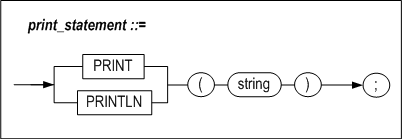

# 3. Stored Procedure Blocks

A stored procedure or function consists of one or more blocks. This chapter describes how to develop a procedural program within a stored procedure using blocks.

### Stored Procedure Block

#### Syntax

 

 

 

A block can be broadly divided into a declaration section, a block body and an exception handler section.

 A semicolon (“;”), which indicates the end of a statement, is not used after the DECLARE, BEGIN or EXCEPTION statements, but must be placed after the END statement and other commands in stored procedures. Comments can be used in stored procedures.

To comment out all or part of a single line, place two hyphen characters (“--”) at the beginning of the text to be commented out. To comment out multiple lines, place the C-style delimiters “/*” and “*/” around the text to be commented out.

Stored procedure block can be used independently without header. This is called anonymous block. Anonymous block is supported from Altibase 7.1.0.2.3 and has features as follows.

- Does not create or store PSM object in database.
- Does not return the value of RETURN clause.
- Unlike stored procedures, BIND variables for INPUT, OUTPUT, INOUTPUT can be used.

```
iSQL> VAR OUT1 OUTPUT INTEGER;
iSQL> VAR INOUT1 INOUTPUT INTEGER;
iSQL> EXEC :INOUT1 := 1;

iSQL> DECLARE
    VAR1 INTEGER;
BEGIN
    VAR1 := :INOUT1;
    :OUT1 := VAR1;
    :INOUT1 := VAR1 + 1;
END;
/
Execute success.

iSQL> PRINT VAR;
[ HOST VARIABLE ]
-------------------------------------------------------
NAME                 TYPE                 VALUE
-------------------------------------------------------
OUT1                 INTEGER              1
INOUT1               INTEGER              2
```

In this chapter, the variable assignment statements, which can be used within the declaration section and block body, and the SELECT INTO, assignment statements, LABEL, PRINT and RETURN statements, which can be used only within the block body, will be described.

Information on the use of control flow statements, cursor-related statements and exception handlers in stored procedures can be found in subsequent chapters. For information on general SQL statements, please refer to the *SQL Reference.*

#### Declare Section  

The declare section is delimited by the AS and BEGIN keywords for the main block, and by the DECLARE and BEGIN keywords for sub-blocks. Local variables, cursors, and user-defined exceptions for use in the current block are declared here.

In this chapter, only local variables will be described. Cursors and exception handlers will be described together with the related statements in Chapter5: Using Cursors and Chapter9: Exception Handlers, respectively.

#### Block Body

The block body is the part between the BEGIN and END keywords. It contains SQL statements and control flow statements.

The following SQL statements and control flow statements can be used within the block body:

-   DML statements: SELECT/INSERT/DELETE/UPDATE/MOVE/MERGE/ENQUEUE/DEQUEUE

-   Transaction statements: COMMIT/ROLLBACK/SAVEPOINT

-   Control flow statements: IF, CASE, FOR, LOOP, WHILE, EXIT, CONTINUE, NULL

-   Assignment statements

-   Output statements: PRINT, RETURN

-   Cursor statements: OPEN, FETCH, CLOSE, Cursor FOR LOOP

-   Dynamic SQL statement: EXECUTE IM../../media/StoredProcedureTE

-   Exception handling statements: RAISE, RAISE_APPLICATION_ERROR

One advantage of stored procedures compared to SQL statements is that it is possible to nest blocks. Anywhere that commands can be used, commands can be formed into blocks, which can be nested.

#### Exception Handler Section

The exception handler section is delimited by the EXCEPTION and END keywords. It contains a routine for handling particular errors that may arise during execution of the stored procedure or function

### Declaring Local Variables

#### Syntax


#### Purpose

##### variable_name

This is used to specify the name of a variable.

The name of the variable must be unique within the block in which it is declared.

If a column and a variable have the same name, any reference to this name in a SQL statement will be interpreted to mean the column. In the following example, both instances of eno are interpreted to mean the column name, with the undesirable result that all of the records in the employees table will be deleted.

```
DECLARE
eno INTEGER := 100;
BEGIN
DELETE FROM employees WHERE eno = eno;
…

```

To overcome this ambiguity, use a label to assign a name to the block as follows:

```
<<del_block>>
DECLARE
eno INTEGER := 100;
BEGIN
DELETE FROM employees WHERE eno = del_block.eno;

```

For more information about naming blocks, please refer to LABEL in this chapter.

##### pragma declaration

Please refer to the Pragma section in chapter 10 of this chapter.

##### data_type

This is used to specify the data type of the variable. The following data types can be used within stored procedures:

-   Data types available for use in SQL statements : please refer to Data Types in Chapter 2.
-   BOOLEAN types: please refer to Data Types in Chapter 2.
-   Any type which is defined for a column or variable and is referenced using the %TYPE attribute
-   A RECORD type, comprising multiple columns, referenced using the %ROWTYPE attribute
-   User-defined types: please refer to Chapter6: User-Defined Types.

The %TYPE and %ROWTYPE attributes obviate the necessity to change the code in stored procedures when table definitions change. That is, when the data type of a column in a table is changed, a variable defined using the %TYPE attribute will automatically take on the correct type, without any intervention. This helps realize data independence and lower maintenance expenses.

##### CONSTANT

This option is used when it is desired to use a particular variable as a constant, so that no other value can be assigned to it within the stored procedure. A variable defined in this way is read-only.

For example, when max_val is declared as shown below, it is handled as a constant having the value of 100, and no other value can be arbitrarily allocated thereto.

```
max_val CONSTANT integer := 100;
```


##### NOCOPY

The NOCOPY option of local variables operates is on equal terms with that of the parameters. Thus, only the address assigned to variables is copied if the NOCOPY option is specified when declaring variables.

##### DEFAULT

This is used as follows to set an initial value for a variable when it is declared:

```
curr_val INTEGER DEFAULT 100;
count_val INTEGER := 0;
```


##### Cursor Declaration

 Please refer to the CURSOR section in Chapter 5 in this manual.

##### Exception Declaration

Please refer to the Exception Delacration section in Chapter 9 in this manual.

##### Nested Blocks and Variable Scope

The scope of a variable specified in the DECLARE section of a block starts at the BEGIN statement and finishes at the END statement in the block in which it was declared.

Suppose that block2 is declared inside block1, and that variables having the same name, v_result, are declared within each block, as shown below. When v_result is referenced outside of block2, the reference is interpreted to mean the variable declared in block1, whereas when v_result is referenced inside block2, it is interpreted to mean the variable declared in block2.

Meanwhile, both the variable x, which was declared in block1 (the outer block), and the variable y, which was declared in block2 (the inner block), can be referred to in the inner block, but only x can be referred to in the outer block.


##### Restrictions

The following are not supported when declaring variables:

* Variables defined within stored procedures cannot have NOT NULL constraints.

* Multiple variables cannot be declared at the same time. That is, statements such as the following are not possible:

```
i, j, k INTEGER;
```


#### Examples

##### Use of %TYPE

```
DECLARE
my_title books.title%TYPE;
```

In the above example, the variable my_title is declared such that it will have the same type as the title column in the books table.

##### Use of %ROWTYPE

```
DECLARE
dept_rec departments%ROWTYPE
```

In the above example, the variable *dept_rec*, which is a RECORD type variable, is declared such that it will be the same as the departments table or cursor.

##### Example 1

This example shows the declaration of constants and the use of the %ROWTYPE attribute.

```
CREATE TABLE t1(i1 INTEGER, i2 INTEGER);

CREATE OR REPLACE PROCEDURE proc1
AS
  v1 constant INTEGER := 1;
  v2 constant t1.i1%TYPE := 1;
BEGIN
  INSERT INTO t1 VALUES (v1, v2);
END;
/

EXEC proc1;
iSQL> SELECT * FROM t1;
T1.I1       T1.I2       
---------------------------
1           1           
1 row selected.

--DROP TABLE t1;
CREATE TABLE t1 (i1 INTEGER, i2 INTEGER, i3 INTEGER);
INSERT INTO t1 VALUES(1,1,1);

CREATE OR REPLACE PROCEDURE proc1
AS
  r1 t1%ROWTYPE;
BEGIN
  INSERT INTO t1 VALUES(3,3,3);
  <<s>>
  DECLARE
    r1 t1%ROWTYPE;

  BEGIN
    SELECT i1, i2, i3 INTO s.r1.i1, s.r1.i2, s.r1.i3 FROM t1 WHERE i1 = 1;
    INSERT INTO t1 VALUES (s.r1.i1, s.r1.i2, s.r1.i3);
  END;

END;
/

iSQL> EXEC proc1;
Execute success.
iSQL> SELECT * FROM t1;
T1.I1       T1.I2       T1.I3       
----------------------------------------
1           1           1           
3           3           3           
1           1           1           
3 rows selected.

```


##### Example 2

This example also shows the use of the %ROWTYPE attribute.

```
CREATE TABLE emp(
    eno INTEGER,
    ename CHAR(10),
    emp_job CHAR(15),
    join_date DATE,
    salary NUMBER(10,2),
    dno BYTE(2));

CREATE TABLE emp401(
    eno INTEGER,
    ename CHAR(10),
    emp_job CHAR(15),
    join_date DATE,
    leave_date DATE,
    salary NUMBER(10,2),
    dno BYTE(2),
    fund NUMBER(10,2) DEFAULT 0);

INSERT INTO emp VALUES (10, 'DKLEE', 'ENGINEER', '01-Jul-2000', 30000000, BYTE'D001');
INSERT INTO emp VALUES (20, 'SWMYUNG', 'MANAGER', '01-Nov-1999', 50000000, BYTE'C002');

CREATE OR REPLACE PROCEDURE proc1(p1 INTEGER)
AS
BEGIN
  DECLARE
    emp_rec emp%ROWTYPE;
  BEGIN
    SELECT * INTO emp_rec
    FROM emp
    WHERE eno = p1;
    INSERT INTO emp401(eno, ename, emp_job, join_date, leave_date, salary, dno)
      VALUES(emp_rec.eno, emp_rec.ename, emp_rec.emp_job, emp_rec.join_date, sysdate, emp_rec.salary, emp_rec.dno);
  END;
END;
/

iSQL> EXEC proc1(10);
Execute success.
iSQL> SELECT * FROM emp401;
EMP401.ENO  EMP401.ENAME  EMP401.EMP_JOB   EMP401.JOIN_DATE     
-----------------------------------------------
EMP401.LEAVE_DATE    EMP401.SALARY EMP401.DNO  EMP401.FUND
-----------------------------------------------
10          DKLEE       ENGINEER         2000/07/01 00:00:00  
2005/01/27 16:26:26  30000000    D001  0           
1 row selected.

```


##### Example 3

This is an example describing the use of NOCOPY option.

```
iSQL>create or replace procedure proc1
as
      type arr_type is table of INTEGER index by INTEGER;
      var1 arr_type;
      var2 arr_type;
      var3 NOCOPY arr_type;
    begin
      for i in 1 .. 5 loop
        var1[i] := i;
      end loop;
      var2 := var1;
      var3 := var1;
    end;
/
Create success.
iSQL>  exec proc1;
Execute success.
iSQL> create or replace procedure proc2
    as
      type arr_type_1d is table of INTEGER index by INTEGER;
      type arr_type_2d is table of arr_type_1d index by INTEGER;
      var_2d arr_type_2d;
      var_1d NOCOPY arr_type_1d;
    begin
      for i in 1 .. 5 loop
        var_1d := var_2d[i];  
        for j in 1 .. 5 loop
          var_1d[j] := i * j;
        end loop;
      end loop;
      for i in 1 .. 5 loop
        var_1d := var_2d[i];
        for j in 1 .. 5 loop
          println(var_1d[j]);
        end loop;
      end loop;
    end;
    /
Create success.
iSQL> exec proc2;
1
2
3
4
5
2
4
6
8
10
3
6
9
12
15
4
8
12
16
20
5
10
15
20
25
Execute success.

```


### SELECT INTO

#### Syntax


Because the syntax of select_list and rest_of_select_statement is the same as for a SELECT statement, please refer to the SQL Reference for more information on those elements.

#### Purpose

When a stored procedure includes a SELECT statement, the SELECT statement must contain an INTO clause.

A SELECT statement in a stored procedure or function must retrieve exactly one record. If the statement retrieves zero or multiple records, an error will be raised.

The number of columns in select_list in the SELECT clause must be the same as the number of variable_name in the INTO clause. Furthermore, the data types of corresponding columns and variables must be compatible. Similarly, when the %ROWTYPE attribute is used, the number of columns in the %ROWTYPE variable and the number of columns in select_list must be the same, and the data types of corresponding columns must be compatible.

When a standard exception occurs, the stored procedure raises an error. The NO_DATA_FOUND and TOO_MANY_ROW exceptions can be used to handle errors in the block's exception handler section. Please refer to Chapter9: Exception Handlers for more information about handling errors.


##### BULK COLLECT clause

Unlike the INTO clause that returns one record each time, the BULK COLLECT clause returns all of the execution results of the SELECT statement at once. Two types of bind variables as shown below can be specified to follow INTO:

-   array_record_name  
    This specifies the associative array variables of RECORD type that are to store the records that the SELECT statement returns.

-   array_variable_name  
    SThis specifies the array variables for each column of the SELECT list. Each data type of the array variables must be compatible with the data type of the corresponding column in the SELECT list, and the number of array variables must equal the number of columns of the SELECT list.

Returning all of the result sets of queries at once using the BULK COLLECT clause is more efficient than returning result rows one at a time using the loop statement.

#### Example

##### Example 1

```
CREATE TABLE t1(i1 INTEGER, i2 INTEGER, i3 INTEGER);
INSERT INTO t1 VALUES(1,1,1);

CREATE OR REPLACE PROCEDURE proc1
AS
  v1 INTEGER;
  r1 t1%ROWTYPE;
BEGIN
  INSERT INTO t1 VALUES (3,3,3);
  <<s>>
  DECLARE
    v1 proc1.r1.i1%TYPE;
    r1 t1%ROWTYPE;
  BEGIN
    SELECT i1,i2,i3
    INTO s.r1.i1, s.r1.i2, s.r1.i3
    FROM t1  
    WHERE i1 = 1;

    INSERT INTO t1 VALUES(s.r1.i1, s.r1.i2, s.r1.i3);
  END;
END;
/

iSQL> EXEC proc1;
Execute success.
iSQL> SELECT * FROM t1;
T1.I1       T1.I2       T1.I3       
----------------------------------------
1           1           1           
3           3           3           
1           1           1           
3 rows selected.

```


##### Example 2

```
CREATE TABLE t1 (i1 INTEGER, i2 INTEGER, i3 INTEGER);
INSERT INTO t1 VALUES(100, 100, 100);

CREATE SEQUENCE seq1;

CREATE SEQUENCE seq2;

CREATE SEQUENCE seq3;

CREATE OR REPLACE PROCEDURE proc1
AS
BEGIN
  <<seq1>>
  DECLARE
   nextval INTEGER;
  BEGIN
   nextval := 10;
    INSERT INTO t1 VALUES (seq1.NEXTVAL,0,0);
  END;
END;
/

CREATE OR REPLACE PROCEDURE proc2
AS
BEGIN
  INSERT INTO t1 VALUES (seq1.NEXTVAL, seq2.NEXTVAL, seq3.NEXTVAL);
  INSERT INTO t1 VALUES (seq1.NEXTVAL, seq2.NEXTVAL, seq3.NEXTVAL);
  INSERT INTO t1 VALUES (seq1.NEXTVAL, seq2.NEXTVAL, seq3.NEXTVAL);
END;
/   

CREATE OR REPLACE PROCEDURE proc3
AS
  v1 INTEGER;
  v2 INTEGER;
  v3 INTEGER;
BEGIN
  SELECT seq1.currval, seq2.NEXTVAL, seq3.NEXTVAL
  INTO v1, v2, v3 FROM t1 WHERE i1 = 100;
  INSERT INTO t1 VALUES (v1, v2, v3);

  SELECT seq1.currval, seq1.NEXTVAL, seq1.currval
  INTO v1, v2, v3 FROM t1 WHERE i1 = 100;
  INSERT INTO t1 VALUES (v1, v2, v3);

  SELECT seq1.currval, seq2.NEXTVAL, seq3.NEXTVAL
  INTO v1, v2, v3 FROM t1 WHERE i1 = 100;
  INSERT INTO t1 VALUES (v1, v2, v3);
END;
/

EXEC proc1;
SELECT * FROM t1;
EXEC proc2;
SELECT * FROM t1;
EXEC proc3;
SELECT * FROM t1;
EXEC proc2;
SELECT * FROM t1;
EXEC proc3;

iSQL> SELECT * FROM t1;
T1.I1       T1.I2       T1.I3       
----------------------------------------
100         100         100         
10          0           0           
1           1           1           
2           2           2           
3           3           3           
3           4           4           
4           4           4           
4           5           5           
5           6           6           
6           7           7           
7           8           8           
7           9           9           
8           8           8           
8           10          10          
14 rows selected.

```


##### Example 3

```
CREATE TABLE t1(i1 INTEGER, i2 INTEGER, i3 INTEGER);

CREATE TABLE t2(i1 INTEGER, i2 INTEGER, i3 INTEGER);
INSERT INTO t1 VALUES (1,1,1);
INSERT INTO t1 VALUES (2,2,2);

CREATE OR REPLACE PROCEDURE proc1
AS
  v1 INTEGER;
  r1 t1%ROWTYPE;
BEGIN
  SELECT i1 INTO v1 FROM t1 WHERE i1 = 1;
  SELECT * INTO r1 FROM t1 WHERE i1 = 1;
  INSERT INTO t2 VALUES (v1, r1.i2, r1.i3);
  <<s>>
  DECLARE
    r1 t1%ROWTYPE;
  BEGIN
    SELECT i1, i2, i3 INTO s.r1.i1, s.r1.i2, s.r1.i3
    FROM t1 WHERE i1 = 2;
    INSERT INTO t2 VALUES (s.r1.i1, s.r1.i2, s.r1.i3);
  END;
END;
/

iSQL> EXEC proc1;
Execute success.
iSQL> SELECT * FROM t2;
T2.I1       T2.I2       T2.I3       
----------------------------------------
1           1           1           
2           2           2           
2 rows selected.

```


##### Example 4

```
CREATE TABLE t3(i1 INTEGER);

CREATE OR REPLACE PROCEDURE proc1
AS
  max_qty orders.qty%TYPE;
BEGIN
  SELECT MAX(qty)
  INTO max_qty
  FROM orders;

  INSERT INTO t3 VALUES(max_qty);
END;
/

iSQL> exec proc1;
Execute success
iSQL> SELECT * FROM t3;
T3.I1       
--------------
10000       
1 row selected.

```


##### Example 5

```
CREATE TABLE delayed_processing(
  cno CHAR(14),
  order_date DATE);

CREATE OR REPLACE PROCEDURE proc1
AS
  de_cno CHAR(14);
  de_order_date DATE;
BEGIN
  INSERT INTO delayed_processing

  SELECT cno, order_date
  INTO de_cno, de_order_date
  FROM orders
  WHERE processing = 'D';

END;
/
iSQL> EXEC proc1;
Execute success.
iSQL> SELECT * FROM delayed_processing;
DELAYED_PROCESSING.CNO  DELAYED_PROCESSING.ORDER_DATE
-----------------------------------------------
7610011000001  2000/11/29 00:00:00  
7001011001001  2000/11/29 00:00:00  
2 rows selected.

```


##### Example 6

```
create table t1(i1 int,i2 int);
insert into t1 values(1,1);
insert into t1 values(2,2);
insert into t1 values(3,3);

CREATE OR REPLACE PROCEDURE proc1
AS
  type myvarchararr is table of varchar(10) index by integer;
  v2 myvarchararr;
BEGIN
  SELECT i2 BULK COLLECT INTO v2 FROM t1;
  FOR i IN v2.first() .. v2.last() LOOP
    println('v2['||i||']='||v2[i]);
  END LOOP;
END;
/

iSQL> EXEC proc1();
v2[1]=1
v2[2]=2
v2[3]=3
Execute success.

```


### RETURNING INTO Clause

#### Syntax


#### Function

The RETURNING INTO clause specifies the variables which are to store the record values affected by the execution of DELETE, INSERT, or UPDATE statements that have this clause. The variables can be individual variables or array variables.

##### expr

Each expr must be a column name affected by DML statements or a data expression compatible with column types.

##### into_clause

The INTO clause commands modified record values to be respectively stored as variable_name variables.

##### variable_name

Each variable_name is a PSM variable in which queried expr values are to be stored. Unless using record type variables, the number of variables must equal the number of expr of the expr list. PSM variable types must be compatible with relevant expr types.

##### record_name

This is the name of the RECORD type variable which is to store the row returned by the statement.

##### bulk_collect_clause

Unlike the INTO clause which retrieves one record at a time, the BULK COLLECT clause retrieves all of the rows returned by the statement at once. Two types of bind variables as shown below can be specified to follow INTO:

-   array_record_name  
    This specifies the associative array variables of RECORD.

-   array_variable_name  
    This specifies the array variables for each column of the *expr* list. Each data type of the array variables must be compatible with the data type of the corresponding column in the expr list, and the number of array variables must equal the number of columns of the *expr* list.

#### Example

##### Example 1

```
iSQL> create table employees ( eno integer, ename varchar(20));
Create success.

iSQL> create or replace procedure proc1
as
  x1 integer;
  x2 varchar(30);
begin
      insert into employees values (1, 'jake') return eno, ename into x1, x2;
      println( 'x1='||x1||', x2='||x2);
end;
/
Create success.

iSQL> exec proc1;
x1=1, x2=jake
Execute success.

```


##### Example 2

```
iSQL> create table employees ( eno integer, ename varchar(20));
Create success.
iSQL> create or replace procedure proc1
as
  type myintarr is table of integer index by integer;
  type myvarchararr is table of varchar(30) index by integer;

  v1 myintarr;
  v2 myvarchararr;

begin
      insert into employees values (1, 'jake') return eno, ename bulk collect into v1, v2;
      for i in v1.first() .. v1.last() loop
      println( 'v1['||i||']='||v1[i] );
      end loop;
      for i in v2.first() .. v2.last() loop
      println( 'v2['||i||']='||v2[i] );
      end loop;
end;
/
Create success.
iSQL> exec proc1;
v1[1]=1
v2[1]=jake
Execute success.

```


##### Example 3

```
iSQL> create table employees ( eno integer, ename varchar(20));
Create success.
iSQL> create or replace procedure proc1
as
  type myrec is record( i1 integer, i2 varchar(30) );
  type myrecarr is table of myrec index by integer;

  r1 myrecarr;
  s1 myrec;

begin
    insert into employees values (1, 'jake') return eno, ename bulk collect into r1;
    for i in r1.first() .. r1.last() loop
    s1 := r1[i];
    println( 'r1['||i||'].eno='||s1.i1||', r1['||i||'].ename='||s1.i2 );
    end loop;
end;
/
Create success.
iSQL> exec proc1;
r1[1].eno=1, r1[1].ename=jake
Execute success.

```


##### Example 4

```
create table employees ( eno integer, ename varchar(20));
insert into employees values (1, 'jake');
insert into employees values (2, 'nikita');
insert into employees values (3, 'dana');

iSQL> create or replace procedure proc1
as
  x1 integer;
  x2 varchar(30);
begin
      delete from employees where eno = 1 return eno, ename into x1, x2;
      println( 'x1='||x1||', x2='||x2);
end;
/
Create success.
iSQL> exec proc1;
x1=1, x2=jake
Execute success.

```


##### Example 5

```
create table employees ( eno integer, ename varchar(20));
insert into employees values (1, 'no1.jake');
insert into employees values (1, 'no2.jake');
insert into employees values (1, 'no3.jake');

iSQL> create or replace procedure proc1
as
  type myintarr is table of integer index by integer;
  type myvarchararr is table of varchar(30) index by integer;

  v1 myintarr;
  v2 myvarchararr;

begin
      delete from employees where eno = 1 return eno, ename bulk collect into v1, v2;

      for i in v1.first() .. v1.last() loop
      println( 'v1['||i||']='||v1[i] );
      end loop;
      for i in v2.first() .. v2.last() loop
      println( 'v2['||i||']='||v2[i] );
      end loop;

end;
/
Create success.
iSQL> exec proc1;
v1[1]=1
v1[2]=1
v1[3]=1
v2[1]=no1.jake
v2[2]=no2.jake
v2[3]=no3.jake
Execute success.

```


##### Example 6

```
create table employees ( eno integer, ename varchar(20));
insert into employees values (1, 'no1.jake');
insert into employees values (1, 'no2.jake');
insert into employees values (1, 'no3.jake');

iSQL> create or replace procedure proc1
as
  type myrec is record( i1 integer, i2 varchar(30) );
  type myrecarr is table of myrec index by integer;

  r1 myrecarr;
  s1 myrec;

begin
    delete from employees where eno = 1 return eno, ename bulk collect into r1;
    for i in r1.first() .. r1.last() loop
    s1 := r1[i];
    println( 'r1['||i||'].eno='||s1.i1||', r1['||i||'].ename='||s1.i2 );
    end loop;
end;
/
Create success.
iSQL> exec proc1;
r1[1].eno=1, r1[1].ename=no1.jake
r1[2].eno=1, r1[2].ename=no2.jake
r1[3].eno=1, r1[3].ename=no3.jake
Execute success.

```


##### Example 7

```
create table employees ( eno integer, ename varchar(20));
insert into employees values (1, 'jake');
insert into employees values (2, 'nikita');
insert into employees values (3, 'dana');

iSQL> create or replace procedure proc1
as
  x1 integer;
  x2 varchar(30);
begin
      update employees set ename = 'mikhaila' where eno = 1 return eno, ename into x1, x2;
      println( 'x1='||x1||', x2='||x2);
end;
/
Create success.
iSQL> exec proc1;
x1=1, x2=mikhaila
Execute success.

```


##### Example 8

```
create table employees ( eno integer, ename varchar(20));
insert into employees values (1, 'no1.jake');
insert into employees values (1, 'no2.jake');
insert into employees values (1, 'no3.jake');

iSQL> create or replace procedure proc1
as
  type myintarr is table of integer index by integer;
  type myvarchararr is table of varchar(30) index by integer;

  v1 myintarr;
  v2 myvarchararr;

begin
      update employees set eno = 5, ename = 'mikhaila' where eno = 1 return eno, ename bulk collect into v1, v2;

      for i in v1.first() .. v1.last() loop
      println( 'v1['||i||']='||v1[i] );
      end loop;
      for i in v2.first() .. v2.last() loop
      println( 'v2['||i||']='||v2[i] );
      end loop;

end;
/
Create success.
iSQL> exec proc1;
v1[1]=5
v1[2]=5
v1[3]=5
v2[1]=mikhaila
v2[2]=mikhaila
v2[3]=mikhaila
Execute success.

```


##### Example 9

```
create table employees ( eno integer, ename varchar(20));
insert into employees values (1, 'no1.jake');
insert into employees values (1, 'no2.jake');
insert into employees values (1, 'no3.jake');

iSQL> create or replace procedure proc1
as
  type myrec is record( i1 integer, i2 varchar(30) );
  type myrecarr is table of myrec index by integer;

  r1 myrecarr;
  s1 myrec;

begin
    update employees set eno = 5, ename = 'mikhaila' where eno = 1 return eno, ename bulk collect into r1;
    for i in r1.first() .. r1.last() loop
    s1 := r1[i];
    println( 'r1['||i||'].eno='||s1.i1||', r1['||i||'].ename='||s1.i2 );
    end loop;
end;
/
Create success.
iSQL> exec proc1;
r1[1].eno=5, r1[1].ename=mikhaila
r1[2].eno=5, r1[2].ename=mikhaila
r1[3].eno=5, r1[3].ename=mikhaila
Execute success.

```


### Assignment Statements

#### Syntax


#### Purpose

These statements are used to assign a value to a local variable or to an OUT or IN/OUT parameter.

Values can be assigned to variables and parameters using either of the two following statements:

-   Using the assignment operator “:=”  
    *variable_name* := value;  
    *parameter_name* := value;

-   Using the “SET” expression  
    SET *variable_name* = value;  
    SET *parameter_name* = value;

Refer to each of the individual values in a RECORD type variable that was declared using the %ROWTYPE attribute in this way:

#### Example

##### Example 1

```
CREATE TABLE t1(i1 INTEGER, i2 INTEGER, i3 INTEGER);

CREATE OR REPLACE PROCEDURE proc1
AS
  i INTEGER;
BEGIN
  i := 5;

  WHILE i <= 10 LOOP
    INSERT INTO t1 VALUES (i, i+1, i+2);
    i := i + 1;
  END LOOP;

END;
/

iSQL> EXEC proc1;
Execute success.
iSQL> SELECT * FROM t1;
T1.I1       T1.I2       T1.I3       
----------------------------------------
5           6           7           
6           7           8           
7           8           9           
8           9           10          
9           10          11          
10          11          12          
6 rows selected.

```


##### Example 2

```
CREATE TABLE t1(i1 INTEGER, i2 INTEGER, i3 INTEGER);

CREATE OR REPLACE FUNCTION plus20(p1 IN INTEGER)
RETURN INTEGER
AS
  v1 INTEGER;
BEGIN
  v1 := p1 + 20;
  RETURN v1;
END;
/

CREATE OR REPLACE PROCEDURE proc1
AS
  v1 INTEGER;
  in_arg INTEGER;
BEGIN
  in_arg := 80;
  v1 := plus20(in_arg);
  INSERT INTO t1 VALUES (v1, v1, v1);
END;
/

iSQL> EXEC proc1;
Execute success.
iSQL> SELECT * FROM t1;
T1.I1       T1.I2       T1.I3       
----------------------------------------
100         100         100         
1 row selected.

```


### LABEL

The LABEL statement is used to name a particular point within a stored procedure. A label can be specified within a block using the delimiters shown below:

\<\< User_defined_label_name \>\>

#### Purpose

User-defined labels are used in the following three situations:

-   To limit the scope of multiple variables having the same name, or to overcome ambiguity that occurs when a variable and a column have the same name
-   To exit a nested loop
-   For use with the GOTO statement

#### Limitations

1. The same label cannot be used more than once within the same block. In the following example, a compilation error will occur, because LABEL1 appears twice within the same block:

```
CREATE OR REPLACE PROCEDURE PROC1
AS
    V1 INTEGER;
BEGIN
    <<LABEL1>>
    V1 := 1;
    <<LABEL1>>   
    V1 := V1 + 1;
…
```

2. In order to use labels to limit the scope of variables having the same name, the labels must be declared immediately before DECLARE statements. Note that it is possible to declare more than one label before a single DECLARE statement. In the following example, there are two references to the variable V1 denoted by (1):

```
CREATE OR REPLACE PROCEDURE PROC1
AS
    V1 INTEGER;
BEGIN
    <<LABEL1>>    --- LABLE 지정
    <<LABEL2>>
     DECLARE
            V1 INTEGER; .......(1)
     BEGIN
            <<LABEL3>>
            DECLARE
                V1 INTEGER; ......(2)
            BEGIN    
                LABEL1.V1 := 1;   -- (1)의 V1 참조
                LABEL2.V1 := 2;   -- (1)의 V1 참조
                LABEL3.V1 := 3;   -- (2)의 V1 참조
            END;
       END;
END;
/
In the following example, because the label declaration does not immediately precede the DECLARE statement, an error results:
AS
    V1 INTEGER;
BEGIN
    <<LABEL1>>
     V1 := 1;
     DECLARE
         V1 INTEGER;
      BEGIN
          LABEL1.V1 := 1;   --- ERROR.
```


2. Similarly, when using a label to exit nested loops, the label must be declared immediately before the loop. Note again that it is possible to declare more than one label before the loop.

```
CREATE OR REPLACE PROCEDURE PROC1
AS
    V1 INTEGER;
BEGIN
     V1 := 0;
    <<LABEL1>>
    <<LABEL2>>
     FOR I IN 1 .. 10 LOOP
          V1 := V1 + 1;
           FOR I IN 1 .. 10 LOOP
                V1 := V1 + 1;
                EXIT LABEL1 WHEN V1 = 30;
            END LOOP;
      END LOOP;
END;
/
```

In the following example, one of the labels is not declared immediately before the loop. Because this label cannot be used to exit from the nested loops, an error is raised during the attempt to compile the stored procedure.

```
CREATE OR REPLACE PROCEDURE PROC1
AS
    V1 INTEGER;
BEGIN
    <<LABEL1>>
     V1 := 0;
    <<LABEL2>>
     FOR I IN 1 .. 10 LOOP
          V1 := V1 + 1;
           FOR I IN 1 .. 10 LOOP
                V1 := V1 + 1;
              EXIT LABEL1 WHEN V1 = 30; -- ERROR
          END LOOP;
      END LOOP;
END;
/
```


### PRINT

#### Syntax



#### Purpose

The PRINT statement is used to output desired text to the calling client or routine. PRINT is a system procedure that is provided within Altibase, and is typically used for debugging and testing. PRINTLN differs from PRINT only in that it outputs the appropriate newline sequence ( "\n" in Unix) after the string. The owner of PRINT and PRINTLN is the SYSTEM_user.

It is possible to specify the SYSTEM_ user when using these routines, as follows:

```
SYSTEM_.PRINTLN(‘Hello World’);
```

However, it is not necessary to specify the SYSTEM_ user in this way, because a public synonym exists for these procedures.

##### String

This is the string to be output to the client.

As seen in Example 2 below, the double-vertical-bars concatenation operator ("||") can be used to combine the values of variables, query results, etc. with text to create a single line of text to be output to the client.

#### Example

##### Example 1

```
CREATE OR REPLACE PROCEDURE proc1
AS
  v1 BIGINT;
BEGIN
  v1 := BIGINT'9223372036854775807';
  system_.println ('1');
  system_.println (v1);
  system_.println ('2');
END;
/

iSQL> EXEC proc1;
1
9223372036854775807
2
Execute success.
```


##### Example 2

```
CREATE OR REPLACE PROCEDURE proc1
AS
  eno_count INTEGER;
BEGIN
  SELECT COUNT(eno) INTO eno_count FROM employees;
  println('The NUMBER of Employees: ' || eno_count);
END;
/

iSQL> EXEC proc1;
The NUMBER of Employees: 20
Execute success.
```


##### Example 3

The following example illustrates how to use a loop with PRINT and PRINTLN to output formatted query results.

```
CREATE OR REPLACE PROCEDURE showProcedures
AS
  CURSOR c1 IS
    SELECT SYSTEM_.sys_procedures_.proc_name, decode(SYSTEM_.sys_procedures_.object_TYPE, 0, 'Procedure',1,'Function')
    FROM system_.sys_procedures_ ;

  v1 CHAR(40);
  v2 CHAR(20);
BEGIN
  OPEN c1;
  SYSTEM_.PRINTLN('--------------------------');
  SYSTEM_.PRINT('Proc_Name');
  SYSTEM_.PRINTLN('    Procedure/Function');
  SYSTEM_.PRINTLN('--------------------------');

LOOP
    FETCH C1 INTO v1, v2;
    EXIT WHEN C1%NOTFOUND;
    PRINT(' ');
    PRINT(v1);
    PRINTLN(v2);
END LOOP;

  PRINTLN('------------------------');
  CLOSE c1;
END;
/

iSQL> EXEC showProcedures;
-----------------------------------------------
Proc_Name                           Procedure/Function
-----------------------------------------------

 PRINT                                   Procedure
 PRINTLN                                 Procedure
.
.

 SHOWPROCEDURES                          Procedure
-----------------------------------------------
Execute success.
```


### RETURN

#### Syntax


#### Purpose

This statement is used to interrupt the execution of a stored procedure. When used with a stored function, it is additionally used to specify the return value.

Because stored procedures do not return values, an error will be raised in response to an attempt to compile a stored procedure that specifies a return value. In contrast, because a function must always return a value, it is necessary to specify a return value when creating a function.

##### expression

*expression* is used to specify the return value for a stored function. It is possible to perform operations in *expression*.

#### Example

##### Example 1

```
CREATE TABLE t1(i1 INTEGER, i2 INTEGER, i3 INTEGER);

INSERT INTO t1 VALUES(1,1,1);

CREATE OR REPLACE FUNCTION times_half(p1 IN INTEGER)
RETURN INTEGER
AS
BEGIN
  RETURN p1 / 2;
END;
/

iSQL> SELECT times_half(times_half(8)) FROM t1;
TIMES_HALF(TIMES_HALF(8))
----------------------------
2           
1 row selected.
```


##### Example 2

```
CREATE TABLE t1(i1 INTEGER, i2 INTEGER, i3 INTEGER);

INSERT INTO t1 VALUES(1,1,1);
INSERT INTO t1 VALUES(10,10,10);
INSERT INTO t1 VALUES(100,100,100);

CREATE OR REPLACE FUNCTION max_all_val
RETURN INTEGER
AS
  v1 INTEGER;
BEGIN
  SELECT MAX(i1) INTO v1 FROM t1;
  RETURN v1;
END;
/

iSQL> SELECT max_all_val FROM t1;
MAX_ALL_VAL
--------------
100         
100         
100         
3 rows selected.
```


##### Example 3

```
CREATE TABLE t4(i1 INTEGER, i2 INTEGER);

INSERT INTO t4 VALUES(3, 0);
INSERT INTO t4 VALUES(2, 0);
INSERT INTO t4 VALUES(1, 0);
INSERT INTO t4 VALUES(0, 0);

CREATE OR REPLACE FUNCTION func_plus_10(p1 INTEGER)
RETURN INTEGER
AS
BEGIN
  RETURN p1+10;
END;
/

iSQL> SELECT func_plus_10(i1) FROM t4;
FUNC_PLUS_10(I1)
-------------------
13          
12          
11          
10          
4 rows selected.
```


### INSERT Extension

#### Syntax


#### Purpose

This is a stored procedure extension of the INSERT

The following example inserts the value of a record type variable when inserting a new record into a table or a specific partition withn a stored procedure.

The extension can be executed by replacing the single_table_insert clause and the values_clause clause with the syntax defined above in the SQL reference INSERT.

##### single_table_insert

The single_table_insert clause is used to insert one record into one table.

Note that the INSERT extension cannot specify the column name to insert.

##### record_name

This is a name of the record variable to insert into the specified table. This specifies variables of the RECORD type and the ROWTYPE type.

The number of columns in the record variable and the number of columns in the table must be the same. Also, the columns defined inside the record type must be exactly matched or compatible in the order of the column type. If there is a NOT NULL constraint on a column of the table, NULL values cannot be used for the column of the corresponding record.

#### Example

##### Example 1

This example inserts the record type variable r1 into the table t1 in the procedure.

```
CREATE TABLE t1(
    i1 INTEGER,
    i2 INTEGER,
    i3 INTEGER );

CREATE OR REPLACE PROCEDURE proc1
AS
    r1 t1%ROWTYPE;
BEGIN
    FOR i IN 1 .. 5 LOOP
        r1.i1 := i+10;
        r1.i2 := i+20;
        r1.i3 := i+30;
        INSERT INTO t1 VALUES r1;
    END LOOP;
END;
/

iSQL> EXEC proc1();
Execute success.
iSQL> SELECT * FROM t1;
I1          I2          I3          
----------------------------------------
11          21          31         
12          22          32         
13          23          33         
14          24          34         
15          25          35
5 rows selected.

```

##### Example 2

The following example inserts the value of the OLD ROW record type variable into the log_tbl table when deleting rows of the ORDER table.

```
CREATE TABLE log_tbl (
  ONO            BIGINT,
  ORDER_DATE     DATE,
  ENO            INTEGER,
  CNO            BIGINT,
  GNO            CHAR(10),
  QTY            INTEGER,
  ARRIVAL_DATE   DATE,
  PROCESSING     CHAR(1) );

CREATE TRIGGER del_trigger
AFTER DELETE ON orders
REFERENCING OLD ROW old_row
FOR EACH ROW
AS BEGIN
INSERT INTO log_tbl VALUES old_row;
END;
/

iSQL> DELETE FROM orders WHERE processing = 'D';
2 rows deleted.

iSQL> SELECT * FROM log_tbl;
ONO                  ORDER_DATE   ENO         CNO                  
------------------------------------------------------------------------
GNO         QTY         ARRIVAL_DATE PROCESSING  
------------------------------------------------------
11290011             29-NOV-2011  12          17                  
E111100001  1000        05-DEC-2011  D  
11290100             29-NOV-2011  19          11                 
E111100001  500         07-DEC-2011  D  
2 rows selected.

```


### UPDATE Extension

#### Syntax


#### Purpose

This is a stored procedure extension of the UPDATE statement.

The following example shows changing a record of a table or a specific partition into the value of a record type variable within a stored procedure.

The extension can excuted by replacing the set_clause_list clause with the statement defined above in the SQL Reference UPDATE.

##### record_name

This is a name of the record variable to change. This specifies a variable of type RECORD and ROWTYPE.

The number of columns in the record variable and the number of columns in the specified table must be the same. In addition, the columns defined inside the record type must be exactly matched or compatible in the order of the specified table column type. If there is a NOT NULL constraint on a column of the table, NULL values cannot be used for the column of the corresponding record.

#### Example

##### Example 1

Update the salary of employees with programmer job. This example inserts the value of a record type variable inside a procedure.

```
CREATE OR REPLACE PROCEDURE proc1 as
    TYPE TYPE_REC IS RECORD( eno INTEGER, SALARY NUMBER(10,2) );
    TYPE TYPE_ARR IS TABLE OF TYPE_REC INDEX BY INTEGER;
    emps TYPE_ARR;
    idx  INTEGER;
BEGIN
    SELECT ENO, SALARY BULK COLLECT INTO emps FROM EMPLOYEES WHERE EMP_JOB = 'programmer';

    FOR idx IN emps.FIRST() .. emps.LAST() LOOP
        emps[idx].SALARY := emps[idx].SALARY * 1.02;

        UPDATE (SELECT ENO, SALARY FROM EMPLOYEES)
            SET ROW = emps[idx]
            WHERE ENO = emps[idx].eno;
    END LOOP;
END;
/

iSQL> SELECT * FROM EMPLOYEES WHERE EMP_JOB = 'programmer';
ENO         E_LASTNAME            E_FIRSTNAME           EMP_JOB          
------------------------------------------------------------------------------
EMP_TEL          DNO         SALARY      SEX  BIRTH   JOIN_DATE    STATUS  
-----------------------------------------------------------------------------------
6           Momoi                 Ryu                   programmer       
0197853222       1002        1700        M  790822  09-SEP-2010  H  
10          Bae                   Elizabeth             programmer       
0167452000       1003        4000        F  710213  05-JAN-2010  H  
2 rows selected.
iSQL> EXEC PROC1();
Execute success.

iSQL> SELECT * FROM EMPLOYEES WHERE EMP_JOB = 'programmer';
ENO         E_LASTNAME            E_FIRSTNAME           EMP_JOB          
------------------------------------------------------------------------------
EMP_TEL          DNO         SALARY      SEX  BIRTH   JOIN_DATE    STATUS  
-----------------------------------------------------------------------------------
6           Momoi                 Ryu                   programmer       
0197853222       1002        1734        M  790822  09-SEP-2010  H  
10          Bae                   Elizabeth             programmer       
0167452000       1003        4080        F  710213  05-JAN-2010  H  
2 rows selected.

```


