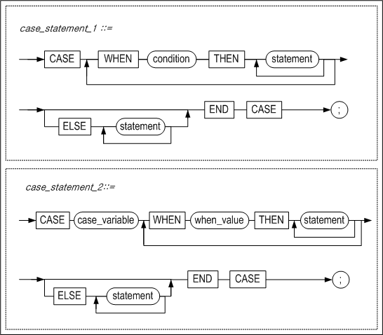
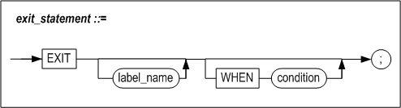
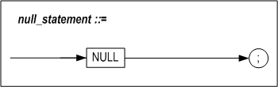

# 4. Control Flow Statement

### Overview

This chapter describes how to use control flow statements in a stored procedure body.

#### Syntax


Altibase supports the use of the following control flow statements in stored procedures:

-   The IF and CASE conditional statements
-   The LOOP, WHILE and FOR loop constructs, which cause multiple statements to be repeatedly executed
-   The EXIT and CONTINUE statements, which are used to control the iteration of loops
-   The NULL statement, which indicates that nothing is to be executed
-   The GOTO statement, which is used to transfer control to a particular point

#### Restrictions

Any expressions containing subqueries cannot be used for condition of IF statement and CASE statement. However followings are exceptions of the rule:

-   EXIST (subquery)

-   NOT EXIST (subquery)

### IF

#### Syntax


#### Purpose

This is a conditional construct that determines where execution continues depending on whether or not a given condition is satisfied. The IF clause checks the condition and passes control to the THEN clause if the condition is true, or to the ELSE clause if the condition is false or NULL.

##### condition

All conditions that are available for use in the WHERE clause of SQL statements can be used here. For more information about the conditions that are supported in SQL, please refer to the *SQL Reference.*

##### ELS(E)IF

Use this clause to specify another condition to be checked when the previous IF condition is FALSE.

One IF clause can have multiple ELS(E)IF clauses. The ELS(E)IF clause is optional..

##### ELSE

This clause is used to specify what to do when all of the preceding IF and ELS(E)IF conditions are FALSE. One IF clause can have only one corresponding ELSE clause. The ELSE clause can be omitted.

##### Nested IF Constructs

IF constructs can be nested within other IF constructs. That is, one IF construct can be located within a series of statements that are executed depending on the outcome of another IF, ELS(E)IF, or ELSE clause. An END IF clause must be provided for every IF clause.

#### Examples

##### Example 1

```
CREATE OR REPLACE PROCEDURE proc1
AS
  CURSOR c1 IS SELECT eno, emp_job, salary FROM employees;
  emp_id employee.eno%TYPE;
  e_job employee.emp_job%TYPE;
  e_salary employee.salary%TYPE;
BEGIN
  OPEN c1;
  LOOP
    FETCH c1 INTO emp_id, e_job, e_salary;
    EXIT WHEN c1%NOTFOUND;

    IF e_salary IS NULL THEN
      IF e_job = 'CEO' THEN
        e_salary := 5000;
      ELSIF e_job = 'MANAGER' THEN
        e_salary := 4500;
      ELSIF e_job = 'ENGINEER' THEN
        e_salary := 4300;
      ELSIF e_job = 'PROGRAMMER' THEN
        e_salary := 4100;
      ELSE
        e_salary := 4000;
      END IF;

      UPDATE employees SET salary = e_salary WHERE eno = emp_id;
    END IF;

  END LOOP;
  CLOSE c1;
END;
/

iSQL> SELECT eno, emp_job FROM employees WHERE salary IS NULL;
ENO         EMP_JOB          
--------------------------------
1           CEO              
8           manager          
20          sales rep         
3 rows selected.
iSQL> EXEC proc1;
Execute success.
iSQL> SELECT eno, emp_job, salary FROM employees
WHERE eno=1 OR eno=8 OR eno=20;
ENO         EMP_JOB          SALARY      
---------------------------------------------
1           CEO              5000     
8           manager          4500     
20          sales rep         4000     
3 rows selected.
```


##### Example 2

```
CREATE TABLE t1 (i1 VARCHAR(20), i2 NUMBER, i3 DATE);
CREATE TABLE t2 (i1 VARCHAR(20), i2 NUMBER, i3 DATE);

INSERT INTO t1 VALUES ('21-JUL-2001', 2, '01-JUL-2000');
INSERT INTO t2 VALUES (NULL,NULL,'01-FEB-1990');
INSERT INTO t2 VALUES (NULL,NULL,'02-FEB-1990');

CREATE OR REPLACE FUNCTION func2
(p1 IN DATE, p2 IN CHAR(30))
RETURN NUMBER
AS
BEGIN
  RETURN (TO_NUMBER(TO_CHAR(p1, 'dd')) + TO_NUMBER(p2));
END;
/
CREATE OR REPLACE FUNCTION func1
(p1 IN DATE, p2 IN DATE)
RETURN DATE
AS
BEGIN
  IF p1 >= p2 THEN
    RETURN add_months(p1, 3);
  ELSE
    RETURN add_months(p1, 4);
  END IF;
END;
/

CREATE OR REPLACE PROCEDURE proc1
AS
  v1  VARCHAR(20);
  v2  NUMBER;
  v3  DATE;
BEGIN
  SELECT i1, func2(TO_DATE(i1), TO_CHAR(i3, 'yyyy')), i3
  INTO v1,v2,v3 FROM t1 WHERE i2 = 2;
  INSERT INTO t2 VALUES (v1,v2,v3);

  IF v2 not in (2001, 2002, 2003) AND v1 = '21-JUL-2001' THEN
    UPDATE t2
    SET i1 = func1(v1, '17-JUL-2001'),
        i2 = nvl(i2, 10)
    WHERE i3 = '01-FEB-1990';

    UPDATE t2
    SET i1 = func1(v1, '27-JUL-2001'),
        i2 = nvl(i2, 10*2)
    WHERE i3 = '02-FEB-1990';
  END IF;

END;
/

iSQL> EXEC proc1;
Execute success.
iSQL> SELECT * FROM t2;
T2.I1                 T2.I2       T2.I3                
-----------------------------------------------
21-JUL-2001           2021        2000/07/01 00:00:00  
21-OCT-01             10          1990/02/01 00:00:00  
21-NOV-01             20          1990/02/02 00:00:00  
3 rows selected.

```


##### Example 3

```
CREATE TABLE payroll(
  eno INTEGER,
  bonus NUMBER(10, 2));

CREATE OR REPLACE PROCEDURE proc1
AS
BEGIN
  DECLARe
    CURSOR c1 IS
      SELECT DISTINCT(eno), SUM(qty) FROM orders GROUP BY eno;
      emp_id orders.eno%TYPE;
      sum_qty orders.qty%TYPE;
      bonus NUMBER(10, 2);
    BEGIN
      OPEN c1;
      IF c1%ISOPEN THEN
        LOOP
          FETCH c1 INTO emp_id, sum_qty;
          EXIT WHEN c1%NOTFOUND;
          IF sum_qty > 25000 THEN
            bonus := 1000;
          ELSIF sum_qty > 15000 THEN
            bonus := 500;
          ELSE
            bonus := 200;
          END IF;

        INSERT INTO payroll VALUES(emp_id, bonus);
      END LOOP;
    END IF;
  END;
END;
/

iSQL> EXEC proc1;
Execute success.
iSQL> SELECT DISTINCT(eno), SUM(qty) sum FROM orders GROUP BY eno;
ENO         SUM                  
------------------------------------
12          17870                
19          25350                
20          13210                
3 rows selected.
iSQL> SELECT * FROM payroll;
PAYROLL.ENO PAYROLL.BONUS
-----------------------------
12          500         
19          1000        
20          200         
3 rows selected.

```


### CASE

#### Syntax



#### Purpose

CASE is a conditional construct that determines the flow of execution on the basis of the value of some variable. Its functionality is similar to that of the IF statement, however, it is more easily legible.

As can be seen in the above diagram, the CASE statement can have one of two forms:

-   *case_statement_1*: The first is used to execute a desired statement or series of statements when the specified condition is satisfied

-   *case_statemen_2*: The second is used to execute a desired statement or series of statements when the variable has the specified value.

Note that both methods cannot be used together within a single CASE construct.

If none of the conditions specified in the case construct are satisfied, then the statements following the ELSE clause are executed. If the ELSE clause is omitted and none of the conditions are satisfied, then nothing is executed.

##### condition

This is used to specify the condition to check. It has the same form as the condition in the WHERE clause of a SELECT SQL statement.

##### case_variable

This is used to specify the name of the variable that is checked to determine procedural flow within the stored procedure.

##### when_value

This is the value with which case_variable is compared. If they are the same, the statement or statements following the THEN statement will be executed.

##### ELSE

If none of the WHEN conditions are satisfied in the case of case_statement_1, or if case_variable does not match any when_value in the case of case_statement_2, the statements following the ELSE clause will be executed.

The ELSE clause can be omitted, and only one ELSE clause can be specified for one CASE construct. If there is no ELSE clause and none of the conditions are satisfied, no statement will be executed.

#### Example

##### Example 1

```
CREATE OR REPLACE PROCEDURE proc1
AS
  CURSOR c1 IS SELECT eno, emp_job, salary FROM employees;
  emp_id employees.eno%TYPE;
  e_job employees.emp_job%TYPE;
  e_salary employees.salary%TYPE;
BEGIN
  OPEN c1;

  LOOP
    FETCH c1 INTO emp_id, e_job, e_salary;
    EXIT WHEN c1%NOTFOUND;

    IF e_salary IS NULL THEN
      CASE
        WHEN e_job = 'CEO' THEN e_salary := 5000;
        WHEN e_job = 'MANAGER' THEN e_salary := 4500;
        WHEN e_job = 'ENGINEER' THEN e_salary := 4300;
        WHEN e_job = 'PROGRAMMER' THEN e_salary := 4100;
        ELSE e_salary := 4000;
      END CASE;
      UPDATE employees SET salary = e_salary WHERE eno = emp_id;
    END IF;

  END LOOP;

  CLOSE c1;
END;
/

iSQL> EXEC proc1;
Execute success.
iSQL> SELECT eno, emp_job, salary FROM employees
WHERE eno=1 OR eno=8 OR eno=20;
ENO         EMP_JOB          SALARY      
---------------------------------------------
1           CEO              5000     
8           manager          4500     
20          sales rep         4000     
3 rows selected.

```


##### Example 2

```
@SCHEMA.SQL

CREATE OR REPLACE PROCEDURE PROC1
AS
  CURSOR C1 IS SELECT ENO, EMP_JOB, SALARY FROM EMPLOYEES;
  EMP_ID EMPLOYEES.ENO%TYPE;
  E_JOB EMPLOYEES.EMP_JOB%TYPE;
  E_SALARY EMPLOYEES.SALARY%TYPE;
BEGIN
  OPEN C1;

  LOOP
    FETCH C1 INTO EMP_ID, E_JOB, E_SALARY;
    EXIT WHEN C1%NOTFOUND;

    IF E_SALARY IS NULL THEN
      CASE E_JOB
        WHEN 'CEO' THEN E_SALARY := 5000;
        WHEN 'MANAGER' THEN E_SALARY := 4500;
        WHEN 'ENGINEER' THEN E_SALARY := 4300;
        WHEN 'PROGRAMMER' THEN E_SALARY := 4100;
        ELSE E_SALARY := 4000;
      END CASE;
      UPDATE EMPLOYEES SET SALARY = E_SALARY WHERE ENO = EMP_ID;
    END IF;

  END LOOP;

  CLOSE C1;
END;
/

ISQL> SELECT ENO, EMP_JOB FROM EMPLOYEES WHERE SALARY IS NULL;
ENO         EMP_JOB          
--------------------------------
1           CEO              
8           MANAGER          
20          SALES REP         
3 ROWS SELECTED.
ISQL> EXEC PROC1;
EXECUTE SUCCESS.
ISQL> SELECT ENO, EMP_JOB, SALARY FROM EMPLOYEES WHERE ENO=1 OR ENO=8 OR ENO=20;
ENO         EMP_JOB          SALARY      
---------------------------------------------
1           CEO              5000     
8           MANAGER          4500     
20          SALES REP         4000     
3 ROWS SELECTED.

```


### LOOP

#### Syntax


#### Purpose

The LOOP construct is used to repeatedly execute a desired statement or series of statements without using a particular condition to control execution.

Bear in mind that using the LOOP construct without an EXIT statement or some other way of exiting the loop can create an infinite loop, which can cause system problems.

#### Example

```
CREATE TABLE item(id INTEGER, counter NUMBER(2));

CREATE OR REPLACE PROCEDURE proc1
AS
BEGIN
  DECLARE
    v_id item.id%TYPE := 501;
    v_counter NUMBER(2) := 1;
  BEGIN
    LOOP
      INSERT INTO item VALUES(v_id, v_counter);
      v_counter := v_counter + 1;
      EXIT WHEN v_counter > 10;
    END LOOP;
  END;
END;
/

iSQL> EXEC proc1;
Execute success.
iSQL> SELECT * FROM item;
ITEM.ID     ITEM.COUNTER
----------------------------
501         1           	
501         2           
…          
501         9           
501         10          
10 rows selected.

```


### WHILE LOOP

#### Syntax


#### Purpose

The WHILE LOOP construct iterates the statements in the loop body as long as the condition remains true. If this condition is not true the first time it is executed, the statements in the loop will not be executed even once, and control will pass to the statement following the loop.

##### condition

This specifies a condition clause that determines whether or not to execute a LOOP. Conditional clauses can use all the predicates available in the WHERE clause of SQL statements.

#### Example

```
CREATE TABLE t1(i1 INTEGER, i2 INTEGER, i3 INTEGER);

CREATE OR REPLACE PROCEDURE proc1
AS
  v1 INTEGER;
BEGIN
  v1 := 1;

  WHILE v1 < 3 LOOP
    v1 := v1 + 1;
    INSERT INTO t1 VALUES (v1, v1, v1);
    IF v1 = 2 THEN
      CONTINUE;
    END IF;
  END LOOP;

END;
/

iSQL> EXEC proc1;
Execute success.
iSQL> SELECT * FROM t1;
T1.I1       T1.I2       T1.I3       
----------------------------------------
2           2           2           
3           3           3           
2 rows selected.

```


### FOR LOOP

#### Syntax


#### Purpose

The FOR LOOP construct is used to repeatedly execute a desired statement or series of statements a predetermined number of times. The range is specified using two periods (“..”), and is only evaluated once, before entering the FOR loop. If the lower and higher bounds are set to the same value, the loop body is iterated only one time.

##### counter_name

This loop construct uses an integer variable that increases or decreases to a fixed final value. This variable does not need to be expressly declared. The scope of this variable is limited to the statements between the LOOP and END LOOP clauses. No other value can be assigned to this variable.

##### REVERSE

This statement is optionally used to specify that the counter is to decrease from *upper_bound* to *lower_bound*.

##### lower_bound

This is the minimum value that the counter can have. It must take the form of an integer, or an expression that is compatible with the INTEGER type.

*lower_bound* can be a local variable. Note however that the value of the variable is determined and stored only once, at the beginning of the first iteration of the FOR loop. This means that subsequently changing the value of this local variable during execution of the FOR loop will have no effect on the number of iterations.

If *lower_bound* is a non-integer number, it is rounded to the nearest integer.

##### upper_bound

This is the maximum value that the *counter_name* can have. Like *lower_bound*, it must take the form of an integer, or an expression that is compatible with the INTEGER type. If it is a non-integer number, it is rounded to the nearest integer.

If the value of *upper_bound* is lower than that of *lower_bound* upon first execution of the FOR statement, no error is raised; the entire FOR loop is skipped, and control is passed to the following statement

As with *lower_bound, upper_bound* can be a local variable, but as the value of the variable is determined and stored only at the beginning of the first iteration of the FOR loop, subsequently changing the value of this local variable will have no effect on the number of iterations.

##### step_size

*step_size* is used to set the amount by which the value of the counter is incremented or decremented. If it is omitted, 1 is the default value.

Note that *step_size* cannot be set to a value less than 1. Additionally, if it is a non-integer number, it is rounded to the nearest integer.

#### Example

##### Example 1

```
CREATE TABLE t6(i1 INTEGER, sum INTEGER);

CREATE OR REPLACE PROCEDURE proc1
AS
  v1 INTEGER;
  sum INTEGER := 0;
BEGIN
  FOR i IN 1 .. 50 LOOP
    v1 := 2 * i - 1;
    sum := sum + v1;
    INSERT INTO t6 VALUES(v1, sum);
  END LOOP;
END;
/

iSQL> EXEC proc1;
Execute success.
iSQL> SELECT * FROM t6;
T6.I1       T6.SUM      
---------------------------
1           1           
3           4           
5           9
…        
97          2401        
99          2500        
50 rows selected.
```


##### Example 2

```
CREATE OR REPLACE PROCEDURE proc1
AS
  eno_count INTEGER;
BEGIN
  SELECT COUNT(eno) INTO eno_count FROM employees;
  FOR i IN 1 .. eno_count LOOP
    UPDATE employees SET salary = salary * 1.2 WHERE eno = i;
  END LOOP;
END;
/

iSQL> SELECT eno, salary FROM employees WHERE eno in (11,12,13);
ENO         SALARY      
---------------------------
11          2750     
12          1890     
13          980      
3 rows selected.

iSQL> EXEC proc1;
Execute success.
iSQL> SELECT eno, salary FROM employees WHERE eno IN (11,12,13);
ENO         SALARY      
---------------------------
11          3300     
12          2268     
13          1176     
3 rows selected.

```


##### Example 3

```
CREATE TABLE t1(i1 INTEGER, i2 INTEGER, i3 INTEGER);

CREATE OR REPLACE PROCEDURE proc1
AS
BEGIN
  <<a>>
  INSERT INTO t1 VALUES (1,1,1);
  IF 1 = 1 THEN
    NULL;
  END IF;
  <<b>>
  FOR v1 IN 1 .. 3 LOOP
    <<c>>
    FOR v1 IN 1 .. 3 LOOP
      INSERT INTO t1 VALUES (b.v1, b.v1, c.v1);
    END LOOP;
  END LOOP;
END;    
/

iSQL> EXEC proc1;
Execute success.
iSQL> SELECT * FROM t1;
T1.I1       T1.I2       T1.I3       
----------------------------------------
1           1           1           
1           1           1           
1           1           2           
1           1           3           
2           2           1           
2           2           2           
2           2           3           
3           3           1           
3           3           2           
3           3           3           
10 rows selected.

--#####################
--	reverse
--#####################

CREATE TABLE t6(i1 INTEGER, sum INTEGER);

CREATE OR REPLACE PROCEDURE proc1
AS  
  sum INTEGER := 0;
BEGIN
  FOR i IN reverse 1 .. 100 LOOP
    sum := sum + i;
    INSERT INTO t6 VALUES(i, sum);
  END LOOP;
END;
/

iSQL> EXEC proc1;
Execute success.
iSQL> SELECT * FROM t6;
T6.I1       T6.SUM      
---------------------------
100         100         
99          199         
98          297
…
3           5047        
2           5049        
1           5050        
100 rows selected.

--#####################
--	step
--#####################

CREATE TABLE t6(i1 INTEGER, sum INTEGER);

CREATE OR REPLACE PROCEDURE proc1
AS  
  sum INTEGER := 0;
BEGIN
  FOR i IN 1 .. 100 STEP 2 LOOP
    sum := sum + i;
    INSERT INTO t6 VALUES(i, sum);
  END LOOP;
END;
/

iSQL> EXEC proc1;
Execute success.
iSQL> SELECT * FROM t6;
T6.I1       T6.SUM      
---------------------------
1           1           
3           4           
5           9
…
97          2401        
99          2500        
50 rows selected.
```


### EXIT

#### Syntax



#### Purpose

The EXIT statement is used to terminate the iteration of a loop. If label_name is specified, iteration of the loop specified using label_name is terminated. If label_name is not specified, iteration of the innermost loop is terminated.

If the EXIT statement is used anywhere other than inside a LOOP, an error will occur.

```
<<outer>>
LOOP
  ...
  LOOP
    ...
    EXIT outer WHEN ...  -- EXIT both LOOPs
  END LOOP;
  ...
END LOOP outer;

EXIT WHEN count > 100;

IF count > 100 THEN  
  EXIT;
END IF;
```

The EXIT statement can be used inside any of the following LOOP statements:

-   LOOP

-   WHILE LOOP

-   FOR LOOP

-   CURSOR FOR LOOP

##### label_name

To exit a loop other than the innermost loop, define a label immediately before the corresponding loop, and specify the name here.

##### WHEN condition

A conditional expression can be specified in the WHEN clause, to make it possible to exit the loop only when a certain condition is satisfied. All conditions that are available for use in the WHERE clause of a SELECT statement can be used in this expression.

When an EXIT statement is encountered, if the condition specified in the WHEN clause is true, iteration of the innermost loop (or the loop identified using the label) terminates, and control is passed to the next statement.

Using EXIT WHEN is akin to using a simple IF construct. The following are logically identical:

```
EXIT WHEN count > 100;

IF count > 100 THEN  
   EXIT;
END IF;
```


#### Example

```
CREATE TABLE stock(
  gno BYTE(5) primary key,
  stock INTEGER,
  price numeric(10,2));

CREATE OR REPLACE PROCEDURE proc1
AS
  CURSOR c1 IS SELECT gno, stock, price FROM goods;
  rec1 c1%ROWTYPE;
BEGIN
  OPEN c1;
  LOOP
    FETCH c1 INTO rec1;
    IF c1%found THEN
      IF rec1.stock > 0 AND rec1.stock < 1000 THEN
        INSERT INTO stock VALUES(rec1.gno, rec1.stock, rec1.price);
      END IF;
    ELSIF c1%NOTFOUND THEN
      EXIT;
    END IF;
  END LOOP;
  CLOSE c1;
END;
/

iSQL> EXEC proc1;
Execute success.
iSQL> SELECT * FROM stock;
STOCK.GNO   STOCK.STOCK STOCK.PRICE
----------------------------------------
A111100002  100         98000       
B111100001  780         35800       
D111100003  650         45100       
E111100001  900         2290.54     
E111100006  900         2338.62     
5 rows selected.

--#####################
--	EXIT WHEN
--#####################

CREATE OR REPLACE PROCEDURE proc1
AS
  CURSOR c1 IS SELECT gno, stock, price FROM goods;
  rec1 c1%ROWTYPE;
BEGIN
  OPEN c1;
  IF c1%ISOPEN THEN
    LOOP
      FETCH c1 INTO rec1;
      EXIT WHEN c1%NOTFOUND;
      IF rec1.stock > 0 AND rec1.stock < 1000 THEN
        INSERT INTO stock VALUES(rec1.gno, rec1.stock, rec1.price);
      END IF;
    END LOOP;
  END IF;
  CLOSE c1;
END;
/

iSQL> EXEC proc1;
Execute success.
iSQL> SELECT * FROM stock;
STOCK.GNO   STOCK.STOCK STOCK.PRICE
----------------------------------------
A111100002  100         98000       
B111100001  780         35800       
D111100003  650         45100       
E111100001  900         2290.54     
E111100006  900         2338.62     
5 rows selected.
```


### CONTINUE

#### Syntax


#### Purpose

The CONTINUE statement causes subsequent statements in the loop in which it is found to be ignored, and passes control to the beginning of the loop. That is, it terminates the current iteration of the loop. The CONTINUE statement can be used inside any of the following loop statements:

-   WHILE

-   FOR

-   CURSOR FOR

If the CONTINUE statement is used anywhere other than inside a loop, an error will occur.

#### Example

```
CREATE TABLE t8(i1 INTEGER, mathpower INTEGER default 0);

INSERT INTO t8(i1) VALUES(7);
INSERT INTO t8(i1) VALUES(3);
INSERT INTO t8(i1) VALUES(20);
INSERT INTO t8(i1) VALUES(15);
INSERT INTO t8(i1) VALUES(6);
INSERT INTO t8(i1) VALUES(1);
INSERT INTO t8(i1) VALUES(9);

CREATE OR REPLACE PROCEDURE proc1
AS
BEGIN
  DECLARE
    CURSOR c1 IS SELECT i1 FROM t8;
    rec c1%ROWTYPE;
  BEGIN
    OPEN c1;
    LOOP
      FETCH c1 INTO rec;
      EXIT WHEN c1%NOTFOUND;

      IF power(rec.i1, rec.i1) > 50000 THEN
        continue;
      ELSE
        UPDATE t8 SET mathpower = power(rec.i1, rec.i1)
        WHERE i1 = rec.i1;
      END IF;
    END LOOP;
    CLOSE c1;
  END;
END;
/

iSQL> EXEC proc1;
Execute success.
iSQL> SELECT * FROM t8;
T8.I1       T8.MATHPOWER
----------------------------
7           0           
20          0           
15          0           
9           0           
3           27          
6           46656       
1           1           
7 rows selected.
```


### GOTO

#### Syntax


#### Purpose

This statement passes control to the specified label.

##### label_name

This is the name of the label to which control will be transferred.

#### Limitations

The use of the GOTO statement is limited as follows:

* When used within an IF or CASE block, it cannot be used to transfer control from one of the alternative execution paths, that is, one of the statement blocks preceded by a THEN, ELS(E)IF, ELSE or WHEN statement, to another. If this is attempted, an error will occur when attempting to compile the procedure, as seen below:

```
CREATE OR REPLACE PROCEDURE PROC1
AS
    V1 INTEGER;
BEGIN
    V1 := 1;
    IF V1 = 1 THEN
        GOTO LABEL1;
    ELSE
        <<LABEL1>>
        PRINTLN(V1);
    END IF;
END;
/
[ERR-3120F : Illegal GOTO statement.
In PROC1
0007 :     GOTO LABEL1;
               ^     ^
]
```


- It cannot be used to transfer control from an external block to an internal block. This limitation applies to all BEGIN/END blocks and all loop constructs.

```
  CREATE OR REPLACE PROCEDURE PROC1
  AS
      V1 INTEGER;
  BEGIN
      V1 := 1;
      DECLARE
          V2 INTEGER;
      BEGIN
          <<LABEL1>>
          V2 := 1;
      END;
      GOTO LABEL1;
  END;
  /
  [ERR-3120F : Illegal GOTO statement.
  In PROC1
  0012 :   GOTO LABEL1;
               ^     ^
  ]
```


#### Example

\<Example 1\> It cannot be used to pass control from within an exception handler to another location within the block to which the exception handler pertains. Therefore, in the following example, an error is returned.

```
CREATE OR REPLACE PROCEDURE PROC1
AS
    E1 EXCEPTION;
BEGIN
    RAISE E1;
    <<LABEL1>>
    PRINTLN('END');
    EXCEPTION
        WHEN E1 THEN
        GOTO LABEL1;
END;
/
[ERR-3120F : Illegal GOTO statement.
In PROC1
0010 :       GOTO LABEL1;
                 ^     ^
]
```


\<Example 2\> However, it is acceptable to use a GOTO statement to pass control from an exception handler in one block to the body of an outer block. In the following example, before the value of V1 reaches 5, four exceptions occur. After that, execution terminates normally.

```
CREATE OR REPLACE PROCEDURE PROC1
AS
    E1 EXCEPTION;
    V1 INTEGER;
BEGIN
    V1 := 1;
    <<LABEL1>>
    V1 := V1 + 1;
    PRINTLN('BLOCK1');
    BEGIN
        PRINTLN('BLOCK2');
        PRINTLN(V1);
        IF V1 = 5 THEN
            PRINTLN('goto label2 '||v1);
            GOTO LABEL2;
        ELSE
            RAISE E1;
        END IF;
        EXCEPTION
            WHEN E1 THEN
            PRINTLN('goto label1 '|| v1);
            GOTO LABEL1;
    END;
    <<LABEL2>>
    PRINTLN('BLOCK1 AFTER BLOCK2');
END;
/

iSQL> EXEC PROC1;
BLOCK1
BLOCK2
2
goto label1 2
BLOCK1
BLOCK2
3
goto label1 3
BLOCK1
BLOCK2
4
goto label1 4
BLOCK1
BLOCK2
5
goto label2 5
BLOCK1 AFTER BLOCK2
Execute success.
```


### NULL

#### Syntax



#### Purpose

The NULL statement does nothing. It is used to expressly pass control to the next statement. This is used to improve program readability.

#### Example

```
CREATE OR REPLACE PROCEDURE bonus (amount NUMBER(10,2))
AS
  CURSOR c1 IS SELECT eno, sum(qty) FROM orders group by eno;
  order_eno orders.eno%TYPE;
  order_qty orders.qty%TYPE;
BEGIN
  OPEN c1;
  LOOP
    FETCH c1 INTO order_eno, order_qty;
    EXIT WHEN c1%NOTFOUND;
    IF order_qty > 20000 THEN
      UPDATE employees SET salary = salary + amount
      WHERE eno = order_eno;
    ELSE
      NULL;
    END IF;
  END LOOP;
  CLOSE c1;
END;
/

iSQL> SELECT e.eno, salary, sum(qty)
FROM employees e, orders o
WHERE e.eno = o.eno
group by e.eno, salary;
ENO         SALARY      SUM(QTY)             
-----------------------------------------------
12          1890        17870                
19          1800        25350                
20                      13210                
3 rows selected.
iSQL> EXEC bonus(75);
Execute success.
iSQL> SELECT eno, salary FROM employees WHERE eno = 19;
ENO         SALARY      
---------------------------
19          1875     
1 row selected.
```


