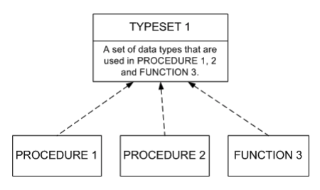
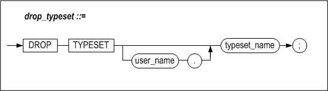

# 7. Typesets

This chapter describes how to define and use typesets.

### Overview

A typeset is a database object that allows the user-defined types used in stored procedures to be stored and managed in one place.

#### Features

##### Sharing User-Defined Types

When a typeset is used, all user-defined types can be managed in one place. This means that it is not necessary to repeatedly declare user-defined types having identical structures in respective stored procedures.

##### Use of User-Defined Types as Parameters or Return Values

Types belonging to the same typeset can be passed as parameters or return values between different procedures. Note however that individual types cannot be passed to clients without using a REF CURSOR.

##### Integration of Data Types in Logical Units

Typesets can be used to integrate data types into logical units for easier management within stored procedures and stored functions.

##### Passing Result Sets to Client Applications

A result set returned by a SQL statement that is executed within a stored procedure can be passed to a client using a REF CURSOR type variable in a typeset.

#### Structure

As shown in the following diagram and sample code, using a typeset allows user-defined types to be shared and managed by different procedures, facilitating data transfer.



##### TYPESET 1

The emp_rec_type and emp_arr_type types are defined within typeset_1.

```
CREATE TYPESET typeset_1
AS
TYPE emp_rec_type IS RECORD (
                 name    VARCHAR(20),
                 job_id  VARCHAR(10),
                 salary  NUMBER(8) );

TYPE emp_arr_type IS TABLE OF emp_rec_type
       INDEX BY INTEGER;
END;
/
```


##### PROCEDURE 1

procedure_1 calls procedure_2 using emp_arr_type as an OUT parameter.

```
CREATE PROCEDURE procedure_1
AS
V1 typeset_1.emp_arr_type;
BEGIN
  procedure_2( V1 );
  PRINTLN(V1[1].name);
PRINTLN(V1[1].job_id);
PRINTLN(V1[1].salary);

END;
/
```


##### PROCEDURE 2

procedure_2 assigns the value returned by function_3 to its OUT parameter.

```
CREATE PROCEDURE procedure_2
( P1 OUT typeset_1.emp_arr_type )
AS
V1 typeset_1.emp_rec_type;
BEGIN
V1 := function_3();
P1[1] := V1;
END;
/
```


##### FUNCTION 3

function_3 returns a value whose type is typeset_1.emp_rec_type

```
CREATE FUNCTION function_3
RETURN typeset_1.emp_rec_type
AS
  V1 typeset_1.emp_rec_type;
BEGIN
V1.name := 'Smith';
V1.job_id := 1010;
V1.salary := 200;

RETURN V1;
END;
/
```


### CREATE TYPESET

#### Syntax


#### Prerequisites

Only the SYS user and users having the CREATE PROCEDURE or CREATE ANY PROCEDURE system privilege can execute the CREATE TYPESET statement.

#### Description

This statement defines a user-defined typeset for use in a stored procedure or stored function. The individual types defined in a typeset can also be used as stored procedure INPUT/OUTPUT parameters.

##### user_name

This is used to specify the name of the owner of the typeset to be created. If it is omitted, Altibase will create the typeset in the schema of the user who is connected via the current session.

##### typeset_name

This is used to specify the name of the typeset.

##### type_declaration

Please refer to "Defining a User-Defined Type" in Chapter 6, User-Defined Types.

#### Example

##### Example 1

Create a typeset named my_typeset.

```
CREATE TYPESET my_typeset
AS
TYPE emp_rec_type IS RECORD(
      name VARCHAR(20), id INTEGER );
TYPE emp_arr_type IS TABLE OF emp_rec_type
       INDEX BY INTEGER;
END;
/
```


##### Example 2

Create a procedure my_proc1, which uses my_typeset.

```
CREATE PROCEDURE my_proc1
AS
V1 my_typeset.emp_rec_type;
V2 my_typeset.emp_arr_type;
BEGIN
V1.name := 'jejeong';
V1.id    := 10761;
V2[1]    := V1;

V1.name := 'ehkim';
V1.id    := 11385;
V2[2]    := V1;

V1.name := 'mslee';
V1.id    := 13693;
V2[3]    := V1;

PRINTLN('NAME : '||V2[1].name||
          '  ID : '||V2[1].id );
PRINTLN('NAME : '||V2[2].name||
          '  ID : '||V2[2].id );
PRINTLN('NAME : '||V2[3].name||
          '  ID : '||V2[3].id );
END;
/
```

The Result

```
iSQL> exec my_proc1;
NAME : jejeong  ID : 10761
NAME : ehkim  ID : 11385
NAME : mslee  ID : 13693
Execute success.
```


### DROP TYPESET

#### Syntax



#### Prerequisites

Only the SYS user, the owner of the typeset to be dropped, and users having the DROP ANY PROCEDURE system privilege can execute the DROP TYPESET statement.

#### Description

This statement is used to remove the specified typeset. Once the typeset has been removed, any stored procedures that use the typeset will be invalid.

##### user_name

This is used to specify the name of the owner of the typeset to be removed. If it is omitted, Altibase will assume that the typeset to be removed is in the schema of the user who is connected via the current session.

##### typeset_name

This specifies the name of the typeset to remove.

#### Example

Remove a typeset named my_typeset.

```
DROP TYPESET my_typeset;
```


