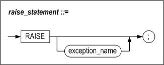

# 9. Exception Handlers

### Overview

Execeptions that occur while a stored procedure is executing can be managed by appropriately declaring exceptions and managing them using exception handlers.

#### Types

Two types of exceptions can occur within stored procedures in Altibase.

-   System-defined Exception

-   User-defined Exception

Execeptions supported by stored procedures include

##### System-Defined Exceptions

System-defined exceptions are already defined within the system, and thus do not need to be declared in the DECLARE section of a stored procedure or block.

Some of the system-defined exceptions that can occur within stored procedures are as follows:

| Exception Name      | Cause                                                        |
| ------------------- | ------------------------------------------------------------ |
| CURSOR_ALREADY_OPEN | This exception is raised when an attempt is made to open a cursor that is already open without first closing it. In the case of a Cursor FOR LOOP, because the cursor is implicitly opened, this exception will be raised if an attempt is made to explicitly open the cursor using the OPEN statement within the loop. |
| DUP_VAL_ON_INDEX    | This exception is raised when an attempt is made to insert a duplicate value into a column designated as a unique index. |
| INVALID_CURSOR      | This exception is raised when the operation cannot be completed with the cursor in its current state, such as when an attempt is made to use a cursor that is not open to perform a FETCH or CLOSE operation. |
| NO_DATA_FOUND       | This exception is raised when no records are returned by a SELECT statement. |
| TOO_MANY_ROWS       | A SELECT INTO statement can return only one row. This occurs when mroe than one row is returned. |

##### User-defined Exceptions

User-defined exceptions are expressly declared by the user and intentionally raised using the RAISE statement.

An example is shown below:

```
DECLARE
  comm_missing  EXCEPTION;    -- DECLARE user defined EXCEPTION
BEGIN
  ......
  RAISE comm_missing;   -- raising EXCEPTION
  ......
  EXCEPTION
    WHEN comm_missing THEN ......
```

If a user-defined exception has the same name as a system-defined exception, the user-defined exception will take precedence over the system-defined exception.

#### Declaring an Exception

The names of system-defined exceptions are defined inside the system, so there is no need to explicitly declare them.

In contrast, user-defined exceptions must be explicitly declared in the DECLARE section of a block or stored procedure.

#### Raising an Exception

There is no need to explicitly raise system-defined exceptions. If a system-defined exception occurs during the execution of a stored procedure, whether an exception handler exists for the system-defined exception is checked. If such an exception handler exists, control is automatically diverted to the exception handler, and the tasks defined therein are undertaken.

In contrast, user-defined exceptions must be explicitly raised in a stored procedure. User-defined exceptions are raised during the execution of a stored procedure using the RAISE statement.

#### The Exception Handler

The tasks to perform in the event of a system-defined or user-defined exception are defined here.

### EXCEPTION

#### Syntax


#### Description

To define the user-defined exception.

##### exception_name

The scope of an exception is from the BEGIN statement to the END statement of the block in which it is declared. The name of the exception must be unique within the block.

#### Example

```
DECLARE
  error_1   EXCEPTION;
  error_2   EXCEPTION;
  error_3   EXCEPTION;
```


### RAISE

#### Syntax



#### Description

This statement is used to expressly raise an exception and pass control to the routine defined for the corresponding exception handler.

##### exception_name

The name of the exception to raise is specified here. exception_name must be either the name of an exception declared in the declare section of the block or a system-defined exception.

If the exception specified here has not been declared, it will be impossible to compile the stored procedure. If the exception has been declared but no corresponding exception handler exists in the exception handler section, execution of the stored procedure will stop and an “unhandled exception” error will be returned.

User exceptions having the same name can be declared in inner and outer blocks. To avoid ambiguity in such cases, label each block and then reference the appropriate exception by specifying the label before the exception name in the RAISE statement.

An exception declared for an outer block can be raised within the handler for an exception declared for an inner block.

An exception name can be omitted only when the RAISE statement is used in the exception handler section, in which case it raises the exception that occurred previously.

#### Example

##### Example 1

In the following example, the VALUE_ERROR exception is handled in the exception handler, and the same exception is raised from the exception handler.

```
CREATE OR REPLACE PROCEDURE PROC1
AS
BEGIN
  RAISE VALUE_ERROR;
  EXCEPTION
    WHEN VALUE_ERROR THEN
      PRINTLN('VALUE ERROR CATCHED. BUT RE-RAISE.');
      RAISE;
END;
/
iSQL> EXEC PROC1;
VALUE ERROR CATCHED. BUT RE-RAISE.        
[ERR-3116F : Value error
0004 :   RAISE VALUE_ERROR;
        ^                 ^
]
```


##### Example 2

In the following example, the exception raised from PROC1 of Example 1 is handled.

```
CREATE OR REPLACE PROCEDURE PROC2
AS
BEGIN
  PROC1;
  EXCEPTION
    WHEN OTHERS THEN
    PRINTLN('EXCEPTION FROM PROC1 CATCHED.');
    PRINTLN('SQLCODE : '||SQLCODE);
END;
/
iSQL> EXEC PROC2;
VALUE ERROR CATCHED. BUT RE-RAISE.
EXCEPTION FROM PROC1 CATCHED.
SQLCODE : 201071
Execute success.
```


### RAISE_APPLICATION_ERROR

The use of up to 1001 user-defined error codes, specifically the error codes ranging from 990000 to 991000, is supported.

#### Syntax

```
RAISE_APPLICATION_ERROR (
	errcode INTEGER,
    errmsg VARCHAR(2047) );
```

#### Parameter

| Name    | In/Output | Data Type | Description                                                  |
| ------- | --------- | --------- | ------------------------------------------------------------ |
| errcode | IN        | INTEGER   | User-defined Error Code (in the range from 990000 to 991000) |
| errmsg  | IN        | VARCHAR   | User-defined Error Message Text                              |

#### Description

This procedure is used to raise an exception having a user-defined error code and message.

#### Example

The following example shows how to raise user-defined errors. Note that in iSQL, error codes are displayed as hexadecimal values.

```
CREATE OR REPLACE PROCEDURE PROC1
AS
BEGIN
    RAISE_APPLICATION_ERROR( 990000,
	 'This is my error msg. ' );
END;
/
iSQL> EXEC PROC1;
[ERR-F1B30 : This is my error msg.
at "SYS.PROC1", line 4]
```


### User-defined Exceptions

There are two kinds of situations in which the user might want to use the RAISE statement to generate an exception:

-   To handle a user-defined exception
-   To handle a system-defined exception

#### User-defined Exception Codes

When handling user-defined exceptions, the error code is always **201232**, which can be verified by checking the value of SQLCODE.

```
CREATE OR REPLACE PROCEDURE PROC1
AS
    E1 EXCEPTION;
BEGIN
    RAISE E1;
EXCEPTION
WHEN E1 THEN
    PRINTLN('SQLCODE: ' || SQLCODE);  -- output error code
    PRINTLN('SQLERRM: ' || SQLERRM);  -- output error message
END;
/

iSQL> EXEC PROC1;
SQLCODE: 201232
SQLERRM: User-Defined Exception.
Execute success.
```

If the exception is not handled as a user-defined exception in the exception handler section, the following error occurs. This message means that there is no user-defined exception handler for the exception.

```
CREATE OR REPLACE PROCEDURE PROC1
AS
    E1 EXCEPTION;
BEGIN
    RAISE E1;
END;
/

iSQL> EXEC PROC1;
[ERR-31157 : Unhandled exception : E1]
```

The following error code is always output (in either decimal or hexadecimal form) for user-defined exceptions:

| Exception Name | Error Code(integer) | Error Code(hexadecimal) | Error Section                          |
| -------------- | ------------------- | ----------------------- | :------------------------------------- |
|                | 201232              | 31210                   | qpERR_ABORT_QSX_USER_DEFINED_EXCEPTION |

#### System-defined Exception Codes

When a system-defined exception occurs, the corresponding system-defined error code is returned, as shown below:

```
CREATE OR REPLACE PROCEDURE PROC1
AS
BEGIN
    RAISE NO_DATA_FOUND;
EXCEPTION
WHEN NO_DATA_FOUND THEN
    PRINTLN('SQLCODE: ' || SQLCODE);  -- output error code
    PRINTLN('SQLERRM: ' || SQLERRM);  -- output error message
END;
/
iSQL> EXEC PROC1;
SQLCODE: 201066
SQLERRM: No data found.
at "SYS.PROC1", line 4
Execute success.
```

For exceptional instances of the system-defined exception, as in the following, the outputs of predefined error codes can be seen even though additional exception is not handled by the exception handler.

```
CREATE OR REPLACE PROCEDURE PROC1
AS
BEGIN
    RAISE NO_DATA_FOUND;
END;
/

iSQL> EXEC PROC1;
[ERR-3116A : No data found.
at "SYS.PROC1", line 4]
```

For convenience, the most commonly used system-defined exception codes are listed in the following table. For information on the cause of each exception, please refer to "System-Defined Exceptions".

| Exception Name        | Error Code (integer) | Error Code (hexadecimal) | Error Section                           |
|-----------------------|----------------------|--------------------------|-----------------------------------------|
| "CURSOR_ALREADY_OPEN" | 201062               | 31166                    | qpERR_ABORT_QSX_CURSOR_ALREADY_OPEN     |
| "DUP_VAL_ON_INDEX"    | 201063               | 31167                    | qpERR_ABORT_QSX_DUP_VAL_ON_INDEX        |
| "INVALID_CURSOR"      | 201064               | 31168                    | qpERR_ABORT_QSX_INVALID_CURSOR          |
| "NO_DATA_FOUND"       | 201066               | 3116A                    | qpERR_ABORT_QSX_NO_DATA_FOUND           |
| "TOO_MANY_ROWS        | 201070               | 3116E                    | qpERR_ABORT_QSX_TOO_MANY_ROWS           |
| "INVALID_PATH"        | 201237               | 31215                    | qpERR_ABORT_QSX_FILE_INVALID_PATH       |
| "INVALID_MODE"        | 201235               | 31213                    | qpERR_ABORT_QSX_INVALID_FILEOPEN_MODE   |
| "INVALID_FILEHANDLE"  | 201238               | 31216                    | qpERR_ABORT_QSX_FILE_INVALID_FILEHANDLE |
| "INVALID_OPERATION"   | 201239               | 31217                    | qpERR_ABORT_QSX_FILE_INVALID_OPERATION  |
| "READ_ERROR"          | 201242               | 3121A                    | qpERR_ABORT_QSX_FILE_READ_ERROR         |
| "WRITE_ERROR"         | 201243               | 3121B                    | qpERR_ABORT_QSX_FILE_WRITE_ERROR        |
| "ACCESS_DENIED"       | 201236               | 31214                    | qpERR_ABORT_QSX_DIRECTORY_ACCESS_DENIED |
| "DELETE_FAILED"       | 201240               | 31218                    | qpERR_ABORT_QSX_FILE_DELETE_FAILED      |
| "RENAME_FAILED"       | 201241               | 31219                    | qpERR_ABORT_QSX_FILE_RENAME_FAILED      |

For the complete list of all error codes, please refer to the *Error Message Reference.*

### SQLCODE and SQLERRM

SQLCODE and SQLERRM are used in an exception handler to obtain the error code and message for an exception that occurs during the execution of a SQL statement so that the exception can be responded to in a suitable manner.

The contents of SQLCODE and SQLERRM are set in the following cases:

-   When an error occurs during the execution of a stored procedure
-   When a user-defined exception occurs
-   When a system-defined exception occurs
-   When RAISE_APPLICATION_ERROR is used to raise a user-defined error (code and message)
-   When another exception is raised within an exception handler

In all of the above cases, the current contents of SQLCODE and SQLERRM are replaced with the error code and message corresponding to the newly raised exception.

Additionally, after an exception handler is executed without raising another exception, the contents of SQLCODE and SQLERRM are restored to the state before the exception occurred, in the manner of a LIFO (last in, first out) stack.

Therefore, once the contents of SQLCODE and SQLERRM have been set in response to an exception, they will remain unchanged until control is passed to an outer block of the stored procedure, regardless of whether the exception is handled within the block in which it was raised..

The following is an example:

```
CREATE OR REPLACE PROCEDURE PROC1
AS
BEGIN
  BEGIN
    RAISE NO_DATA_FOUND;
  EXCEPTION
    WHEN OTHERS THEN
      BEGIN
        PRINTLN('1SQLCODE : '||SQLCODE);
        PRINTLN('1SQLERRM : '||SQLERRM);
        RAISE VALUE_ERROR;
      EXCEPTION
        WHEN OTHERS THEN
          PRINTLN('2SQLCODE : '||SQLCODE);
          PRINTLN('2SQLERRM : '||SQLERRM);
      END;
    PRINTLN('3SQLCODE : '||SQLCODE);
    PRINTLN('3SQLERRM : '||SQLERRM);
  END;
  PRINTLN('4SQLCODE : '||SQLCODE);
 PRINTLN('4SQLERRM : '||SQLERRM);
END;
/
```

The output of the above example is as follows:

```
iSQL> EXEC PROC1;
1SQLCODE : 201066
1SQLERRM : No data found.
at "SYS.PROC1", line 5
2SQLCODE : 201071
2SQLERRM : Value error
at "SYS.PROC1", line 11
3SQLCODE : 201066
3SQLERRM : No data found.
at "SYS.PROC1", line 5
4SQLCODE : 0
4SQLERRM : Successfully completed
Execute success.
```

The scope of SQLCODE and SQLERRM in the above example is illustrated in the following figure:


### Exception Handler

#### Syntax


#### Purpose

Exception handlers are used to specify the actions to take in response to exceptions.

When an exception occurs, Altibase looks for an exception handler to which to pass control. The rules that are followed when looking for an exception handler are as follows:

-   Starting with the current block and progressing successively outwards to blocks that contain the current block, Altibase looks for a handler for the exception. During this process, if an OTHERS exception handler is found in any block, that OTHERS handler will be used to handle the exception.

-   If no exception handler is found even in the outermost block, an “Unhandled Exception” error is raised, and execution of the stored procedure or function stops immediately.

SQLCODE and SQLERRM can be used in an exception handler to check which kind of error occurred and return the related error message. In other words, SQLCODE returns the Altibase error number and SQLERRM returns the corresponding error message.

SQLCODE and SQLERRM cannot be directly used in SQL statements. Instead, assign their values to local variables and use these variables within SQL statements.

##### exception name

This is used to specify the name of the system-defined or user-defined exception to handle.

Multiple exceptions to be handled in the same way can be combined using "Or" and processed using the same routine.

##### others

If an exception that is not handled by any other exception handlers is raised, it will ultimately be handled by the OTHERS routine if present.

#### Example

##### Example 1

```
CREATE TABLE t1(i1 INTEGER, i2 INTEGER, i3 INTEGER);

CREATE TABLE t2(i1 INTEGER, i2 INTEGER, i3 INTEGER);
INSERT INTO t1 VALUES(1,1,1);
INSERT INTO t1 VALUES(2,2,2);

CREATE OR REPLACE PROCEDURE proc1
AS
BEGIN
  DECLARE
    CURSOR c1 IS SELECT * FROM t1;
      v1 INTEGER;
      v2 INTEGER;
      v3 INTEGER;
  BEGIN
    -- OPEN c1;

    FETCH c1 INTO v1, v2, v3;
    INSERT INTO t2 VALUES (v1, v2, v3);

    CLOSE c1;

  EXCEPTION
    WHEN INVALID_CURSOR THEN
    INSERT INTO t2 VALUES (-999, -999, -999);

  END;

END;
/

iSQL> EXEC proc1;
Execute success.

iSQL> SELECT * FROM t2;
T2.I1       T2.I2       T2.I3       
----------------------------------------
-999        -999        -999        
1 row selected.
```


##### Example 2

```
CREATE TABLE t1(i1 INTEGER, i2 INTEGER, i3 INTEGER);

CREATE OR REPLACE PROCEDURE proc1(p1 IN INTEGER)
AS
  v1 INTEGER;
  err1 EXCEPTION;
BEGIN
  IF p1 < 0 THEN
    RAISE err1;
  END IF;

  SELECT i1 INTO v1 FROM t1;

EXCEPTION
  WHEN NO_DATA_FOUND OR TOO_MANY_ROWS THEN
    INSERT INTO t1 VALUES(1,1,1);
  WHEN OTHERS THEN
    INSERT INTO t1 VALUES(0,0,0);

END;
/

iSQL> EXEC proc1(1);
Execute success.
iSQL> SELECT * FROM t1;
T1.I1       T1.I2       T1.I3       
----------------------------------------
1           1           1           
1 row selected.
iSQL> EXEC proc1(-8);
Execute success.
iSQL> SELECT * FROM t1;
T1.I1       T1.I2       T1.I3       
----------------------------------------
1           1           1           
0           0           0           
2 rows selected.
```


##### Example 3

```
CREATE TABLE t1(i1 INTEGER NOT NULL);

CREATE OR REPLACE PROCEDURE proc1
AS
  code INTEGER;
  errm VARCHAR(200);
BEGIN
  INSERT INTO t1 VALUES(NULL);
EXCEPTION
WHEN OTHERS THEN

-- 변수 code에 SQLCODE 에러코드 값 대입
 code := SQLCODE;

-- 변수 errm에 SQLERRM 에러 메시지 저장

errm := SUBSTRING(SQLERRM, 1, 200);
  system_.println('SQLCODE : ' || code);
  system_.println('SQLERRM : ' || errm);
END;
/

iSQL> EXEC proc1;
SQLCODE : 200820
SQLERRM : Unable to insert (or update) NULL into NOT NULL column.
at "SYS.PROC1", line 6
Execute success.
```


