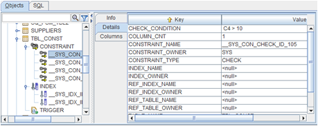
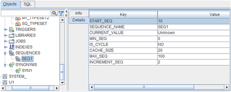
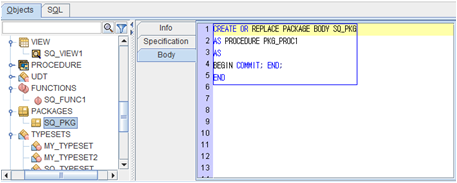
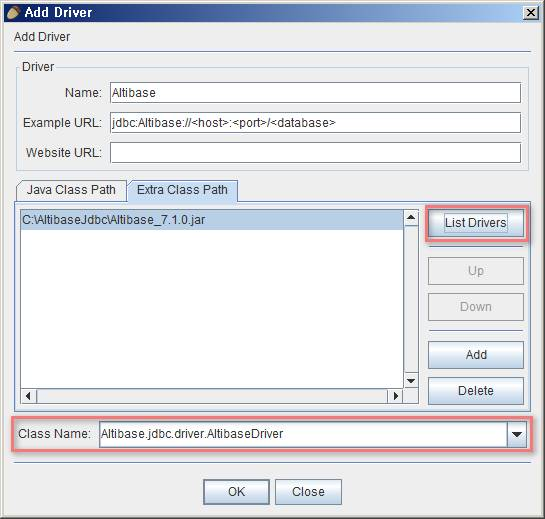
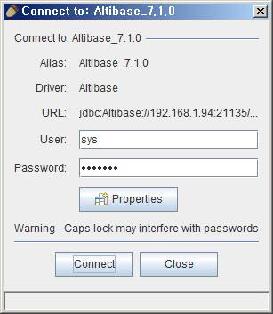
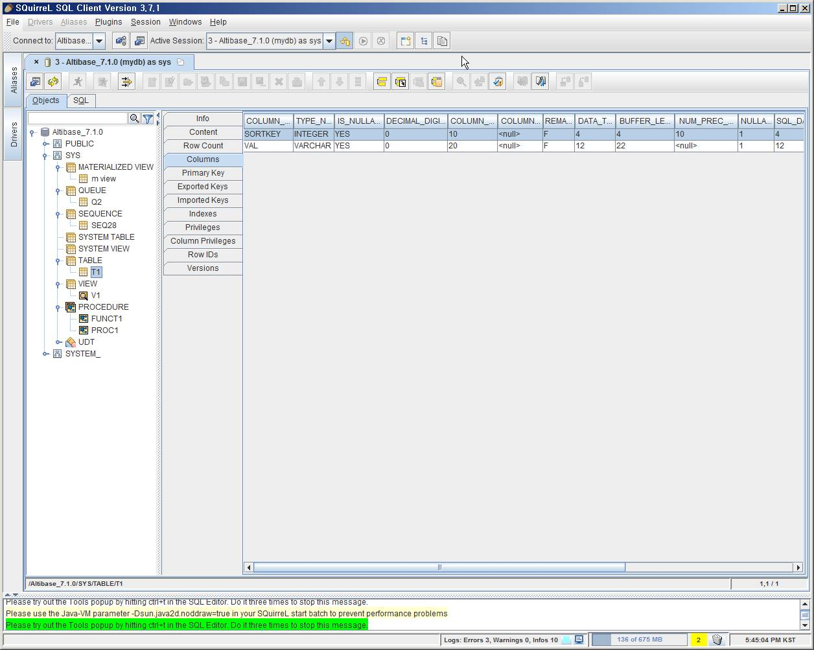
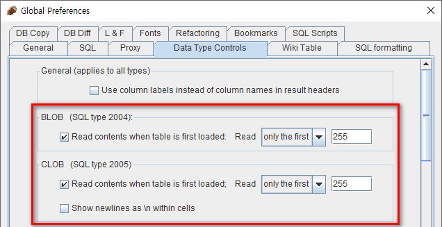
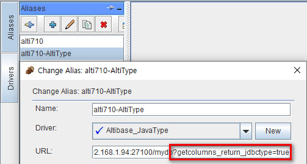

# 2.SQuirreL SQL Client

This chapter describes how to install SQuirreL SQL Client and Altibase Plugin for SQuirreL SQL and integrate with Altibase via Altibase JDBC.

### Installing Altibase Plugin for SQuirreL SQL Client

Altibase Plugin is not an official plugin for SQuirreL SQL Client, so users must download and install it separately from SQuirreL SQL Client. 

#### System Requirements

This is the list of the software and system requirements to install and run the Altibase plugin and the database management system.

| Software Requirements      | SQuirreL SQL Client 3.7.1 or 3.8.0 | SQuirreL SQL Client 3.8.1 or 3.9.0 |
| -------------------------- | ---------------------------------- | ---------------------------------- |
| Compatible Database System | Altibase 6.5.1 or later            | Altibase 6.5.1 or later            |
| Compatible Java            | Java 1.8.0                         | Java 1.8.0 or later                |

### Installing and Removing Altibase Plugin

This section describes how to install, prepare, and remove the Altibase Plugin

#### Installation Procedure

1. SQuirreL SQL Client Download: Download and install SQuirreL SQL Client from http://squirrel-sql.sourceforge.net . 
2. Altibase Plugin Download: Download <altibase4squirrel.zip from <http://support.altibase.com/en/> — download item and extract it. Among the extracted files, copy the altibase4squirrel.jar(Altibase Plugin) file to the plugins subdirectory of the installed SQuirreL SQL Client directory. (Example: C:\\Program
   Files\\squirrel-sql-3.8.0\\plugins\\altibase4squirrel.jar)
3. Running SQuirreL SQL Client: Now it is ready to use the Altibase Plugin.
   When running SQuirreL SQL Client, altibase4squirrel.jar is automatically loaded.
   Plug loading can be checked by clicking 'Plugin-Summary' in the main menu after running SQuirreL SQL Client.  SQuirreL SQL Client runs squirrel-sql.bat on Windows and squirrel-sql.sh on Linux. For more information on running SQuirreL SQL Client, please refer to the SQuirreL SQL Client manual.

#### Removing Altibase Plugin

To uninstall the Altibase Plugin, after finishing the SQuirreL SQL Client program, delete the altibase4squirrel.jar from the SQuirreL SQL Client plugin directory.

### Features of Altibase Plugin

The features of Altibase Plugin are as follows:

#### Altibase Database Objects

The Altibase database objects are displayed in the SQuirreL SQL Client Object Tree.

The objects shown are:

| Object Type | Types                                                      |
| ----------- | ---------------------------------------------------------- |
| Table       | Table, Queue, Materialized View, System Table, System View |
| PSM         | Stored Procedure, Function, Packages, Trigger              |
| Others      | Index, Sequence, Synonym, Library, Job                     |

#### Table and Dependent Objects (Constraint, Index, Trigger)

Dependent objects, such as constraint, index, and trigger, for the table objects are expressed as sub-objects of the table.



#### Object Details

This shows detailed information about database objects. For example, index, sequence, synonym, constraint, and others support detailed information about objects.



#### Source View

The following object creation DDL is shown for the PSM object type and required objects: 

Stored Procedure, Function, Package, Typeset, Trigger, Library, Synonym,
View, Materialized View



#### PSM DDL grammar Support

Altibase PSM DDL grammar is supported in the SQL editor of SQuirreL SQL Client. If altibase.jar is not installed, the SQuirreL SQL Client's own parser fails to parse the Altibase PSM generated DDL.


### Installing SQuirreL SQL Client

This chapter describes how to install SQuirreL SQL Client.

#### Installation Procesdure

1. Download the SQuirreL SQL Client that can be installed on the system from the link below.  
   [http://squirrel-sql.sourceforge.net/#installation](http://squirrel-sql.sourceforge.net/#installation )

2. Double click on the downloaded "squirrel_sql-3.7.1-standard.jar" to start installation.

### Altibase JDBC Driver Registration

#### Registration Procedure

1. Double-click "squirrel-sql.bat" in the directory where SQuirreL SQL Client is installed to run the program. 

2. Click Driver → New Driver to register the Altibase JDBC driver. If the Drivers menu is inactive, click Windows → View Drivers to activate it. 

3. Enter the following in the Driver section of the Add Driver window.
   
   ```
   Name: Altibase
   Example URL:jdbc:Altibase://<host>:<port>/<database>
   ```

4. Click the "Add" button on the Extra Class Path tab at the bottom to select the Altibase JDBC drier file to be used for connection.
   

After selecting the file, press the "List Drivers" button, and check if "Altibase.jdbc.driver.AltibaseDriver" has been added to the Class Name combo box at the bottom.
   

5. Click the "OK" button to complete Altibase JDBC driver registration. 

### Integration with Altibase

#### Database Connection Information Registration

1. Click Aliases → New Alias in the main menu to register the database information to be accessed. If the Aliases menu is disabled, click Windows → View Aliases to activate it. 

2. Enter the information below:
   
   Name: Database Connection Name
   
   Driver: Select the Altibase registered earlier
   
   URL: Enter the host, port, and database name to the connect
   
   User Name: Database user name to access
   
   Password: Password of the database user to use for access

3. After completing the input, click the "Test" button at the bottom to confirm that the entered connection information is correct.
   
   

#### Using Database

1. Click Aliases → Connect in the main menu to open the connection window.



2. Click the "Connect" button to access the registered database.

#### Objects

If the connection is successful, a window consisting of two tabs will open as shown below. The object window is selected by default, and users can view the objects and detailed information existing in the connected database.



#### SQL

By selecting SQL from the two tabs at the top, users can enter and execute queries.


### FAQ

#### After installing the latest JDK version, when running the SQuirreL SQL client, it fails with the message "Your Java Virtual Machine must be at least 1.6 to run SQuirrel 3.x and above". 

This error occurs because the SQuirreL SQL client does not recognize the latest Java version.

Find the JavaVersionChecker line in the squirrel-sql.bat or squirrel-sql.sh file and add the version to use. For example, when using OpenJDK 18 version, add '18' at the end of the JavaVersionChecker line and save it, then run the SQuirreL SQL client.

`$JAVACMD -cp "$UNIX_STYLE_HOME/lib/versioncheck.jar" JavaVersionChecker 1.6 1.7 1.8 18`

If you use Java version 9 or later, SQuirreL SQL client version 3.8.1 or 3.9.0 is required.

Please refer to https://sourceforge.net/p/squirrel-sql/bugs/1347/

#### How to retrieve LOB data.

In the SQuirreL SQL client, LOB data can be retrieved in the SQL tab or the Objects tab.

| SQL                                               | Objects                                               |
| ------------------------------------------------- | ----------------------------------------------------- |
|  |  |

##### Settings for LOB data retrieval in the SQuirreL SQL client

The following setting is required to display LOB data in the SQL tab or the Objects tab.

1. Change the Data Type Controls setting.<br>
   In 'File → Global Preferences → Data Type Controls tab', check the "Read contents when table is first loaded" option of BLOB or CLOB 



2. Change the autocommit mode to false in the session properties.<br>
   In Altibase HDB, transactions must be managed explicitly for LOB data. To apply this, uncheck the "Auto Commit SQL" checkbox in File → New Session Properties → SQL tab.


##### Additional required settings when retrieving LOB data in the Objects tab

1. Use the Altibase HDB JDBC Driver corresponding to the version below.
   - Altibase 7.1.0.7.2 or higher
   - Altibase 7.2.0.0.2 or higher

2. Add getcolumns_return_jdbctype=true to the JDBC connection properties.<br>
   It can be changed in Drivers → Add Driver to designate a new driver, or Aliases → Modify the selected Alias to add or change existing connection information.




<br>

