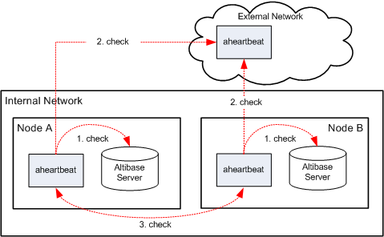

# 1. Introduction to Altibase Heartbeat

This chapter introduces the Altibase Heartbeat and describes its basic procedure.

### Overview of Altibase Heartbeat

The Altibase Heartbeat utility detects node failures in a distributed database environment and enables the DBA to counter failures. aheartbeat[^1]  can be utilized in an environment where Altibase servers are connected through replication. 

[^1]: aheartbeat has detected failure on the other node, this file is executed for remote node Failover. This file can be either an executable binary or script file.

Therefore, Altibase Heardbeat and aheartbeat are used interchageably in this document. 

#### Altibase Heartbeat Components

Altibase Heartbeat mainly consists of the following:

-   aheartbeat process

-   Execution file to perform Failover to the local node

-   Execution file for remote node Failover

##### aheartbeat Process

aheartbeat is a background process and detects two types of failures; it either detects database failure by periodically connecting to the Altibase server on the same node, or detects network failure by periodically connecting to aheartbeats on other nodes.

##### Execution File to Perform Failover to the Local Node

After database server failure on the same node as aheartbeat has been detected, this file is executed to perform Failover to the local node. This file can be either an executable binary or script file.

##### Execution File to Perform Failover to the Local Node

After aheartbeat has detected failure on the other node, this file is executed for remote node Failover. This file can be either an executable binary or script file.

### Altibase Heartbeat Procedure

This section explains the basic Altibase Heartbeat procedure in a distributed database environment. The following figure is a diagram of a simple distributed database environment consisting of multiple Altibase databases with Altibase Heartbeats.

[Figure 1-1] Altibase Heartbeat Procedure

As shown above, aheartbeat detects database failure by monitoring the Altibase server process of the node it resides on(1. check in the figure). It also detects node failure(3. check) or external network failure(2. check) by monitoring aheartbeat processes on other nodes. 

If the Altibase server on Node A fails, let's look at how aheartbeats will run:

1.  Node A’s aheartbeat detects an Altibase server failure.

2.  Node A’s aheartbeat executes the execution file to perform Failover to the local node and terminates itself.
  
3.  By detecting the termination of Node A’s aheartbeat, Node B’s aheartbeat registers an Altibase server failure on Node A and executes the execution file for remote node Failover. 

 

