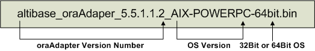

# 2. Installation and Configuration

This chapter describes how to install and configure the Adapter for Oracle.

### Pre-installation Tasks

The following system requirements must be met to install and run Adapter for Oracle (oraAdapter). It is also necessary to make some environment settings for the system to ensure that oraAdapter runs properly

For detailed information about system requirements, please contact Altibase's Customer Support site (http://altibase.com/support-center/en/).

#### OS

The following operating systems currently support oraAdapter: 

-   AIX 5.3

-   AIX 6.1

-   LINUX

#### Database Versions

-   Altibase: Version 5.5.1 or above
-   Oracle Database: Version 10g or higher (must be compatible with OCI). Refer to the Library_Path chapter for more details.

#### Database Character Sets

This is the default character set for saving data.

Setting Altibase and Oracle to the same database character set can reduce the cost associated with data conversion, so it is recommended to set the same character set.

#### National Character Set

Data in a language that is not supported by the database character set can be saved using the NCHAR and NVARCHAR types. Just as with the database character set, setting AltibaseAltibase and Oracle to use the same national character set can reduce the cost for data conversion; it is recommended to set the same national character set.

#### Interface

Before installing oraAdapter, make sure that Oracle Call Interface (hereinafter referred to as OCI) is installed. For detailed instructions on installing OCI, refer to the relevant Oracle documentation.

### Installation

The oraAdapter installer can be executed in GUI mode if suitable display settings have been made. The description of oraAdapter installation in this manual will assume that the installation is being conducted in GUI mode. It is also possible to install oraAdapter in text mode if the appropriate display settings have not been made.

#### Installing oraAdapter

1. The first task is to obtain the version of the oraAdapter installer that is correct for the system on which it is to be run. The picture shows the naming convention for the oraAdapter installer.   
   The oraAdapter version must be the same as the version of Altibase with which it will be run.
   
   

2. When the installer is executed, the dialog appears. Verify that the version of oraAdapter to be installed is the correct version and click "Next".
  
3. The next dialog is for choosing the directory in which oraAdapter is to be installed. By default, a directory called "oraAdapter" will be created within the home directory of the user performing the installation
  
4. To use oraAdapter, Altibase Log Analyzer (ALA) property settings should be as follows.


ALA_SENDER_IP: This is the IP address of the server on which Altibase is installed. It is set to 127.0.0.1 by default, assuming that Altibase and oraAdapter are operating on the same server.

   ALA_RECEIVER_PORT: This is the number of the port on which oraAdapter listens. It can be set within the range from 1024 to 65535.

   ALA_REPLICATION_NAME: This is the name of a replication object that exists in Altibase.

ALA_XLOG_POOL_SIZE: This is used to set the maximum size of the XLog pool. The default is 10,000 XLogs.

ALA_SOCKET_TYPE: This is used to set the communication protocol that is used by ALA. oraAdapter supports the use of TCP/IP and the UNIX Domain Socket protocols.

   ALA_LOGGING_ACTIVE: This setting determines whether ALA will output trace logs. The default value is 1, which means that trace logs will be output.

5. In the next dialog, appropriate Altibase property settings must be made. For more detailed information on properties, please refer to the section entitled “Properties for Checking Constraints” later in this chapter.
  
   ALTIBASE_USER: This is the name of the user account with which to access Altibase..

   ALTIBASE_PASSWORD: This is the password corresponding to the user account with which Altibase will be accessed.

   ALTIBASE_IP: This is the IP address of the server on which Altibase is installed. It is set to 127.0.0.1 by default, assuming that Altibase and oraAdapter are operating on the same server.

   This is the number of the port at which Altibase listens. It can be set within the range from 1024 to 65536.
   
6.  To use oraAdapter, appropriate Oracle DB property settings must be made. For more detailed information on properties, please refer to the section entitled “Properties for OCI” later in this chapter.
  
    ORACLE_SERVER_ALIAS: This is used to specify an alias for accessing an Oracle DB that is already set in an Oracle Client. If this is not specified, access will be made to the Oracle DB that is set as the default host.

    ORACLE_USER: This is the name of a user account with which to access the Oracle DB.
    

ORACLE_PASSWORD: This is the password corresponding to the user account with which to access the Oracle DB.
    
ORACLE_SKIP_INSERT:  If the user chooses “YES”, INSERT statements executed on Altibase will not be implemented on the Oracle DB.
    
ORACLE_SKIP_UPDATE: If the user chooses “YES”, UPDATE statements executed on Altibase will not be implemented on the Oracle DB.
    
    ORACLE_SKIP_DELETE:  If the user chooses “YES”, DELETE statements executed on Altibase will not be implemented on the Oracle DB.

7.  In the next two dialogs, appropriate Oracle DB property settings must be made. For more detailed information on these properties, please refer to the section entitled “Properties for OCI” later in this chapter.
  
    ORACLE_ASYNCHRONOUS_COMMIT: If the user chooses “YES”, “asynchronous commit” will be used on the Oracle DB.

    ORACLE_GROUP_COMMIT: If the user chooses “YES”, “group commit” will be used on the Oracle DB.
    

ORACLE_ARRAY_DML_MAX_SIZE: “Array DML” means grouping multiple DML statements. This property sets the maximum number of DML statements that are grouped in this way. To disable Array DML, set this property to 1.
    
    ORACLE_UPDATE_STATEMENT_CACHE_SIZE: This property is used to set the size of the cache in which prepared UPDATE statements are stored. If this property is set to 0, oraAdapter does not cache UPDATE statements.

8. Once all of the property settings pertaining to the use of oraAdapter have been made,  they can be verified in the confirmation dialog box. Verify that all of the properties have been correctly set and click "Next".
  
9. After the user has verified the property settings in the confirmation dialog box, the user is ready to install oraAdapter. Click "Next" to continue.

10. While oraAdapter is being installed, the following two environment variables are set. Note that in order for the system to make use of the two new environment variables, it will be necessary to log out and log back in.


ORA_ADAPTER_HOME: this environment variable is added with the oraAdapter home directory that was specified earlier during the installation process
    
    PATH: this environment variable is added with the value of “ORA_ADAPTER_HOME/bin”.

11. The dialog box appears after oraAdapter has been successfully installed.

### Post-installation Tasks

#### Setting Environment Variables

After oraAdapter has been installed, it is necessary to set environment variables, add a library path, and set the database and national character sets. 

For more detailed information on setting environment variables, please refer to the section entitled Configuration later in this chapter.

- ORA_ADAPTER_HOME  
  This is set automatically when oraAdapter is installed.

- Add a Library Path  
  Add the path to the OCI library. In AIX, the OCI library path can be added as below:
  
```
  $ export LIBPATH=$LIBPATH:$ORACLE_HOME/LIB
```

-   NLS_LANG  
    This is used to indicate the character set that is being used in Altibase.

#### Checking the Installation Directory

After oraAdapter installation is complete, verify that the bin, conf, msg, and trc directories have been created in the $ORA_ADAPTER_HOME directory. The structure and role of each directory is as follows:

-   bin directory  
    This directory contains the oraAdapter (Adapter for Oracle) and oaUtility (Adapter for Oracle Utility) executable files and some internally used files.
    
-   conf directory  
    The oraAdapter.conf file, in which the oraAdapter property settings are stored, is located in this directory.
    
-   msg directory  
    If any errors occur while oraAdapter is running, the messages in this directory will be used to write trace logs.
    
-   trc directory  
    The oraAdapter writes trace logs to files located in this directory.

### Configuration

To use oraAdapter, the following environment variables must be set.

#### ORA_ADAPTER_HOME

is is the directory in which oraAdapter was installed. This environment variable is set automatically during oraAdapter installation.

#### Library Path

oraAdapter uses an OCI library which is compatible with 10gOCI in order to apply modified data of ALTIBASE HDB to Oracle DB. Therefore, the path in which OCI library is located should be added into the environment variables of the user account which will run oraAdapter..

The environment variables in which a library is generally added is LD_LIBRARY_PATH, however, they vary depending on the OS which will be executing oraAdapter.

Example) AIX is LIBPATH, Solaris is LD_LIBRARY_PATH.

oraAdapter is supposed to dynamically link with the Oracle OCI 10g library(libclntsh.so.10.1). In order to use other version's Oracle OCI library, the version of OCI library should be linked with libclntsh.so.10.1.

For example, if Oracle 11g Instant Client is installed, libclntsh.so.11.1 should be linked with libclntsh.so.10.1 as follows.

```
$ cd $ORACLE_HOME/lib
$ ln -s libclntsh.so.11.1 libclntsh.so.10.1 
```

Refer to Oracle Call Interface for the compatibility between Oracle 10g OCI and other version's OCI library. Refer to the *Interface Manual* for the library compatibility between Oracle 10g OCI and other OCI version.

#### NLS_LANG

The NLS_LANG environment variable is used with the OCI. This environment variable is used to indicate the character set of the strings that are inputted to the OCI. The OCI refers to this environment variable when converting data retrieved from Altibase to the Oracle database character set. Because oraAdapter receives data from Altibase, the NLS_LANG environment variable must be set to the Oracle DB character set that corresponds to the Altibase character set.

Note that if the character set of the Oracle DB is not the same as that of Altibase, performance will suffer as a result of the data conversion task performed by the OCI.

The syntax of the NLS_LANG environment variable is as follows.


The following table shows the character sets that are supported for use with Altibase and the corresponding Oracle DB character sets and oraAdapter NLS_LANG environment variable settings.

| Altibase    | NLS_LANG        | Oracle DB      |
| ----------- | --------------- | -------------- |
| US7ASCII    | .US7ASCII       | US7ASCII       |
| KO16KSC5601 | .KO16KSC5601    | KO16KSC5601    |
| MS949       | .KO16MSWIN949   | KO16MSWIN949   |
| SHIFT-JIS   | .JA16SJIS       | JA16SJIS       |
| MS932       |                 | JA16SJIS       |
| EUC-JP      | .JA16EUC        | JA16EUC        |
| GB231280    | .ZHS16CGB231280 | ZHS16CGB231280 |
| BIG5        | .ZHT16BIG5      | ZHT16BIG5      |
| MS936       |                 | ZHS16GBK       |
| UTF-8       | .UTF8           | UTF8           |

[Table 2-1] Database Character Set

| Altibase | NLS_LANG   | Oracle DB |
| -------- | ---------- | --------- |
| UTF-8    | .UTF8      | UTF8      |
| UTF-16   | .AL16UTF16 | AL16UTF16 |

[Table 2-2] National Character Set

### Properties

The properties that are set within oraAdapter are used by the Altibase Log Analyzer and Oracle Call Interface, and are also necessary for making the settings that determine how oraAdapter will be executed.

The property file is oraAdapter.conf, which is located in the $ORA_ADAPTER_HOME/conf/ directory. 

The properties that are used within oraAdapter can be classified as follows:

-   Properties for ALA
-   Properties for Checking Constraints
-   Properties for OCI
-   DML-Related Properties

#### Properties for ALA

The following properties must be set in order for oraAdapter to be able to use the Altibase Log Analyzer. For more detailed information about ALA properties, please refer to the *Log Analyzer User's Manual.*

##### ALA_SENDER_IP

This is the IP of the XLog Sender. Set it to the IP of the server on which Altibase is installed.

-   Default Value: 127.0.0.1

##### ALA_SENDER_REPLICATION_PORT

This specifies how oraAdapter connects to the ALA replication sender while the Altibase ALA replication object is running.

-   Default Value: 0

-   Range : 0 \~ 65535

-   0: oraAdapter waits until the sender of the ALA duplication object attempts to connect.

-   Non-zero value: oraAdapter attempts to connect directly to the redundant sender using the corresponding port number.

##### ALA_RECEIVER_PORT

This is the port number at which the XLog Collector will listen to receive XLogs. Set it to the port number at which oraAdapter is listening.

-   Range: 1024 – 65535

##### ALA_RECEIVE_XLOG_TIMEOUT (Unit: seconds)

This property specifies the standby time for XLog collector to receive XLogs.

-   Default Value: 300

-   Range: 1 – 4294967295

##### ALA_REPLICATION_NAME

This is the name of the replication object used as the XLog Sender. It is set to the name of a replication object created within Altibase.

##### ALA_SOCKET_TYPE

This is used to set the protocol that is used by the Altibase Log Analyzer. Adapter for Oracle supports TCP/IP and the Unix Domain Protocol. However, in order to use a UNIX domain socket, Altibase and Adapter for Oracle must be located on the same server.

-   TCP: TCP/IP will be used(Default

-   UNIX: the Unix Domain Protocol will be used

##### ALA_XLOG_POOL_SIZE (Unit: Number)

This is the number of XLogs that oraAdapter can allocate.

The record modifications are accumulated with XLogs before a transaction of the original DB is committed in oraAdapter. If a transaction taking place changes multiple records, the oraAdapter cannot normally replicate due to the insufficient XLogs. Therefore, the value of this property should be adjusted in accordance with the type of transaction in the original DB. 

If ALA Sender performs sync task in the original DB, a commit is implemented for the number of times specified in REPLICATION_SYNC_TUPLE_COUNT property. Therefore, if the value of ALA_XLOG_POOL_SIZE property is smaller than that of the REPLICATION_SYNC_TUPLE_COUNT, sync task cannot be proceeded due to the insufficient XLogs; thus, the property value should be set to a large value.

-   Default Value: 100,000

-   Range: 1 – 2147483647

##### ALA_LOGGING_ACTIVE

This is used to set whether the Altibase Log Analyzer will output Trace Logs.

-   0: Trace logs are not output

-   1: Trace logs are output (Default Value

#### Properties for Checking Constraints

##### ALTIBASE_USER

This property specifies the name of a user account with which to connect to Altibase.

##### ALTIBASE_PASSWORD

This property specifies the password for the user account through which the connection to Altibase will be established.

##### ALTIBASE_IP

This property specifies the IP address of the server on which Altibase is installed.

-   Default Value: 127.0.0.1

##### ALTIBASE_PORT

This property specifies the number of the port at which Altibase listens.

-   Range: 1024 – 65535

#### Properties for OCI

The following properties must be set in order for Adapter for Oracle to be able to use the Oracle Call Interface (OCI). 

##### ORACLE_SERVER_ALIAS

This property is used to specify an alias for an Oracle DB server that is set in the tnsnames.ora file, which contains information about servers to which Oracle Clients connect. If this is not specified, connection will be made to the Oracle DB that is set as the default host. 

If, for example, the tnsname.ora file contains the information shown below, ORACLE_SERVER_ALIAS should be set to orcl10g.

```
orcl10g =
(DESCRIPTION =
  (ADDRESS = (PROTOCOL = TCP)(HOST = server1.us.oracle.com)(PORT = 1521))
  (CONNECT_DATA =
    (SERVER = DEDICATED)
    (SERVICE_NAME = orcl)
  )
)
```


##### ORACLE_USER

These properties are used to set whether DML statements executed in Altibase will also be executed in the Oracle DB.

##### ORACLE_PASSWORD

This property specifies to specify the password for the user account through which the connection to the Oracle DB will be established.

##### ORACLE_ASYNCRONOUS_COMMIT

This property determines whether or not to wait until commit logs have been written to disk.

-   Default Value: 1

-   0: This setting ensures that a commit message (i.e. a message indicating that the transaction has been committed) is returned to the client only after a commit log has been written to a persistent online redo log.
  
-   1: At this setting, a commit message is returned to the client regardless of whether the commit log has been completely written to disk. This is so-called “asynchronous commit”, which can improve performance. Note that using asynchronous commit compromises durability in the interests of speed. Therefore, at this setting, when the Oracle database crashes, it may be necessary to synchronize the Oracle database with the Altibase database.

##### ORACLE_GROUP_COMMIT

If this property is enabled, the logs for multiple transactions that are occurring at the same time are accumulated in a buffer. After a certain amount of logs has amassed in the buffer, they are written to disk all at once. This is so-called “group commit”, which allows redo information for multiple transactions to be written to disk in a single I/O operation.

Group Commit is suitable for environments in which transactions are frequently committed. The resultant improvement in performance comes at the cost of increased response times for individual transactions. It also introduces a problem whereby, if one of the transactions in the group cannot be committed, none of the transactions in the group are committed.

-   Default Value: 1

-   0: Group commit is not used.

-   1: Group commit is used.

##### ORACLE_ARRAY_DML_MAX_SIZE

"Array DML" means grouping multiple DML statements of the same kind. This realizes a performance improvement by reducing network costs.

-   Default Value: 10

-   Range: 1 – 32767

This property has the following characteristics:

-   It improves performance when the ORACLE_GROUP_COMMIT property is enabled. 
-   At present, this property only affects the INSERT and DELETE statements. 
-   To disable Array DML, set this property to 1.

##### ORACLE_UPDATE_STATEMENT_CACHE_SIZE

Statement caching improves performance by caching executable statements that are used repeatedly, such as in a loop or in a method that is called repeatedly.

-   Default Value: 20

-   Range : 0 – 4294967295

This property is used to set the size of the cache in which prepared UPDATE statements are stored.

-   Because the INSERT and DELETE statements already have their own cache, only UPDATE statements are stored in this cache.
  
-   If this property is set to 0, oraAdapter does not cache UPDATE statements.

#### Properties for DML

These properties determine whether to apply DML statements executed in Altibase to Oracle DB.

##### ORACLE_ERROR_RETRY_COUNT (Unit: Number)

This shows the number of retries when an error occurs while oraAdapter reflects a record in Oracle DB.

-   Default Value: 0

-   Range: 0 \~ 65535

-   0: Do not retry.

##### ORACLE_ERROR_RETRY_INTERVAL (Unit: Second)

When retrying the number of times set in the ORACLE_ERROR_RETRY_COUNT property, this indicates the retry cycle.

-   Default Value: 0

-   Range: 0 \~ 65535

-   0: There is no gap.

##### ORACLE_SKIP_ERROR

It is possible to specify whether or not to reflect the record when oraAdapter does not succeed even after retrying the record with ORACLE_ERROR_RETRY_INTERVAL cycles as many times as ORACLE_ERROR_RETRY_COUNT since the error occurred.

-   Default Value: 1
-   Range: 0, 1
-   0: Prints an error message while exiting oraAdapter. (This means not giving up the record)
    However, the record in which the error included in dbms_skip_error_include.list has occurred is abandoned and the next record is reflected.
-   1: Reflects from the record after the error.
    However, the oraAdapter terminates the record in which the error included in dbms_skip_error_exclude.list occurred.

The error values included in dbms_skip_error_include.list and dbms_skip_error_exclude.list are numeric values excluding prefix (ORA-) in OCI Error Message.

##### ORACLE_SKIP_INSERT

This property determines whether INSERT statements executed in Altibase are also executed in Oracle DB. If this is set to 1 (“skip”), the INSERT statement is skipped, which means that it is not executed in the Oracle DB.

-   Default Value: 0

-   0: Do not skip the statement. That is, the statement is executed normally.

-   1: Skip the statement

##### ORACLE_SKIP_UPDATE

This property determines whether the UPDATE statement executed in Altibase is also executed in Oracle DB. If this is set to 1 (“skip”), the UPDATE statement is skipped, which means that it is not executed in the Oracle DB.

-   Default: 0

-   0: Do not skip the statement. That is, the statement is executed normally.

-   1: Skip the statement

##### ORACLE_SKIP_DELETE

This property determines whether DELETE statements executed in Altibase are also executed in Oracle DB. If this is set to 1 (“skip”), the DELETE statement is skipped, meaning that it is not executed in the Oracle DB.

-   Default: 0
-   0: Do not skip the statement. That is, the statement is executed normally.

-   1: Skip the statement

##### ORACLE_SET_USER_TO_TABLE 

When executing DML on the Oracle DB, the user of the reflection table is set as the user specified in XLog Sender.

-   Default Value: 1

-   0: Do not specify the user

-   1: Specify the user

#### Other Properties

##### ADAPTER_ERROR_RESTART_COUNT (Unit: Number)

This property indicates the number of times that oraAdapter is retried when an error occurs while oraAdapter is reflecting records in Oracle DB.

-   Default Value: 0

-   Range: 0 \~ 65535

-   0: Exits oraAdapter and outputs an error message.

-   1 or more: Even if oraAdapter has been executed a specified number of times, or if oraAdapter's own error occurs only once, oraAdapter is terminated and an error message is output.

##### ADAPTER_ERROR_RESTART_INTERVAL (Unit: Second)

When retrying the number of times set in the ADAPTER_ERROR_RESTART_COUNT property, this property indicates the retry cycle.

-   Default Value: 0

-   Range: 0 \~ 65535

-   0: Retries without oraAdapter retry interval.

#### Property Constraints

Spaces or tabs cannot be used when setting property values. Also, to use characters including special characters together, the property values are executed with double quotation marks ("").


