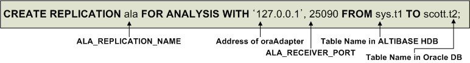

# 3. Managing Adapter for Oracle

This chapter describes how to start up and shut down oraAdapter and how to use the Adapter for Oracle Utility

### oraAdapter Constraints

There are various constraints in using oraAdapter(or oraAdapter). If the following conditions are not satiafied, oraAdapter will not be able to use.

#### Preliquisites

-   If a conflict occurs when executing INSEART/UPDATE/DELETE in the target database(Oracle or other altibase), the execution is cancelled and a message is left to an error log file or the execution is neglected in accordance with the configuration. 
-   An error which was occurred during the replication can be withdrawn. That is to say, if there is a duplicated data when inserting multiple data, the execution is completed except the duplicated data. 
-   The replication speed might be slower than that of the service.

#### Data Constraints

-   Primary key is required in the table to be replicated.
-   To be replicated, primary key of the table cannot be modified.
-   Tables to be replicated on both servers must have the same order and primary key constraints.

#### Connection Constraints

-   The maximum number of possible replication connection for XLog Sender and replication per one ALTIBASE HDB database is determined by specified value of REPLICATION_MAX_COUNT property

#### Allowed DDL Statements

In general, replication target tables cannot execute the data definition language(DDL). However, the followings statemsnts are able to excute DDL regardless of XLog Sender. Refer to the Executing DDL Statements on Replication Target Tables of deploying replication section in the *Replication Manual* for other allowable DDL statements.

-   ALTER INDEX REBUILD PARTITION

-   GRANT OBJECT

-   REVOKE OBJECT

-   CREATE TRIGGER

-   DROP TRIGGER

#### Allowable DDL Statements on Target Replication Tables

Generally, if DDL is executed in a replication target table, all modifications made before the current DDL are applied to the database, and then the databse is terminated. Once oraAdapter(altiAdapter) is terminated, the replication can be executed by re-starting oraAdapter(altiAdapter) after making table schemas identical through executing the same DDL on the target database.

Refer to the Executing DDL Statements in the *Replicaiton Manual* for other allowed DDL statements.

### Startup and Shutdown

This section describes how to startup and shutdown oraAdapter.

#### Startup

How to run oraAdapter will be explained step by step.

In order to use oraAdapter, Altibase and the Oracle DB must first both be running. Additionally, verify that the Adapter for Oracle property settings and environment variables have been set appropriately for the environment in which oraAdapter will be run.

If any environment variables or property settings are changed after oraAdapter has been started, it will be necessary to restart oraAdapter in order to apply the changes. For more information on setting environment variables, please refer to Post-installation Tasks in Chapter Two.

1. Check whether the Altibase REPLICATION_PORT_NO property[^1] has been set to a port number that is available for replication. If it is necessary to change this property setting, Altibase has to be restarted after the new value is given.
  
   [^1]: REPLICATION_PORT_NO specifies the replication port number of a local server for a replication connection. For more detail about this property, please refer to the [General Reference](https://github.com/ALTIBASE/Documents/blob/master/Manuals/Altibase_7.1/eng/General%20Reference-1.Data%20Types%20%26%20Altibase%20Properties.md#replication_port_no).  

2. Before starting oraAdapter, it is also necessary to configure the XLog Sender so that the Altibase Log Analyzer (ALA) can be used. The XLog Sender is used to send XLogs and Meta information from Altibase. FOR ANALYSIS PROPAGATION is used to send logs from the transactions replicated with PROPAGABLE LOGGING to another server.
   In the following statement, an XLog Sender is created so that the data in table t1, which belongs to the sys user in Altibase, can be replicated to table t2, which belongs to the user scott in the Oracle DB.

```
CREATE REPLICATION ala FOR ANALYSIS WITH '127.0.0.1', 25090
                                            FROM sys.t1 TO scott.t2;
```



3. Now it is time to start oraAdapter. oraAdapter can be started either by executing it directly, or using the Adapter for Oracle Utility. For detailed information on how to start oraAdapter using the Adapter for Oracle Utility, please refer to the Adapter for Oracle Utility section later in this chapter. In LINUX, the oraAdapter can be started using the command below:

```
$ cd $ORA_ADAPTER_HOME/bin
$ ./oraAdapter
```

4. If oraAdapter starts normally, you can check the start time and message in oraAdapter.trc file.

```
$ cat $ORA_ADAPTER_HOME/trc/oraAdapter.trc
[2016-07-26 15:53:12] Altibase Adapter started.
```

5. Start XLog sender for Altibase Log Analyzer. If you try to start the XLog sender before running oraAdapter, it will fail. When the XLog sender is executed, shake hands with the oraAdapter to check the authentication procedure. When the handshake is executed normally and the oraAdapter is ready to be cloned, you can check the ready message in the oraAdapter.trc file.


```
$ cat $ORA_ADAPTER_HOME/trc/oraAdapter.trc
[2016-07-26 20:52:51] Adapter is ready to process logs.
iSQL> ALTER REPLICATION ala START;
```


#### Shutdown

The process of shutting down oraAdapter includes the process of stopping the operation of the XLog Sender. If oraAdapter is shut down forcefully using the Adapter for Oracle Utility, it will be shut down successfully, but the Altibase XLog Sender will continue to attempt to connect to oraAdapter.

```
iSQL> ALTER REPLICATION ala STOP;
Alter success.
```


### Data Types

When data in Altibase are applied to an Oracle DB, the data types are converted as shown in the following table.

| Altibase            | Oracle DB            | Additional Information for Oracle DB |
| ------------------- | -------------------- | ------------------------------------ |
| FLOAT               | NUMBER               |                                      |
| NUMERIC             | NUMBER               |                                      |
| DOUBLE              | NUMBER               | BINARY_DOUBLE can also be used.      |
| REAL                | NUMBER               | BINARY_FLOAT can also be used.       |
| BIGINT              | NUMBER               |                                      |
| INTEGER             | NUMBER               |                                      |
| SMALLINT            | NUMBER               |                                      |
| DATE                | DATE                 |                                      |
| CHAR                | CHAR                 |                                      |
| VARCHAR             | VARCHAR2             |                                      |
| NCHAR<br />NVARCHAR | NCHAR<br />NVARCHAR2 |                                      |

[Table 3-1] Data Type Conversion

#### Example

The following example illustrates how the data types are converted when data in Altibase are applied to an Oracle DB, assuming that the National Character Set has been set to UTF-16. 

Assuming that the data types in Altibase have been set as follows:

```
CREATE TABLE T1(
    A1 INTEGER PRIMARY KEY,
    A2  CHAR(20),
    A3  VARCHAR(20),
    A4  NCHAR(20),
    A5  NVARCHAR(20)
    );
```

The data types in the Oracle DB would be set as shown below.

```
CREATE TABLE T1(
    A1 NUMBER PRIMARY KEY,
    A2 CHAR(20),
    A3 VARCHAR2(20),
    A4 NCHAR(20),
    A5 NVARCHAR2(20)
    );
```


### Adapter for Oracle Utility

Adapter for Oracle Utility (oaUtility) is a script that runs oraAdapter as a daemon and check its status. This script runs in a bash shell installed with GNU sed. 

The Adapter for Oracle Utility supports the following options:

-   oaUtility start

-   oaUtility stop

-   oaUtility status

-   oaUtility check

#### oaUtility Prerequisites

To make oaUtility work properly, the user needs to check the following:

-   -oraAdapter is controlled using sed, grep, ps, wc, iSQL (Altibase), and SQLPlus (Oracle) commands based on the Bash Shell. OaUtility works normally when all the utilities are installed and can be executed.
-   oaUtility is affected by personal preferences. Therefore, if the environment variable or personal environment (login.sql, glogin.sql) is set, initialize or change the path to prevent oaUtility from being affected.

#### oaUtility start

##### Syntax

```
oaUtility {start [ force ]}
```

##### Description

This is used to start oraAdapter as a daemon. The force option starts the oraAdapter without checking for a primary key constraint in the replication target table.

> The force option is supported in Altibase 7.1.0.8.2 and later.

#### oaUtility stop

##### Syntax

```
oaUtility {stop}
```

##### Description

This is used to forcefully terminate the Adapter for Oracle process. 

#### oaUtility status

##### Syntax

```
oaUtility {status}
```

##### Description

This is used to check whether oraAdapter is running.

#### oaUtility check

##### Syntax

```
oaUtility { check [ alive | constraints] }
```

##### Description

If neither the alive nor constraints option is specified, oaUtility continually checks whether oraAdapter is running, and if it has been shut down (regardless of whether it was shut down normally or forcibly), restarts it. 

If either the alive or constraints option is specified, the corresponding task is performed only once, and then oaUtility shuts down (i.e. does NOT perform continual checking). Specifying the alive option tells oaUtility to check whether oraAdapter is running. 

Specifying the constraints option tells oaUtility to check whether each of the primary keys in the tables to be ported from Altibase to Oracle DB are defined consistently, i.e. on the basis of columns having the same name.

### Command-Line Option

The following command-line options are supported for use with oraAdapter.

#### Syntax

```
oraAdapter [ -v | -version ]
```

#### Description

Replication can be prepared by directly executing the binary of oraAdapter (altiAdapter).

#### Example

```
$./oraAdapter -v
Altibase Adapter for Oracle version 5.5.1.1.2
...
```

### Offline Option

#### Syntax

```sql
CREATE REPLICATION ala_replication_name FOR ANALYSIS OPTIONS META_LOGGING 
                   WITH 'remote_host_ip', remote_host_port_no 
                   FROM user_name.table_name TO user_name.table_name;                   
ALTER REPLICATION ala_replication_name SET OFFLINE ENABLE WITH 'log_dir';
ALTER REPLICATION ala_replication_name SET OFFLINE DISABLE;
ALTER REPLICATION ala_replication_name BUILD OFFLINE META [AT SN(sn)];
ALTER REPLICATION ala_replication_name RESET OFFLINE META;
ALTER REPLICATION ala_replication_name START WITH OFFLINE;
```

#### Description

Using the oraAdapter to apply changed data from the Altibase server to the Oracle database, it is impossible to send logs that were not applied to the other database if a failure occurs on the running Altibase server. In this case, if the Altibase server is running with the META_LOGGING option and there is a Standby server with the same database structure as the Altibase server, the Offline option helps the Standby server access the unsent log files in the Altibase server where the failure occurs directly, and apply them to the Oracle database.

- META_LOGGING  
  This logs the sender meta and Restart SN information in files. When a failure occurs, the files are used to configure the meta information necessary to read unsent logs. The files ares created within the ala_meta_files folder in the log file path.

- SET OFFLINE ENABLE WITH 'log_dir'  
  This enables the use of the offline replication option. This statement can only be executed when replication is stopped. It sets up the Standby server to access the log files directly by specifying the log file path of the Altibase server where the failure occurs.

- SET OFFLINE DISABLE  
  This disables the use of the offline replication option. This statement can only be executed when replication is stopped.

- BUILD OFFLINE META  
  This reads the sender meta and Restart SN files from the ala_meta_files folder in the specified log file path. This constructs the necessary meta information for the offline replication.

- RESET OFFLINE META   
  This resets the meta information configured by BUILD OFFLINE META when it is no longer needed or configuring new meta information.

- START WITH OFFLINE  
  This starts replication through the specified offline path. Offline replication is a one-time operation, so it terminates right after applying all unsent logs. After the completion of offline replication, users can start replication again.

#### Constraints

- Reading and writing functions of the sender meta or Restart SN file can be executed by ALA only.
- The ALA object name for the server running the offline oraAdapter must be the same as the ALA object name for the Active server.
- Offline oraAdapter does not support ALA objects with compressed tables as replication targets.
- If the offline oraAdapter cannot access the log file and the sender meta file paths of the Active server due to disk issues, the operation fails.
- The log file size of the Active server and Standby server must be the same. The size is determined during the database creation, so it must be verified before using the offline option.
- Changing log files and the sender meta files arbitrarily (renaming, copying log files to another system, deleting) can lead to abnormal termination issues.
- If users restart the Standby server after performing BUILD OFFLINE META, the Remote Meta information used for analyzing logs disappears. Therefore, users need to execute BUILD OFFLINE META again.
- When using the META_LOGGING Option, ALA also does not process the gap as the Archive logs, similar to replication.
- If the SM version, OS, OS bit size (32 or 64), or log file size of the two database servers are different, starting Offline oraAdapter or creating an ALA object with the offline option fails.

#### Example

| No                                                      | Active Server                                                | Standby Server                                               | Oracle                                                 |
| ------------------------------------------------------- | ------------------------------------------------------------ | ------------------------------------------------------------ | ------------------------------------------------------ |
| 1. Create scheme                                        | CREATE TABLE T1 (I1 INTEGER PRIMARY KEY, I2 CHAR(20));       | CREATE TABLE T1 (I1 INTEGER PRIMARY KEY, I2 CHAR(20));       | CREATE TABLE T1 (I1 INTEGER PRIMARY KEY, I2 CHAR(20)); |
| 2. Create replication                                   | CREATE REPLICATION ALA FOR ANALYSIS OPTIONS META_LOGGING WITH 'adapter_ip', adapter_port FROM SYS.T1 to SYS.T1; | CREATE REPLICATION ALA FOR ANALYSIS WITH 'adapter_ip', adapter_port FROM SYS.T1 to SYS.T1; |                                                        |
| 3. Start oraAdapter on the Active server                | $oaUtility start                                             |                                                              |                                                        |
| 4. Start replication on the Active server               | ALTER REPLICATION ALA START;                                 |                                                              |                                                        |
| 5. Failure occurs on the Active server                  | Failure occurs                                               |                                                              |                                                        |
| 6. Start oraAdapter on the Standby server               |                                                              | $oaUtility start                                             |                                                        |
| 7. Set offline option on the Standby server replication |                                                              | ALTER REPLICATION ALA SET OFFLINE ENABLE WITH 'active_home/logs' |                                                        |
| 8. Configure the offline meta information               |                                                              | ALTER REPLICATION ALA BUILD OFFLINE META;                    |                                                        |
| 9. Start offline replication                            |                                                              | ALTER REPLICATION ALA START WITH OFFLINE;                    |                                                        |

#### Example - Processing When Replication GAP contains DDL

| No                                                      | Active Server                                                | Standby Server                                               | Oracle                                                 |
| ------------------------------------------------------- | ------------------------------------------------------------ | ------------------------------------------------------------ | ------------------------------------------------------ |
| 1. Create scheme                                        | CREATE TABLE T1 (I1 INTEGER PRIMARY KEY, I2 CHAR(20));       | CREATE TABLE T1 (I1 INTEGER PRIMARY KEY, I2 CHAR(20));       | CREATE TABLE T1 (I1 INTEGER PRIMARY KEY, I2 CHAR(20)); |
| 2. Create replication                                   | CREATE REPLICATION ALA FOR ANALYSIS OPTIONS META_LOGGING WITH 'adapter_ip', adapter_port FROM SYS.T1 to SYS.T1; | CREATE REPLICATION ALA FOR ANALYSIS WITH 'adapter_ip', adapter_port FROM SYS.T1 to SYS.T1; |                                                        |
| 3. Start oraAdapter on the Active server                | $oaUtility start                                             |                                                              |                                                        |
| 4. Start replication on the Active server               | ALTER REPLICATION ALA START;                                 |                                                              |                                                        |
| 5. DDL on the active server                             | DDL                                                          |                                                              |                                                        |
| 6. Failure occurs on the Active server                  | Failure occurs                                               |                                                              |                                                        |
| 7. Start oraAdapter on the Standby server               |                                                              | $oaUtility start                                             |                                                        |
| 8. Set offline option on the Standby server replication |                                                              | ALTER REPLICATION ALA SET OFFLINE ENABLE WITH 'active_home/logs' |                                                        |
| 9. Configure the offline meta information               |                                                              | ALTER REPLICATION ALA BUILD OFFLINE META;                    |                                                        |
| 10. Start offline replication                           |                                                              | ALTER REPLICATION ALA START WITH OFFLINE;                    |                                                        |
| 11. The error occurs because of  DDL logs               |                                                              | [ERR-611B6 : Offline ALA Sender read DDL log.]               |                                                        |
| 12. DDL on Oracle                                       |                                                              |                                                              | DDL                                                    |
| 13. Restart oraAdatper on the Standby server            |                                                              | $oaUtility start                                             |                                                        |
| 14. Restart offline replication                         |                                                              | ALTER REPLICATION ALA START WITH OFFLINE;                    |                                                        |

