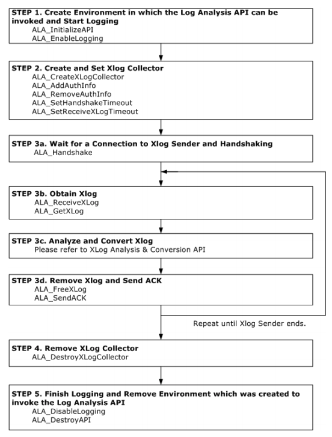

# 1. Log Analyzer Introduction

This chapter explains the concept of Log Analyzer and how to use it.

### Log Analyzer

The Altibase Log Analyzer consists of a module that is included with Altibase for use in providing a history of database DML transactions on the basis of active logs, an external module that is connected to the internal module, and an API that is provided for using XLogs.

Log Analyzer can be used for interlocking Altibase DBMS with other companies' DBMS or detecting  changes within Altibase from outside so as to respond to these changes in the desired manner.

#### Terms & Concepts

##### XLog

An XLog is a logical form of log that results from the conversion of a physical log. It is used to store a history of transactions involving DML (INSERT, UPDATE and DELETE) statements so that it can be accessed by users.

##### XLog Sender

The XLog Sender is the module that analyzes active logs to create XLogs, which it then passes to the XLog Collector.

The XLog Sender actively performs handshaking and XLog transmission.

##### XLog Collector

The XLog Collector is the module that receives meta data and XLogs from the XLog Sender.

The XLog Collector consists of meta data, an XLog queue, a transaction table and an XLog pool. It is called via the Log Analysis API.

##### Log Analysis API

The Log Analysis API is used to obtain XLogs and meta data that are used to interpret the XLogs.

##### Handshake

Handshaking is the task of checking the protocol version, meta data, etc. before the XLogs are Version, sent from the XLog Sender to the XLog Collector.

##### XLog Queue

The XLog Queue is the place where available XLogs are stored before they are accessed by users.

##### XLog Pool

The XLog Pool is memory that has been allocated for the storage of XLogs.

The purpose of the XLog Pool is to reuse the memory that has been allocated to XLogs in order to prevent excessive memory usage.

##### Transaction Table

The transaction table is the place where information about transactions, including the status of transactions, is stored.

##### Restart SN

The Restart SN is the SN of the active log from which reading will resume when the XLog Sender is restarted.

##### SN

The SN (Sequence Number) is the serial number of an individual log record.

##### Replication

Replication is a module that is used to synchronize data between two Altibase databases. For more information, please refer to the *Altibase Replication Manual.*

##### Replication SYNC

Replication SYNC is a replication function whereby all of the records in the replication target tables on the local server are sent to the remote server. 

Replication SYNC is used to match the contents of a replication table before starting replication based on an active log.

#### How the Altibase Log Analyzer Works

The location of the XLog Sender is within an Altibase database. It creates XLogs based on active logs and sends the XLogs along with related meta data to the XLog Collector. The XLog Collector exists within a client application, and provides end users with the XLogs and meta data via the Log Analysis API.

If for some reason a call to the Log Analysis API fails, it is of course necessary to take suitable measures, depending on the cause of the error. The most recent error information is stored in the Error Manager. Additionally, the Log Manager is provided for use in tracing errors. The Log Manager records simple trace and error information in the log files that are specified when the Log Manager is created.

The overall structure is shown in the following illustration:


[Figure 1-1] The Structure of the Altibase Log Analyzer

The Log Analysis API can be used to obtain XLogs and related meta data from the XLog Collector. The XLog Collector receives these meta data from the XLog Sender at the time of handshaking between the XLog Sender and the XLog Collector. The meta data are valid until the next time handshaking is performed.

The movement of XLogs and meta data within the XLog Collector is as follows:

1.  Memory for XLogs is obtained from the XLog Pool.

2.  The XLog Collector receives the data that constitute XLogs from the XLog Sender and uses the data to create XLogs.
  
3.  The XLogs are added to the XLog Queue, where they are accessed and used via the Log Analysis API.  
    When it is desired to obtain the XLogs for transactions in the order in which the transactions are committed, the XLogs are temporarily stored in the Transaction Table before they are added to the XLog Queue.
    
4.  After the XLogs are used, the memory that was assigned to them is returned to the XLog Pool..

The following illustration shows the movement of meta data and XLogs within the XLog Collector:


[Figure 1-2] The Structure of the XLog Collector

#### Features of the Log Analyzer

##### The XLog Sender uses the Replication module

The SQL statements that are used to manage the XLog Sender are almost the same as those that are used to manage Replication. 

For more information on replication, please refer to the *Replication Manual.*

##### Transaction XLogs can be obtained in the order in which transactions are committed

When creating the XLog Collector, it is possible to specify that transaction XLogs are to be obtained in the order in which transactions are committed. When the XLog Collector is set in this way, the following circumstances apply:

-   The XLogs pertaining to a given transaction can be obtained after the COMMIT XLog for the transaction has been received.  
    Because savepoint-related XLogs are not necessary, they are thus not provided.

-   XLogs for transactions that were rolled back cannot be obtained.

##### The TCP and UNIX Domain sockets are supported for use in transmitting XLogs

-   The UNIX Domain socket can be used only when the XLog Sender and XLog Collector reside on the same machine and the OS is UNIX or Linux.
  
-   A single XLog Sender can use only one type of socket.

##### Conversion to ODBC C data types is supported

Internal data of Altibase can be converted to corresponding ODBC C data types.

#### Log Analyzer Limitations

Because the XLog Sender uses the Replication module, the following limitations apply:

-   Only the SYS user can run the XLog Sender. 
-   The basic unit of analysis is the database table. 
-   A table to be analyzed must have a primary key.
-   The values in the columns that constitute the primary key of a table to be analyzed cannot be updated.  
    However, INSERT and DELETE operations can be performed on the columns that constitute the primary key.
-   DDL statements cannot be executed on a table to be analyzed. 
-   The combined total of XLog Senders and Replication Senders that coexist in a single Altibase database cannot exceed 32.
-   The same version of the Altibase Replication protocol must be used for both Replication and the Log Analysis API.  
    If more than one XLog Collector is being used within a single process, the Replication protocol version in all associated Altibase databases must be the same as the Replication protocol version being used by the Log Analysis API.

However, the Log Analyzer differs from Replication in the following ways:

-   The Log Analyzer can be used with tables having foreign keys. 
-   Only Lazy Mode is supported for use with the Log Analyzer. 

For more information on Replication, please refer to the *Replication Manual.*

### How to Use the Log Analysis API

This section explains how to use the Log Analysis API, which is provided for use in client applications.

For complete information on the use of the XLog Sender, please refer to XLog Sender.

#### Required Files

<table>
<tbody>
<tr>
<td>
<p>File Type</p>
</td>
<td>
<p>File Name</p>
</td>
<td>
<p>Description</p>
</td>
</tr>
<tr>
<td rowspan="2" >
<p>Header</p>
</td>
<td >
<p>alaAPI.h</p>
</td>
<td >
<p>This file must be included when authorizing a client program
using the Log Analysis API. It includes the alaTypes.h file.</p>
</td>
</tr>
<tr>
<td >
<p>alaTypes.h</p>
</td>
<td >
<p>This file contains the definitions of data types and macros that
are necessary when writing a client program using the Log
Analysis API.</p>
</td>
</tr>
<tr>
<td rowspan="2">
<p>Library</p>
</td>
<td >
<p>libala_sl.x</p>
</td>
<td >
<p>This is the Log Analysis API shared library.</p>
</td>
</tr>
<tr>
<td >
<p>libala.x</p>
</td>
<td >
<p>This is the Log Analysis API static library.</p>
</td>
</tr>
</tbody>
</table>

[Table 1-1] Required Files

The following must be taken into consideration when creating and compiling source code:

-   The source code must reference the alaAPI.h file. 
-   When linking during the compile operation, it is necessary to link to either the shared library or the static library. 
-   The filename extension of the library files varies depending on the platform.

#### Data Types

The basic data types used by the Log Analysis API are as follows:

<table>
<tbody>
<tr>
<td >
<p>Tye</p>
</td>
<td>
<p>Data Type</p>
</td>
<td>
<p>Description</p>
</td>
</tr>
<tr>
<td>
<p>Boolean</p>
</td>
<td >
<p>ALA_BOOL</p>
</td>
<td>
<p>ALA_TRUE: true</p>
<p>ALA_FALSE: false</p>
</td>
</tr>
<tr>
<td >
<p>Return Code</p>
</td>
<td >
<p>ALA_RC</p>
</td>
<td >
<p>ALA_SUCCESS: success</p>
<p>ALA_FAILURE: failure</p>
</td>
</tr>
<tr>
<td  rowspan="2">
<p>Character</p>
</td>
<td >
<p>Char (SChar)</p>
</td>
<td >
<p>Signed Character (8 bits)</p>
</td>
</tr>
<tr >
<td >
<p>unsigned char (UChar)</p>
</td>
<td>
<p>Unsigned Character (8 bits)</p>
</td>
</tr>
<tr >
<td  rowspan="6">
<p>Integer</p>
</td>
<td>
<p>Short (SShort)</p>
</td>
<td>
<p>Signed Small Integer (16 bits)</p>
</td>
</tr>
<tr>
<td>
<p>unsigned short (UShort)</p>
</td>
<td >
<p>Unsigned Small Integer (16 bits)</p>
</td>
</tr>
<tr>
<td >
<p>Int (SInt)</p>
</td>
<td>
<p>Signed Integer (32 bits)</p>
</td>
</tr>
<tr >
<td >
<p>unsigned Int (UInt)</p>
</td>
<td>
<p>Unsigned Integer (32 bits)</p>
</td>
</tr>
<tr>
<td>
<p>Long (SLong)</p>
</td>
<td>
<p>Signed Big Integer (64 bits)</p>
</td>
</tr>
<tr>
<td>
<p>unsigned long (ULong)</p>
</td>
<td>
<p>Unsigned Big Integer (64 bits)</p>
</td>
</tr>
</tbody>
</table>

[Table 1-2] Log Analysis API Basic Data Types

#### Error Handling

Every Log Analysis API function takes the so-called “Error Manager” as an argument. If the result of a call to the Log Analysis API is ALA_FAILURE, it will be necessary to determine the cause of the error and take appropriate measures. The error information that is provided via the API consists of the Error Code, Error Level, and Error Message.

The structure of the Error Manager is as follows:

```
typedef struct ALA_ErrorMgr
{
    UInt    mErrorCode;     /* CODE  */
    SChar  mErrorState[6];   /* STATE */
    SChar  mErrorMessage[ALA_MAX_ERROR_MSG_LEN+256];
} ALA_ErrorMgr;
```

The following should be kept in mind when using the Error Manager:

-   The entity (e.g. process or thread) that calls the Log Analysis API is responsible for creating and storing the Error Manager.
-   The Error Manager only contains information about the most recent error. 
-   The functions provided in the Log Analysis API for handling errors cannot accept a NULL value for the Error Manager argument. 
-   If NULL is passed as the Error Manager argument to a Log Analysis API function other than an error-handling function, then any errors that occur will not be logged by the Log Manager. 
-   Because mErrorCode element of the Error Manager structure contains internal data, the error code must be obtained using ALA_GetErrorCode().

The ALA_GetErrorLevel() function is used to retrieve the value of ALA_ErrorLevel, which indicates the error level.

```
typedef enum
{
    ALA_ERROR_FATAL = 0,    /* Need to Destroy */
    ALA_ERROR_ABORT,        /* Need to Handshake */
    ALA_ERROR_INFO          /* Information */
} ALA_ErrorLevel;
```

The appropriate action to take in response to an error at each of the supported error levels is as follows:

-   ALA_ERROR_FATAL indicates a fatal error, and thus ALA_DestroyXLogCollector() must be called to terminate the corresponding XLog Collector. 
-   ALA_ERROR_ABORT indicates that the status of the corresponding XLog Collector is abnormal, so ALA_Handshake() must be called to perform handshaking again for the XLog Collector. 
-   ALA_ERROR_INFO indicates that the call to the Log Analysis API failed. The action that is appropriate in response to this kind of error depends on the error code.

Errors that have already occurred can be checked via the log files written by the Log Manager. For information on the use of the Log Manager, please refer to the descriptions of the ALA_EnableLogging and ALA_DisableLogging.

#### Basic Usage

The following diagram illustrates the steps involved when using the Log Analysis API.



The following must be kept in mind when using the Log Analysis API:

-   The XLog Collector can be monitored from Step 3a to Step 3d.
-   The Error Handling API is used in all steps.
-   ALA_SendACK() does not have to be called for every iteration of Step 3. For a detailed explanation of when it is necessary to send ACK, please refer to the descriptions of the ALA_CreateXLogCollector and ALA_SendACK. 
-   If, in Step 3c, the XLog is to be applied to the database using the ODBC interface, AUTOCOMMIT must be set to OFF. 
-   The XLog Sender must be started after STEP 3a. 
-   In Step 3b, ALA_ReceiveXLog() and ALA_GetXLog() do not have to be called by the same thread. 
-   Once ALA_FreeXLog has been called, the corresponding XLog and related data can no longer be used.

###  Summary of the Log Analysis API

#### Log Analysis API Environment Management

<table>
    <TR>
        <TH>Fuction Type</TH><TH>Log Analysis API Function Name</TH><TH>Description</TH>
    </TR>
    <TR>
        <TD rowspan="2">Creating and Destroying
the Log Analysis API
Environment</TD>
       		<td>ALA_InitializeAPI</td><td>Creates an environment in which the Log
Analysis API can be invoked.</td></tr>
    <tr><td>ALA_DestroyAPI</td><td>Terminates an environment which was
created to invoke the Log Analysis API.</td></tr>
    <tr>
        <td rowspan="2">Logging</td><td>ALA_EnableLogging</td><td>Enables logging for problem tracking</td>
    </tr>
    <tr>
        <td>ALA_DisableLogging</td><td>Disables logging.</td>
    </tr>
</table>


​            

#### XLog Collector Management

<table>
<thead>
<tr>
<th>Function Type</th>
<th>Log Analysis API Function Name</th>
<th>Description</th>
</tr>
<tr>
<td rowspan="5">
<p>Creating and Preparing
the XLog Collector</p>
</td>
<td>
<p>ALA_CreateXLogCollector</p>
</td>
<td>
<p>Creates an XLog Collector that corresponds to an XLog Sender.</p>
</td>
</tr>
<tr>
<td>
<p>ALA_AddAuthInfo</p>
</td>
<td>
<p>Adds XLog Sender authentication information.</p>
</td>
</tr>
<tr>
<td>
<p>ALA_RemoveAuthInfo</p>
</td>
<td>
<p>Removes XLog Sender authentication
information.</p>
</td>
</tr>
<tr>
<td>
<p>ALA_SetHandshakeTimeout</p>
</td>
<td>
<p>Specifies the handshake timeout.</p>
</td>
</tr>
<tr>
<td>
<p>ALA_SetReceiveXLogTimeout</p>
</td>
<td>
<p>Specifies the XLog reception timeout.</p>
</td>
</tr>
<tr>
<td rowspan="5">
<p>Receiving Meta Data
and XLogs</p>
</td>
<td>
<p>ALA_Handshake</p>
</td>
<td>
<p>Waits for a connection with an XLog
Sender and performs handshaking.</p>
</td>
</tr>
<tr>
<td>
<p>ALA_ReceiveXLog</p>
</td>
<td>
<p>Receives XLogs and adds them to the
XLog Queue.</p>
</td>
</tr>
<tr>
<td>
<p>ALA_GetXLog</p>
</td>
<td>
<p>Obtains an XLog from the XLog Queue.</p>
</td>
</tr>
<tr>
<td>
<p>ALA_SendACK</p>
</td>
<td>
<p>Sends ACK to the XLog Sender.</p>
</td>
</tr>
<tr>
<td>
<p>ALA_FreeXLog</p>
</td>
<td>
<p>Returns an XLog to the XLog Pool.</p>
</td>
</tr>
<tr>
<td>
<p>Terminating an XLog
Collector</p>
</td>
<td>
<p>ALA_DestroyXLogCollector</p>
</td>
<td>
<p>Terminates an XLog Collector.</p>
</td>
</tr>
<tr>
<td>
<p>XLog Collector Monitoring</p>
</td>
<td>
<p>ALA_GetXLogCollectorStatus</p>
</td>
<td>
<p>Queries the status of an XLog Collector.</p>
</td>
</tr>
</thead>
</table>


#### XLog Analysis & Conversion API

<table>
<tbody>
<tr>
    <th>Function Type</th> <th>Log Analysis API Function Name</th> <th>Description</th>
</tr>
<tr>
<td rowspan="5">
<p>XLog</p>
</td>
<td >
<p>ALA_GetXLogHeader</p>
</td>
<td>
<p>Obtains the header information from an
XLog.</p>
</td>
</tr>
<tr>
<td>
<p>ALA_GetXLogPrimaryKey</p>
</td>
<td>
<p>Obtains the data in the primary key column(s) from an XLog.</p>
</td>
</tr>
<tr>
<td>
<p>ALA_GetXLogColumn</p>
</td>
<td>
<p>Obtains the column data (before and after)
from an XLog.</p>
</td>
</tr>
<tr>
<td>
<p>ALA_GetXLogSavepoint</p>
</td>
<td>
<p>Obtains the savepoint information from an
XLog.</p>
</td>
</tr>
<tr>
<td>
<p>ALA_GetXLogLOB</p>
</td>
<td>
<p>Obtains the LOB data from an XLog.</p>
</td>
</tr>
<tr>
<td rowspan="7">
<p>Reading meta data</p>
</td>
<td >
<p>ALA_GetProtocolVersion</p>
</td>
<td >
<p>Obtains the Replication protocol version
of the Log Analysis API.</p>
</td>
</tr>
<tr>
<td >
<p>ALA_GetReplicationInfo</p>
</td>
<td >
<p>Obtains Replication information.</p>
</td>
</tr>
<tr>
<td >
<p>ALA_GetTableInfo</p>
</td>
<td >
<p>Retrieves information about a table using
the table OID.</p>
</td>
</tr>
<tr>
<td >
<p>ALA_GetTableInfoByName</p>
</td>
<td >
<p>Retrieves information about a table using
the table name and the table owner name.</p>
</td>
</tr>
<tr>
<td >
<p>ALA_GetColumnInfo</p>
</td>
<td >
<p>Retrieves information about a column in a
table using the column ID.</p>
</td>
</tr>
<tr>
<td >
<p>ALA_GetIndexInfo</p>
</td>
<td>
<p>Retrieves information about an index in a
table using the index ID.</p>
</td>
</tr>
<tr>
<td>
<p>ALA_IsHiddenColumn</p>
</td>
<td>
<p>Determines whether the column selected
by the Column ID is a hidden column.</p>
</td>
</tr>
<tr>
<td rowspan="3">
<p>Altibase Internal Data Type</p>
</td>
<td>
<p>ALA_GetInternalNumericInfo</p>
</td>
<td>
<p>Retrieves the sign and exponent of FLOAT and NUMERIC data.</p>
</td>
</tr>
<tr>
<td>
<p>ALA_GetAltibaseText</p>
</td>
<td>
<p>Converts Altibase internal data to strings.</p>
</td>
</tr>
<tr>
<td>
<p>ALA_GetAltibaseSQL</p>
</td>
<td>
<p>Converts transaction-related XLog into Altibase SQL string.</p>
</td>
</tr>
<tr>
<td>
<p>ODBC C Conversion</p>
</td>
<td>
<p>ALA_GetODBCCValue</p>
</td>
<td>
<p>Converts Altibase internal data to ODBC C data types.</p>
</td>
</tr>
</tbody>
</table>


#### Error Handling API

<table width="510">
<tbody>
<tr>
    <th>Function Type </th><th>Log Analysis API</th><th>Description</th>
</tr>
<tr>
<td rowspan="4" width="77">
<p>Error Handling</p>
</td>
<td width="153">
<p>ALA_ClearErrorMgr</p>
</td>
<td width="280">
<p>Initializes the Error Manager.</p>
</td>
</tr>
<tr>
<td width="153">
<p>ALA_GetErrorCode</p>
</td>
<td width="280">
<p>Obtains an error code.</p>
</td>
</tr>
<tr>
<td width="153">
<p>ALA_GetErrorLevel</p>
</td>
<td width="280">
<p>Obtains the error level.</p>
</td>
</tr>
<tr>
<td width="153">
<p>ALA_GetErrorMessage</p>
</td>
<td width="280">
<p>Obtains a specific error message.</p>
</td>
</tr>
</tbody>
</table>


